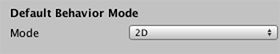

#2D 和 3D 模式设置

创建新项目时，可以指定是以 2D 模式还是 3D 模式启动 Unity Editor。但是，也可以随时在 2D 模式和 3D 模式之间切换 Editor。可以[在此处阅读有关 2D 和 3D 项目之间差异](2Dor3D.html)的更多信息。本页面将介绍如何切换模式以及切换模式时 Editor 中究竟发生哪些变化。

##在 3D 和 2D 模式之间切换
要在 2D 或 3D 模式之间更改模式，请执行以下操作：

1.通过 __Edit > Project Settings > Editor__ 菜单调出 __Editor Settings Inspector__。
2.然后将 __Default Behavior Mode__ 设置为 __2D__ 或 __3D__。

可以在 [Editor Settings](class-EditorManager.html) 页面中找到有关 __Editor Settings Inspector__ 的更多信息。

##2D 与 3D 模式设置
2D 或 3D 模式决定了 Unity Editor 的某些设置。下面列出了这些设置。

###在 2D 项目模式下：
* 导入的任何图像都被假定为 2D 图像（__精灵__）并设置为__精灵__模式。
* 启用 __Sprite Packer__。
* __Scene 视图__设置为 2D。
* 默认游戏对象没有实时方向光。
* 摄像机的默认位置为 0,0,-10。（在 3D 模式下为 0,1,-10。）
* 摄像机设置为 __Orthographic__。（在 3D 模式下设置为 __Perspective__。）
* 在 Lighting 窗口中：
    * 新场景将禁用 __Skybox__。
    * __Ambient Source__ 设置为 __Color__。（颜色设置为深灰色：RGB：54, 58, 66。）
    * __Precomputed Realtime GI__ 设置为 off。
    * __Baked GI__ 设置为 off。
    * __Auto-Building__ 设置为 off。

###在 3D 项目模式下：
* 导入的任何图像都不被假定为 2D 图像（__精灵__）。
* 禁用 __Sprite Packer__。
* __Scene 视图__设置为 3D。
* 默认游戏对象有实时方向光。
* 摄像机的默认位置为 0,1,-10。（在 2D 模式下为 0,0,-10。）
* 摄像机设置为 __Perspective__。（在 2D 模式下设置为 __Orthographic__。）
* 在 Lighting 窗口中：
    * __Skybox__ 是内置的默认 __Skybox Material__。
    * __Ambient Source__ 设置为 __Skybox__。
    * __Precomputed Realtime GI__ 设置为 on。
    * __Baked GI__ 设置为 on。
    * __Auto-Building__ 设置为 on。
