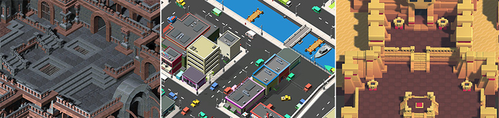
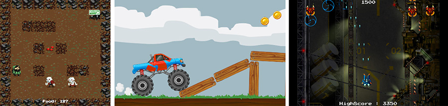
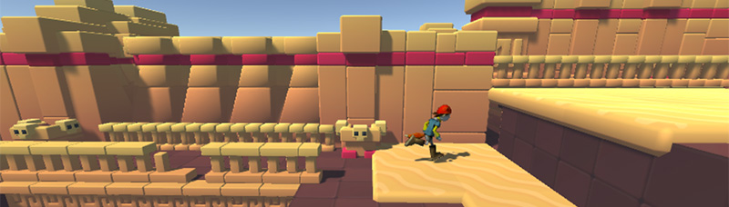

#2D 还是 3D 项目

无论是创建 2D 还是 3D 游戏，Unity 都很拿手。在 Unity 中创建新项目时，可以选择以 2D 或 3D 模式启动。您可能已经知道要构建什么，但有一些细微的要点可能会影响选择的模式。

选择是以 2D 还是 3D 模式启动决定了 Unity Editor 的一些设置，例如图像是作为纹理还是精灵导入。无论在创建项目时设置何种模式，都可以随时在 2D 或 3D 模式之间切换（请参阅 [2D 和 3D 模式设置](2DAnd3DModeSettings.html)）。下面这些指导原则有助于做出选择。

### 全 3D

3D 游戏通常使用三维几何体，在游戏对象的表面上渲染材质和纹理，使它们看起来像构成游戏世界的坚固环境、角色和对象。摄像机可以在场景中及其周围自由移动，并以逼真的方式在游戏世界中投射光线和阴影。3D 游戏通常使用透视渲染场景，因此当对象靠近摄像机时，对象在屏幕上显得更大。对于符合此描述的所有游戏，请采用 **3D** 模式。

### 正交 3D

有时游戏使用 3D 几何体，但使用正交摄像机，而不是透视。这是游戏中常用的技巧，可用于对动作进行鸟瞰，有时也称为“2.5D”。如果要制作这样的游戏，还应该在 **3D** 模式下使用 Editor，因为即使没有*透视*，仍将使用 3D 模型和资源。但此情况下需要将[摄像机](CamerasOverview.html)和 [Scene 视图](SceneViewNavigation.html)切换为**正交 (Orthographic)** 视图。

*以上场景来自 [Synty Studios](https://www.assetstore.unity3d.com/en/#!/publisher/5217) 和 [BITGEM](https://www.assetstore.unity3d.com/en/#!/publisher/1299) 的作品。*

### 全 2D

许多 2D 游戏使用平面图形，有时称为精灵（没有任何三维几何体）。它们作为平面图像被绘制到屏幕上，而且游戏的摄像机没有透视。对于这种类型的游戏，应该以 **2D** 模式启动 Editor。

### 包含 3D 图形的 2D 游戏玩法

一些 2D 游戏将 3D 几何体用于环境和角色，但将*游戏玩法*限制为二维模式。例如，摄像机可以显示横向卷轴视图，并且玩家只能在两个维度上移动，但是游戏本身仍然将 3D 模型用于障碍物并且将 3D 透视用于摄像机。对于这些游戏，3D 效果的用途可能是为了营造风格，而不是充当某种功能。这种类型的游戏有时*也*被称为“2.5D”。尽管游戏玩法是 2D，但主要是操纵 3D 模型来构建游戏，因此应该以 **3D** 模式启动 Editor。

### 带有透视摄像机的 2D 游戏玩法和图形

这是另一种流行的 2D 游戏风格，使用 2D 图形，但通过透视摄像机来获得视差卷轴效果。这是一个“纸板剧院”风格的场景，所有图形都是平面的，但按照与摄像机之间的不同距离排列。在这种情况下，**2D** 模式最有可能符合开发要求。但是，应将[摄像机](CamerasOverview.html)的投影模式更改为**透视 (Perspective)**，并将 [Scene 视图](SceneViewNavigation.html)模式更改为 **3D**。

*上述场景由 [One Point Six Studio](https://www.assetstore.unity3d.com/en/#!/publisher/8138) 提供。*

### 其他风格

您可能计划开发符合上述描述之一的项目，也可能在构思其他完全不同或独特的东西。无论计划是什么，希望以上内容可以让您了解启动 Editor 的模式。请记住，可以在以后随时切换模式。

请参阅 [2D 和 3D 模式设置](2DAnd3DModeSettings.html)以了解有关如何更改 2D/3D 模式的更多信息，并了解有关模式差异的更多详细信息。

##有用的 2D 项目信息
无论开发哪种类型的项目，都有一些有用的页面可以帮助您入门。还有许多特定页面是关于 2D 功能的。请参阅 Unity 用户手册的 [Unity 2D](Unity2D.html) 部分。

###Unity 入门
* [Unity 基础知识](UnityBasics.html)
* [创建场景](CreatingScenes.html)
* [创建游戏玩法](CreatingGameplay.html)

###使用 Unity 进行 2D 开发
* [Unity 2D 手册文档](Unity2D.html)

