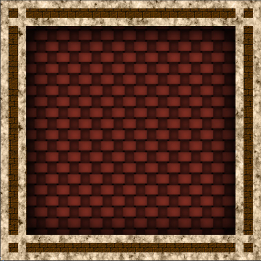
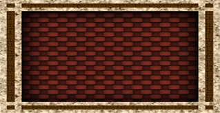
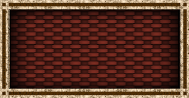
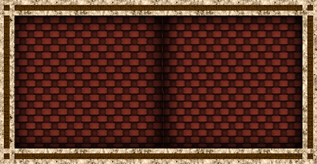
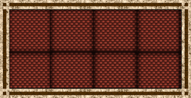
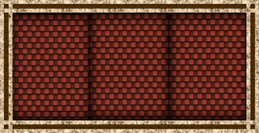

# 9 切片精灵

9 切片是一种 2D 技术，可允许以各种大小复用图像，而无需准备多个[资源](AssetWorkflow.html)。此技术涉及将图像分成九个部分，确保在重新调整[精灵](Sprites.html)的大小时，不同部分以不同方式缩放或平铺（即，以网格形式重复），使精灵保持比例。在创建图案或[纹理](class-TextureImporter.html)（例如 2D 环境中的墙壁或地板）时，这会很有用。

以下是 9 切片精灵（分为九个部分）的一个示例。每个部分以 A 到 I 的字母进行标记。

 

以下几点描述了更改图像尺寸时发生的情况：

* 四个角（A、C、G 和 I）的大小不变。

* B 和 H 部分水平拉伸或平铺。

* D 和 F 部分垂直拉伸或平铺。

* E 部分同时水平且垂直拉伸或平铺。

本页面介绍如何设置 9 切片以及要应用的设置（根据要拉伸还是平铺以上显示的区域）。

## 设置 9 切片精灵

在对精灵进行 9 切片之前，需要确保正确设置该精灵。

首先，需要确保 __Mesh Type__ 设置为 __Full Rect__。要应用此设置，请选择精灵，然后在 Inspector 窗口中单击 __Mesh Type__ 下拉选单并选择 __Full Rect__。如果 __Mesh Type__ 设置为 __Tight__，由于设置 9 切片精灵时精灵渲染器 (Sprite Renderer) 生成和渲染精灵的方式，9 切片可能运行不正常。

下一步，需要通过 [__Sprite Editor__](SpriteEditor.html) 窗口来定义精灵的边框。为此，请选择精灵，然后在 [Inspector](UsingTheInspector.html) 窗口中单击 __Sprite Editor__ 按钮。

的文档以了解关于[精灵导入设置 (Sprite Import Settings)](../uploads/Main/9SliceSprites-2.png) 中所有属性的信息。

使用 Sprite Editor 窗口可定义精灵的边框（即，想要定义平铺区域的位置，例如墙壁或地板瓦片）。为此，请使用 Sprite 控制面板的 __L__、__R__、__T__ 和 __B__ 字段（分别表示左、右、上和下）。或者，单击并拖动顶部、底部和两侧的绿点。

单击 Sprite Editor 窗口的顶栏中的 __Apply__。关闭 Sprite Editor 窗口，然后将精灵从 [Project 窗口](ProjectView.html)拖入 Scene 视图，从而开始对其进行处理。

## 对精灵进行 9 切片

在 [Scene 视图](UsingTheSceneView.html)或 [Hierarchy 窗口](Hierarchy.html)中选择精灵。在 Inspector 窗口中，导航到 [Sprite Renderer](class-SpriteRenderer.html) 组件，然后更改 __Draw Mode__ 属性。

 

默认情况下，此属性设置为 __Simple__；要应用 9 切片，根据所需要的行为，请将其设置为 __Sliced__ 或 __Tiled__。以下部分使用下面所示的精灵来说明每个选项的行为：

### Simple

 

这是默认的精灵渲染器行为。当图像尺寸发生变化时，图像朝所有方向缩放。__Simple__ 不用于 9 切片。

### Sliced

 

在 __Sliced__ 模式下，角点的大小保持不变，精灵的顶部和底部水平拉伸，精灵的两侧垂直拉伸，精灵的中心水平和垂直拉伸，从而适应精灵的大小。

将精灵的 __Draw Mode__ 设置为 __Sliced__ 时，可以选择使用精灵渲染器或[矩形变换组件工具](Toolbar.html)上的 __Size__ 属性来更改大小。这种情况下，仍然可以使用变换组件属性或变换组件工具来缩放精灵；但是，变换组件会在不应用 9 切片的情况下缩放精灵。

### Tiled

 

在 __Tiled__ 模式下，精灵保持相同的大小，不会缩放。取而代之的行为是，精灵的顶部和底部水平重复，精灵的两侧垂直重复，精灵的中心以平铺形式重复，从而适应精灵的大小。

将精灵的 __Draw Mode__ 设置为 __Sliced__ 时，可以选择使用精灵渲染器或[矩形变换组件工具](Toolbar.html)上的 __Size__ 属性来更改大小。这种情况下，仍然可以使用变换组件属性或变换组件工具来缩放精灵；但是，变换组件会在不应用 9 切片的情况下缩放精灵。

将 __Draw Mode__ 设置为 __Tiled__ 后，将出现另一个称为 __Tile Mode__ 的属性。有关 __Tile Mode__ 运作方式的更多信息，请参阅本页的下一部分。

请参阅有关[精灵渲染器](class-SpriteRenderer.html)的文档以了解关于该组件的所有属性的完整详细信息。

## Tile Mode

当 __Draw Mode__ 设置为 __Tiled__ 时，使用 __Tile Mode__ 属性可控制当精灵的尺寸发生变化时各部分的重复方式。

### 

### Continuous

默认情况下，__Tile Mode__ 设置为 __Continuous__。当精灵的大小改变时，重复部分在精灵中均匀重复。

 

### Adaptive

当 __Tile Mode__ 设置为 __Adaptive__ 时，重复部分仅在精灵的尺寸达到 __Stretch Value__ 时才进行重复。

 

使用 __Stretch Value__ 滑动条可设置介于 __0__ 到 __1__ 之间的值。请注意，__1__ 表示图像调整为原始尺寸的两倍，因此如果 __Stretch Value__ 设置为 __1__，则当图像拉伸到原始大小的两倍时，该部分将会重复。

为了演示这一点，以下图像显示了尺寸相同但 __Stretch Value__ 不同的图像之间的差异：

__Stretch Value 0.1__：

 

__Stretch Value 0.5__：

 

## 9 切片和碰撞体

如果[精灵](Sprites.html)已附加 [Collider2D](Collider2D.html)，需要确保在更改精灵的尺寸时，Collider2D 随之改变。

Unity 中支持 9 切片的 Collider2D 组件只有 [2D 盒型碰撞体 (Box Collider 2D)](class-BoxCollider2D.html) 和 [2D 多边形碰撞体 (Polygon Collider 2D)](class-PolygonCollider2D.html)。这两个 Collider2D 具有 __Auto Tiling__ 复选框。要确保 Collider2D 组件设置为支持 9 切片，请选择要应用组件的精灵，导航到 Inspector 窗口中的 Collider2D，然后勾选 __Auto Tiling__ 复选框。这样可以自动更新 Collider2D 的形状，意味着精灵的尺寸变化时，会自动重新调整形状。如果没有启用 __Auto Tiling__，即使精灵的尺寸变化，Collider2D 也会保持相同的形状和大小。

### 限制和已知问题

* 只有两个 Collider2D 支持 9 切片，分别为 BoxCollider2D 和 PolygonCollider2D。

* 精灵渲染器的 __Draw Mode__ 设置为 __Sliced__ 或 __Tiled__ 时，无法编辑 BoxCollider2D 和 PolygonCollider2D。Inspector 窗口中会禁用编辑功能，并告知由于 Collider2D 由精灵渲染器组件的平铺属性所驱动，因此无法对其进行编辑。

* 以 __Auto Tiling__ 模式重新生成该形状时，其他边缘可能出现在 Collider2D 的形状之内。这可能会对碰撞产生影响。

