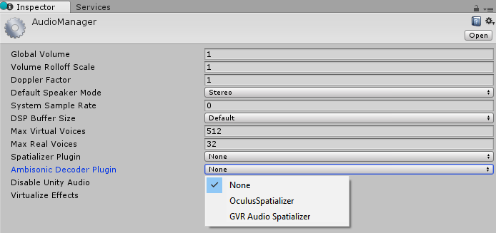
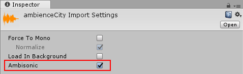

#立体混响声音频

##简介

本页面介绍如何播放立体混响声以及对音频插件接口进行了哪些更改来支持立体混响声音频解码器。

立体混响声以多声道格式存储。立体混响声以更加通用的方法来表示声场，而不是映射到特定扬声器的每个声道。因此，可根据监听器的方位（即用户头部在 XR 中的旋转）来旋转声场。声场也可以解码为与扬声器设置相匹配的格式。立体混响声通常与 360 度视频结合使用，也可用作遥远环境声的音频天空盒。

 

##选择立体混响声音频解码器

通过 **Edit > Project Settings > Audio** 导航到项目的 Audio Manager 的 Inspector 窗口。从项目的可用解码器列表中选择立体混响声解码器。Unity 2017.1 没有内置任何解码器，但 Google 和 Oculus 将分别在自己的音频 SDK 中为 Unity 提供解码器。

##导入立体混响声音频剪辑

按照正常操作导入多声道 WAV 文件。在音频剪辑的 Inspector 窗口中，选中新立体混响声的复选框。WAV 文件应为 B 格式（按照 ACN 组件排序并采用 SN3D 标准化）。

##通过音频源播放立体混响声音频剪辑

与播放任何其他音频剪辑一样，立体混响声音频剪辑通过音频源进行播放。在播放立体混响声剪辑时，首先会解压缩剪辑（如果需要），然后通过立体混响声解码器发送以将其转换为项目的选定扬声器模式，然后通过音频源的效果发送。

 在音频源属性方面，需要注意以下几点：

* 将 spatialize 属性设置为 false。在播放某个立体混响声音频剪辑时，该剪辑会自动通过项目的选定立体混响声音频解码器来发送。解码器将剪辑从立体混响声格式转换为项目的选定扬声器格式。在此解码操作过程中，解码器还根据音频源和音频监听器的方位来处理空间定位问题。

* 与空间定位的音频源一样，立体混响声音频剪辑也将禁用混响区。

##音频插件接口更改

对于插件开发者，请首先阅读 Unity 手册以了解原生音频插件 SDK 和空间音响 SDK，并下载音频插件 SDK：

[https://docs.unity3d.com/Manual/AudioMixerNativeAudioPlugin.html](https://docs.unity3d.com/Manual/AudioMixerNativeAudioPlugin.html)

[https://docs.unity3d.com/Manual/AudioSpatializerSDK.html](https://docs.unity3d.com/Manual/AudioSpatializerSDK.html)

[https://bitbucket.org/Unity-Technologies/nativeaudioplugins](https://bitbucket.org/Unity-Technologies/nativeaudioplugins)

立体混响声音频解码器的 AudioPluginInterface.h 有两项更改。首先，有一个新的效果定义标志：UnityAudioEffectDefinitionFlags_IsAmbisonicDecoder。立体混响声解码器应在效果的定义位字段中设置此标志。在插件扫描阶段，此标志会通知 Unity 此效果是立体混响声解码器，随后此效果将显示为 Audio Manager 的立体混响声解码器列表中的选项。

其次，有一个新的 UnityAudioAmbisonicData 结构会传递到立体混响声解码器，此结构与传递到空间音响的 UnityAudioSpatializerData 结构非常类似，但新增了一个 ambisonicOutChannels 整数。此字段将设置为 DefaultSpeakerMode 的声道数。立体混响声解码器放在音频管线中非常靠前的位置，在此位置将以剪辑的声道数运行，因此 ambisonicOutChannels 可告知插件将实际使用多少个输出声道。

如果我们要播放一阶立体混响声音频剪辑（4 个声道），但我们的扬声器模式是立体声（2 个声道），则为立体混响声解码器的进程回调传入的输入和输出声道数将为 4。ambisonicOutChannels 字段将设置为 2。在这种常见情况下，插件应将其空间定位数据输出到前 2 个声道，并将另外 2 个声道清零。

2017.1 版本中的 Unity 立体混响声源框架可以支持一阶和二阶立体混响声。插件接口包含用于支持双耳立体声、四声道、5.1 和 7.1 输出的信息，但支持级别实际取决于插件。最初，立体混响声解码器插件预计仅支持一阶立体混响声源和双耳立体声输出。

当前框架中未提供特定于不同立体混响声格式的任何内容。如果剪辑的格式与立体混响声解码器插件的预期格式相匹配，应该会一切正常。但我们的当前计划是，Unity 的首选立体混响声格式是 B 格式（按照 ACN 组件排序并采用 SN3D 标准化）。

----
* 2017-08-10  Page published with no [editorial review](DocumentationEditorialReview.html)

 * Unity [2017.1](https://docs.unity3d.com/2017.1/Documentation/Manual/30_search.html?q=newin20171) 中的新功能 NewIn20171
 

