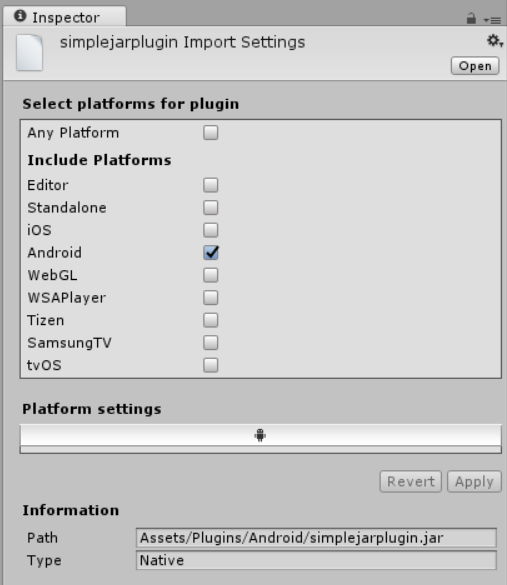

#JAR 插件


JAR(Java Archive) 插件主要用于实现与 Android 操作系统的交互，或用于从 C# 脚本中调用使用 Java 编写的方法。

这些插件只能包含 Java 代码（例如，不能包含 Android 资源），因此它们的使用范围非常有限。
要将 JAR 插件添加到项目中，请将 .jar 文件复制到项目的任意文件夹中，然后在 Unity 中选择该文件，从而在 Inspector 窗口中打开 Import Settings。应勾选 Android 复选框以将此 .jar 文件标记为与 Android 兼容：





使用 Java 插件 
从 Java 调用代码时以及使用本机代码或 C# 脚本与 Java 或 Java VM（虚拟机）交互时，Unity 均使用 [Java 原生接口 (JNI)](http://en.wikipedia.org/wiki/Java_Native_Interface)。

##通过本机 (C/C++) 代码使用 Java 插件
注意：必须具备 Android Java 原生接口 (JNI) 的高级知识才能理解本部分的这些信息。

要从 C 或 C++ 插件访问 Java 代码，您需要访问 Java VM。为了访问 Java VM，请将以下方法添加到 C/C++ 代码中。

```
jint JNI_OnLoad(JavaVM* vm, void* reserved) {
  JNIEnv* jni_env = 0;
  vm->AttachCurrentThread(&amp;jni_env, 0);
  return JNI_VERSION_1_6;
}
```

篇幅所限，本文档不能完全解释 JNI，但需要说明的是，此方法通常涉及查找类定义、解析构造函数 (\<init\>) 方法和创建新对象实例，如以下示例所示：

```
jobject createJavaObject(JNIEnv* jni_env) {
  jclass cls_JavaClass = jni_env->FindClass("com/your/java/Class");         // 查找类定义
  jmethodID mid_JavaClass = jni_env->GetMethodID (cls_JavaClass, "<init>", "()V");      // 查找构造函数方法
  jobject obj_JavaClass = jni_env->NewObject(cls_JavaClass, mid_JavaClass);     // 创建对象实例
  return jni_env->NewGlobalRef(obj_JavaClass);                      // 返回具有全局引用的对象
}
```

有关 JNI 的更多信息，请参阅 Android 开发者文档的 [JNI](https://developer.android.com/training/articles/perf-jni.html) 部分。

##通过包含 helper 类的 C# 脚本使用 Java 插件
注意：必须具备 Android Java 原生接口 (JNI) 的高级知识才能理解本部分的这些信息。

[`AndroidJNIHelper`](../ScriptReference/AndroidJNIHelper.html) 和 [`AndroidJNI`](../ScriptReference/AndroidJNI.html) Unity API 类用作“原始”JNI 接口的包装器。

AndroidJavaObject 和 AndroidJavaClass Unity API 类在使用 JNI 调用时自动执行许多任务，并且还使用缓存来加快 Java 调用速度。`AndroidJavaObject` 和 `AndroidJavaClass` 的组合构建在 `AndroidJNI` 和 `AndroidJNIHelper` 之上，但也有一些额外的功能。这些类还具有静态方法可用于访问 Java 类的静态成员。

可通过三种方式从 C# 脚本进行 Java JNI 调用：

* 原始 JNI，通过 `AndroidJNI` 方法；
* `AndroidJNIHelper` 类与 `AndroidJNI` 相结合；
* `AndroidJavaObject` 和 `AndroidJavaClass` 类，作为最方便的高级 API。

[UnityEngine.AndroidJNI](../ScriptReference/AndroidJNI.html) 是以 C 语言编写的 JNI 调用的包装器（如上所述）。此类中的所有方法都是静态的，并具有与 Java 原生接口的 1:1 映射。

[UnityEngine.AndroidJNIHelper](../ScriptReference/AndroidJNIHelper.html) 提供由下一级使用的 helper 功能，该功能作为公共方法公开，在特殊情况下可能有用。

[UnityEngine.AndroidJavaObject](../ScriptReference/AndroidJavaObject.html) 和 [UnityEngine.AndroidJavaClass](../ScriptReference/AndroidJavaClass.html) 的实例分别与 Java 端的 java.lang.Object 和 java.lang.Class（或它们的子类）实例进行一对一映射。它们基本上提供与 Java 端的 3 种交互：

* 调用一个方法

* 获取字段的值

* 设置字段的值

该调用分为两类：调用“void”方法以及调用具有非 void 返回类型的方法。返回非 void 类型的方法的返回类型用泛型类型表示。Get 和 Set 始终采用表示字段类型的泛型类型。
##示例

###示例 1

```
 AndroidJavaObject jo = new AndroidJavaObject("java.lang.String", "some_string"); 
  // jni.FindClass("java.lang.String");
  // jni.GetMethodID(classID, "<init>", "(Ljava/lang/String;)V");
  // jni.NewStringUTF("some_string");
  // jni.NewObject(classID, methodID, javaString);
  int hash = jo.Call<int>("hashCode"); 
  // jni.GetMethodID(classID, "hashCode", "()I");
  // jni.CallIntMethod(objectID, methodID);
```

此示例将创建一个用[字符串](http://developer.android.com/reference/java/lang/String.html#String(java.lang.StringBuilder))进行实例化的 [java.lang.String](http://developer.android.com/reference/java/lang/String.html) 实例，并检索该字符串的[哈希值](http://developer.android.com/reference/java/lang/String.html#hashCode())。

`AndroidJavaObject` 构造函数至少使用一个参数：要构造实例的类的名称。类名后的所有参数都用于对象的构造函数调用，在本例中为字符串“some_string”。随后对 hashCode() 的调用返回一个“int”（在本示例中用作调用方法的泛型类型参数）。

__注意__：无法使用点分表示法来实例化嵌套的 Java 类。内部类必须使用 $ 分隔符。请使用 `android.view.ViewGroup$LayoutParams` 或 `android/view/ViewGroup$LayoutParams`，其中的 LayoutParams 类嵌套在 ViewGroup 类中。

###示例 2

此示例显示了如何在不使用插件的情况下用 C# 获取当前应用程序的缓存目录：

```
AndroidJavaClass jc = new AndroidJavaClass("com.unity3d.player.UnityPlayer"); 
 // jni.FindClass("com.unity3d.player.UnityPlayer");
 AndroidJavaObject jo = jc.GetStatic AndroidJavaObject>("currentActivity"); 
 // jni.GetStaticFieldID(classID, "Ljava/lang/Object;");
 // jni.GetStaticObjectField(classID, fieldID);
 // jni.FindClass("java.lang.Object");

 Debug.Log(jo.Call AndroidJavaObject>("getCacheDir").Call<string>("getCanonicalPath")); 
 // jni.GetMethodID(classID, "getCacheDir", "()Ljava/io/File;"); // 或其任何基类！
 // jni.CallObjectMethod(objectID, methodID);
 // jni.FindClass("java.io.File");
 // jni.GetMethodID(classID, "getCanonicalPath", "()Ljava/lang/String;");
 // jni.CallObjectMethod(objectID, methodID);
 // jni.GetStringUTFChars(javaString);
```

此示例以 `AndroidJavaClass` 而不是 `AndroidJavaObject` 开头，目的是访问 `com.unity3d.player.UnityPlayer` 的静态成员，而不是创建新对象。然后访问静态字段“currentActivity”，但这次使用 `AndroidJavaObject` 作为泛型参数。这是因为实际字段类型 [android.app.Activity](http://developer.android.com/reference/android/app/Activity.html) 是 [`java.lang.Object`](http://developer.android.com/reference/java/lang/Object.html) 的子类，并且任何[非原始类型](http://developer.android.com/reference/java/lang/Class.html)都必须作为 `AndroidJavaObject` 进行访问。此规则的例外是字符串，即使字符串不代表 Java 中的原始类型，也可以直接访问它们。

然后可在 Activity 对象上调用 [`getCacheDir()`](http://developer.android.com/reference/android/content/Context.html#getCacheDir()) 来获取表示缓存目录的 File 对象，接着可调用 [`getCanonicalPath()`](http://developer.android.com/reference/java/io/File.html#getCanonicalPath()) 来获取字符串表示。

Unity 使用 [`Application.temporaryCachePath`](https://docs.unity3d.com/ScriptReference/Application-temporaryCachePath.html) 和 [`Application.persistentDataPath`](https://docs.unity3d.com/ScriptReference/Application-persistentDataPath.html) API 提供对应用程序的缓存和文件目录的访问。

###示例 3

此示例显示了如何使用 `UnitySendMessage` 将数据从 Java 传递到 Unity。
 

```
using UnityEngine;

public class NewBehaviourScript : MonoBehaviour { 

    void Start () { 
        AndroidJNIHelper.debug = true; 
        using (AndroidJavaClass jc = new AndroidJavaClass("com.unity3d.player.UnityPlayer")) { 
        jc.CallStatic("UnitySendMessage", "Main Camera", "JavaMessage", "NewMessage");
        } 
    } 

    void JavaMessage(string message) { 
        Debug.Log("message from java: " + message); 
    }
}
```

Java 类 `com.unity3d.player.UnityPlayer` 有一个静态方法 [`UnitySendMessage`](https://docs.unity3d.com/Manual/PluginsForIOS.html)，相当于 iOS 方法：`UnitySendMessage`。该方法在 Java 中用于将数据传递给 Unity。

尽管是在 Unity 内部调用 `UnitySendMessage` 方法，但该方法使用 Java 来中继消息，然后 Java 回调本机/Unity 代码以将消息传递给名为“Main Camera”的对象。此对象附带一个脚本，脚本中包含一个名为 `JavaMessage` 的方法。

##将 Java 插件用于 Unity 时的最佳实践

`AndroidJavaObject` 和 `AndroidJavaClass` 方法的计算成本非常高（与使用原始 JNI 的方法一样）。为获得更好的性能以及代码清晰度，请将托管代码与本机/Java 代码之间的转换次数保持在最低限度。

```
//第一次调用 Java 方法，如
AndroidJavaObject jo = new AndroidJavaObject("java.lang.String", "some_string"); // 成本有点高
int hash = jo.Call<int>("hashCode"); // 第一次 - 成本高
int hash = jo.Call<int>("hashCode"); // 第二次 - 成本不像我们已经知道的 java 方法那么高，可以直接调用它
```

Mono 垃圾回收器应该在使用创建的 `AndroidJavaObject` 和 `AndroidJavaClass` 实例后将所有这些实例释放，但建议将它们保留在 `using(){}` 语句中，以确保尽快删除它们。如果不这么做，无法确定什么时候销毁它们。如果将 `AndroidJNIHelper.debug` 设置为 true，您将在调试输出中看到垃圾回收器的活动记录。

```
//安全地获取系统语言
void Start () { 
    using (AndroidJavaClass cls = new AndroidJavaClass("java.util.Locale")) { 
        using(AndroidJavaObject locale = cls.CallStatic<AndroidJavaObject>("getDefault")) { 
            Debug.Log("current lang = " + locale.Call<string>("getDisplayLanguage")); 

        } 
    } 
}
```

<br/> 

----
* <span class="page-edit">2017-05-18  Page published with no [editorial review](DocumentationEditorialReview.html)
</span>

* <span class="page-history">5.5 版中的更新功能</span>
