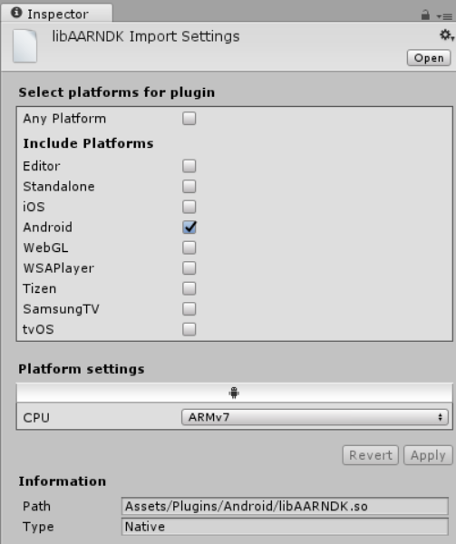

#适用于 Android 的原生 (C++) 插件

Unity 支持用 C/C ++ 编写并封装在共享库 (.so) 中的 Android 原生插件。

要构建适用于 Android 的 C++ 插件，请使用 [Android NDK](https://developer.android.com/ndk/index.html) 并熟悉构建共享库所需的步骤。

如果使用 C++ 来实现该插件，必须确保使用 C 链接来声明方法以免发生[名称错用问题](http://en.wikipedia.org/wiki/Name_mangling)。

```
extern "C" {
  float Foopluginmethod ();
}
```

构建库后，将输出的 .so 文件复制到 Unity 项目的 __Assets/Plugins/Android__ 目录中。在 Inspector 中，将 .so 文件标记为与 Android 兼容，并在下拉框中设置所需的 CPU 架构：




                                                                                                                   
要从 C# 脚本调用原生插件中的方法，请使用以下代码：

```
[DllImport ("pluginName")]
private static extern float Foopluginmethod();
```

请注意，pluginName 不应包含文件名的前缀（“lib”）和扩展名（“.so”）。建议使用额外的 C# 代码层包装所有的原生插件方法调用。此代码将检查 [Application.platform](../ScriptReference/Application-platform.html) 并仅当应用程序在实际设备上运行时才调用本机方法；在 Editor 中运行时，将从 C# 代码返回虚拟值。请使用[平台定义](https://docs.unity3d.com/Manual/PlatformDependentCompilation.html)来控制依赖于平台的代码编译。

##原生 (C++) 插件示例
此 [zip 存档](../uploads/Examples/AndroidNativePlugin.zip)包含一个原生代码插件的简单示例。
此示例演示如何从 Unity 应用程序调用 C++ 代码。该包中包含的一个场景显示了由原生插件计算的两个值之和。需使用 [Android NDK](https://developer.android.com/ndk/index.html) 来编译该插件。

<br/> 

----
* <span class="page-edit">2017-05-18  Page published with no [editorial review](DocumentationEditorialReview.html)
</span>

* <span class="page-history">5.5 版中的更新功能</span>
