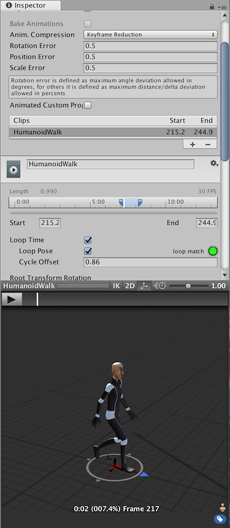
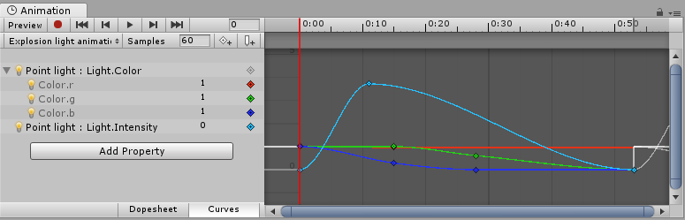

动画剪辑
====================

动画剪辑是 Unity 动画系统的核心元素之一。Unity 支持从外部源导入动画，并允许在编辑器中使用 Animation 窗口从头开始创建动画剪辑。

外部源动画
-------------------------------

从外部源导入的动画剪辑可能包括：

* 在动作捕捉工作室中捕捉的人形动画
* 美术师在外部 3D 应用程序（如 3DS Max 或 Maya）中从头开始创建的动画
* 来自第三方库（例如 Unity 的 Asset Store）的动画集
* 从导入的单个时间轴剪切的多个剪辑。

Unity 中创建和编辑的动画
------------------------------------------

在 Unity 的 Animation 窗口中还可以创建和编辑动画剪辑。这些剪辑可针对以下各项设置动画：

* 游戏对象的位置、旋转和缩放
* 组件属性，例如材质颜色、光照强度、声音音量
* 自定义脚本中的属性，包括浮点、整数、枚举、矢量和布尔值变量
* 自定义脚本中调用函数的时机

---

* 2017-10-02  Page amended with limited [editorial review](DocumentationEditorialReview.html)

* 在 [2017.31](https://docs.unity3d.com/2017.3/Documentation/Manual/30_search.html?q=newin20173) 版本中可为脚本内的整数属性设置动画 NewIn20173
* 在 2017.3 版中向动画预览器添加了 2D 按钮
