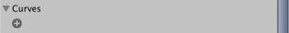
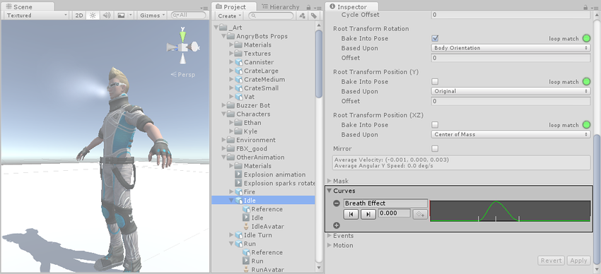

# 曲线

您可以在 [Animation 选项卡](class-AnimationClip.html)中将动画曲线附加到导入的动画剪辑。

可以使用这些曲线将其他动画数据添加到导入的剪辑。可以根据animator的状态，使用该数据来动画化其他项的时序。例如，在冰冷环境的游戏中，可以使用额外的动画曲线来控制粒子系统的发射速率，以显示玩家在冷空气中的冷凝呼吸。

要向导入的动画添加曲线，请展开 [Animation 选项卡](class-AnimationClip.html)底部的 __Curves__ 部分，然后单击加号图标以向当前动画剪辑添加新曲线：

如果导入的动画文件被拆分为多个动画剪辑，则每个剪辑都可以拥有自己的自定义曲线。

曲线的 X 轴表示_标准化时间_，范围始终在 0.0 和 1.0 之间（无论持续时间如何，均分别对应于动画剪辑的开头和结尾）。

双击动画曲线将显示[标准 Unity 曲线编辑器](EditingValueProperties.html)，可以使用该编辑器向曲线添加__关键点__。关键点（Keys）是沿着曲线时间轴上的点，其具有 animator 明确设置的值，而不是仅使用插值。关键点（Keys）非常适合用于沿着动画时间轴标记重要的点。例如，对于行走动画，可以使用关键点来标记左脚在地面上的位置点，然后是双脚在地面上的位置点，右脚在地面上的位置点，依此类推。设置好关键点后，通过按 __Previous Key Frame__ 和 __Next Key Frame__ 按钮即可方便地在关键帧之间移动。这样就会移动垂直的红线并显示关键帧的_标准化时间_。在文本框中输入的值将在此时间驱动曲线值。

## 动画曲线和 Animator Controller 参数

如果一条曲线的名称与 [Animator Controller](Animator.html) 中的某个[参数](AnimationParameters.html)同名，则该参数的值将取自这条曲线在时间轴中每个点的值。例如，如果从脚本调用 [GetFloat](../ScriptReference/Animator.GetFloat.html)，则返回的值等于进行调用时的曲线值。请注意，在任何给定的时间点，可能有多个动画剪辑试图设置同一控制器中的同一参数。在这种情况下，Unity 会混合多个动画剪辑中的曲线值。如果动画没有特定参数对应的曲线，则 Unity 将与该参数的默认值混合。

---

*  2018-04-25  Page amended with limited [editorial review](DocumentationEditorialReview.html)

