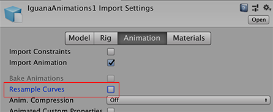

# 欧拉曲线重新采样

3D 应用程序中的旋转通常表示为四元数或欧拉角。在大多数情况下，Unity 在内部将旋转表示为四元数；但是，大致了解 [Unity 中的旋转和方向](QuaternionAndEulerRotationsInUnity.html)也是很重要的。

当导入外部动画文件时，导入后文件通常包含欧拉格式的关键帧动画。Unity默认会将这些动画重新采样为四元数值，并为动画中的每一帧生成一个新的四元数关键帧。这样就最大限度减小了源动画与 Unity 中显示的动画之间的差异。

在某些情况下，即使重新采样，导入的动画的四元数表现也可能与原资源有所差异。因此，Unity 提供了关闭动画重新采样的选项。这意味着您可以在运行时改用原始的欧拉动画关键帧。

**注意：**仅当帧之间的默认四元数插值产生不良结果并导致问题时，才使用欧拉曲线。

## 保持导入动画上的原始欧拉曲线

要使用动画文件中的原始欧拉曲线值，请取消选中 [Animation 选项卡](class-AnimationClip.html)中的 __Resample Curves__ 选项：

禁用此选项时，Unity会根据曲线类型在欧拉或四元数模式下，将旋转曲线与其原始关键帧保持一致。

**注意：**FBX SDK会自动重新采样旋转前或旋转后的关节上的任何旋转曲线。这意味着 Unity 会自动将它们导入为四元数曲线。

Unity 支持各种各样的导入文件，并会尝试使导入的曲线尽可能接近原始曲线。为了实现这一点，Unity 支持所有正常（非重复）欧拉旋转顺序，并以原始旋转顺序导入曲线。

### 欧拉值和 Unity 引擎

使用原始欧拉（非重新采样）旋转时，您可以看到动画播放中有非常小的视觉差异。在后台，Unity 甚至会在运行时以欧拉表示形式存储这些曲线。但是，Unity 最终必须将旋转值转换为四元数，因为引擎仅支持四元数。

禁用 __Resample Curves__ 选项后，Unity 会将旋转值保持为欧拉值，直到将这些值应用于某个游戏对象为止。这意味着最终结果看起来应该与原始情况一样好，但内存有所改善，因为尚未在制作软件中烘焙的旋转曲线占用的内存较少。

 
### Transform Inspector 中的非默认欧拉顺序

默认情况下，Unity 按 Z、X、Y 顺序应用 Transform Inspector 中出现的欧拉角。

当播放或编辑导入的动画时，如果这些动画的欧拉曲线的旋转顺序与 Unity 的默认值不同，则 Unity 会在旋转 (Rotation) 字段旁边显示一个差异指示符：

编辑不同旋转顺序的多个变换时，Unity 会显示一条警告消息，指出应用相同的欧拉旋转会在不同旋转顺序的曲线上得出不同的结果：

---

*  2018-04-25  Page amended with limited [editorial review](DocumentationEditorialReview.html)

