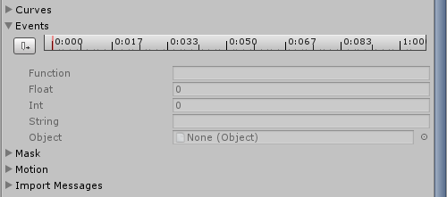
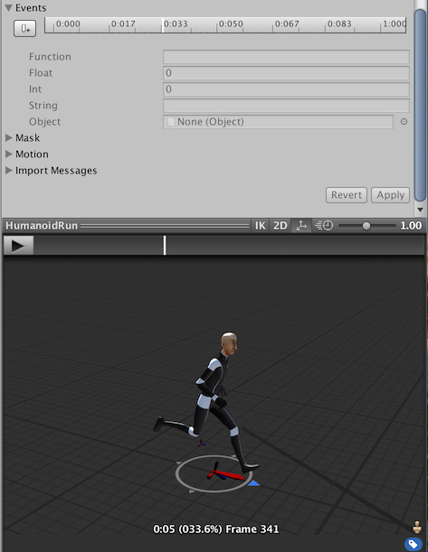

# 事件

您可以在 [Animation 选项卡](class-AnimationClip.html)中将动画事件附加到导入的动画剪辑。

通过事件可以向导入的剪辑添加其他数据，从而确定何时应该在动画中触发某些动作。例如，您可能希望添加事件去指示一个动画角色在行走和运动周期中，应该何时播放脚步声。

要向导入的动画添加事件，请展开 Events 部分以显示导入的动画剪辑的事件时间轴：

要将播放头移动到时间轴中的其他位置，请使用窗口预览面板中的时间轴：

将播放头置于要添加事件的位置，然后单击 __Add Event__。随后将出现一个新事件，由时间轴上的白色小标记指示。在 __Function__ 属性中，填写要在发生事件时调用的函数的名称。

确保在其animator中使用此动画的任何游戏对象都附加了相应的脚本，其中包含具有匹配事件名称的函数。

下面的示例演示了一个事件会调用附加到玩家游戏对象的脚本中的 `Footstep` 函数。此事件可与音频源结合用于播放与动画同步的脚步声。

您还可以选择指定一个参数以发送到事件调用的函数。共有四种不同的参数类型：__Float__、__Int__、__String__ 或 __Object__。

通过填写其中任何字段的值，并实现接受该类型参数的函数，即可将事件中指定的值传递给脚本中的函数。

例如，您可能希望传递 float（浮点）值来指定在不同动作期间应有的脚步声大小，例如在行走周期中采用安静脚步事件，而在奔跑循环中采用响亮脚步事件。此外，还可以传递对效果预制件的引用，从而让您的脚本在动画期间的特定时间点实例化不同的效果。

---

*  2018-04-25  Page amended with limited [editorial review](DocumentationEditorialReview.html)

