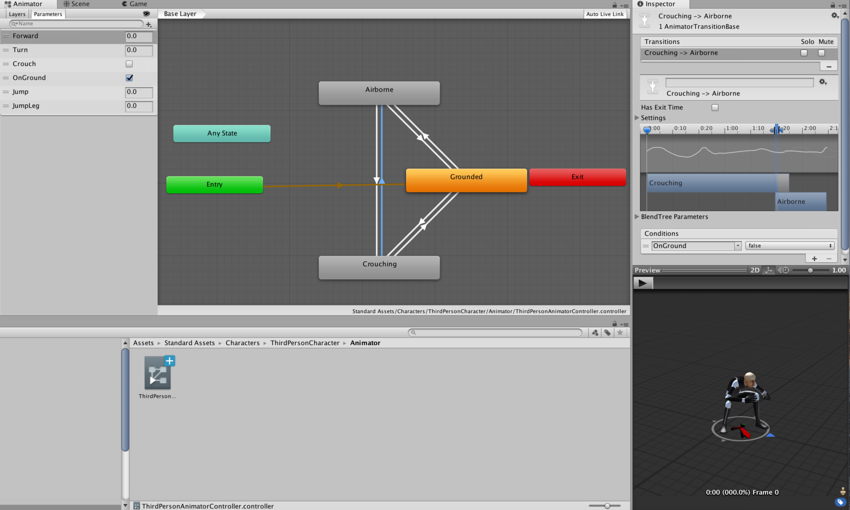
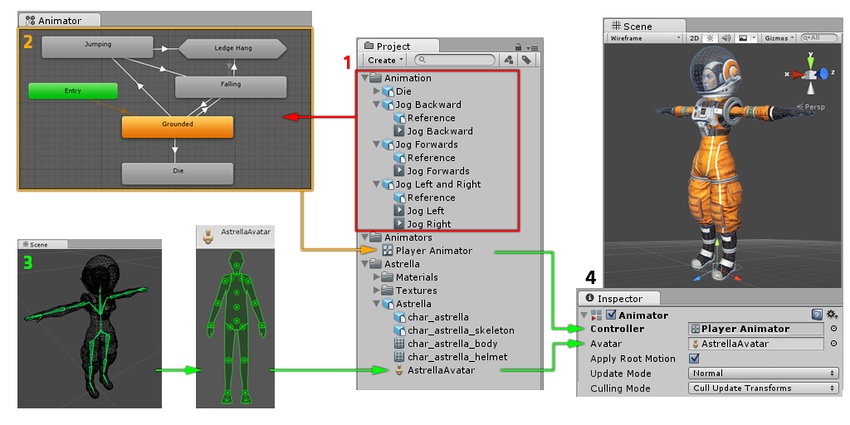

动画系统概述
========================

Unity 有一个丰富而复杂的动画系统（有时称为“__Mecanim__”）。该系统具有以下功能：

* 为 Unity 的所有元素（包括对象、角色和属性）提供简单工作流程和动画设置。
* 支持[导入的动画剪辑](class-AnimationClip.html)以及 Unity 内创建的动画
* 人形动画[重定向](Retargeting.html) - 能够将动画从一个角色模型应用到另一角色模型。
* 对齐动画剪辑的简化工作流程。
* 方便预览动画剪辑以及它们之间的过渡和交互。因此，动画师与工程师之间的工作更加独立，使动画师能够在挂入游戏代码之前为动画构建原型并进行预览。
* 提供可视化编程工具来管理动画之间的复杂交互。
* 以不同逻辑对不同身体部位进行动画化。
* 分层和遮罩功能

动画工作流程
----------------

Unity 的动画系统基于[动画剪辑](AnimationClips.html)的概念；动画剪辑包含某些对象应如何随时间改变其位置、旋转或其他属性的相关信息。每个剪辑可视为单个线性录制。来自外部的动画剪辑由美术师或动画师使用第三方工具（例如 Max 或 Maya）创建而成，或者来自动作捕捉工作室或其他来源。

然后，动画剪辑将编入称为 [Animator Controller](class-AnimatorController.html) 的一个类似于流程图的结构化系统中。Animator Controller 充当“[状态机](AnimationStateMachines.html)”，负责跟踪当前应该播放哪个剪辑以及动画应该何时改变或混合在一起。

一个非常简单的 Animator Controller 可能只包含一个或两个剪辑，例如，使用此剪辑来控制能量块旋转和弹跳，或设置正确时间开门和关门的动画。一个更高级的 Animator Controller 可包含用于主角所有动作的几十段人形动画，并可能同时在多个剪辑之间进行混合，从而当玩家在场景中移动时提供流畅的动作。

Unity 的动画系统还具有用于处理人形角色的许多特殊功能。这些功能可让人形动画从任何来源（例如：动作捕捉、Asset Store 或某个其他第三方动画库）[重定向](Retargeting.html)到您的角色模型中，并可调整[肌肉定义](MuscleDefinitions.html)。这些特殊功能由 Unity 的[替身](AvatarCreationandSetup.html)系统启用；在此系统中，人形角色会被映射到一种通用的内部格式中。

所有这些部分（动画剪辑、Animator Controller 和 Avatar）都通过 [Animator 组件](class-Animator.html)一起附加到某个游戏对象上。该组件引用了Animator Controller，并（在必需时）引用此模型的 Avatar。Animator Controller又进一步包含所使用的动画剪辑的引用。

上图显示了以下内容：

1.动画剪辑是[从外部来源导入的](class-AnimationClip.html)或在 Unity 内创建的。在此示例中，它们是[导入的动作捕捉人形动画](ConfiguringtheAvatar.html)。
2.动画剪辑显示并排列在Animator Controller中。因此，在 Animator 窗口中会显示Animator Controller的视图。状态（可表示动画或嵌套的子状态机）显示为通过线条连接的节点。此Animator Controller作为资源存在于 Project 窗口中。
3.骨架角色模型（在本示例中为宇航员“Astrella”）具有映射到 Unity 常见[替身](class-Avatar.html)格式骨骼的特定配置。此映射作为导入的角色模型的一部分存储为 Avatar 资源，并且在 Project 窗口中显示（如图所示）。
4.对角色模型进行动画化时，角色模型会附带一个Animator组件。在上图所示的 Inspector 视图中，您可以看到一个[Animator组件](class-Animator.html)，该组件已被分配了[Animator Controller](class-AnimatorController.html)和[替身](class-Avatar.html)。Animator将这些一起用于对模型的动画化过程。仅在对人形角色进行动画化时，才需要引用 Avatar。对于[其他动画类型](GenericAnimations.html)，只需Animator Controller。

Unity 动画系统中有很多的概念和术语。如果在任何时间需要了解术语的含义，请转至[动画术语表](AnimationGlossary.html)。

旧版动画系统
-----------------------

虽然在大多数情况下建议使用 Mecanim，但是 Unity 保留了 Unity 4 之前的版本便存在的旧版动画系统。在处理 Unity 4 之前的版本创建的旧内容时可能需要使用它。有关旧版动画系统的信息，请参阅[此部分](Animations.html)

Unity 致力于将工作流程合并到 Mecanim 中，从而逐步彻底淘汰旧版动画系统。

---

*  2018-04-25  Page amended with limited [editorial review](DocumentationEditorialReview.html)

