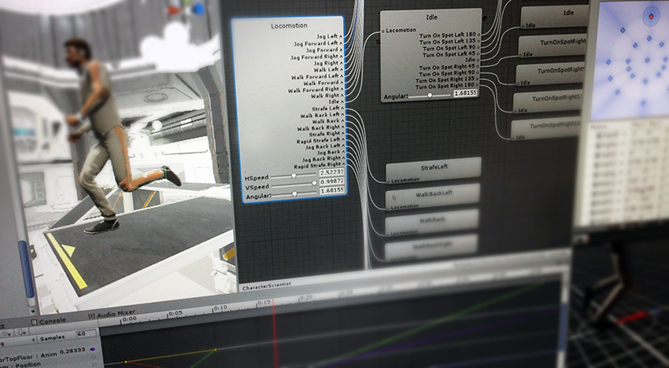

#动画

Unity 的动画功能包括可重定向动画、运行时对动画权重的完全控制、动画播放中的事件调用、复杂的状态机层级视图和过渡、面部动画的混合形状等等。

请通过阅读本部分，了解如何导入和使用导入的动画，以及如何在 Unity 本身内动画化对象、颜色和任何其他参数。

**相关教程：**[动画 (Animation)](http://unity3d.com/learn/tutorials/topics/animation)

请参阅[知识库动画 (Knowledge Base Animation) 部分](https://support.unity3d.com/hc/en-us/sections/201271005-Animation)了解提示、技巧和故障排除信息。
