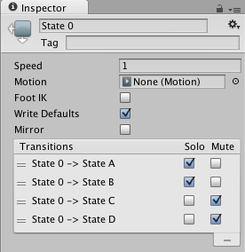
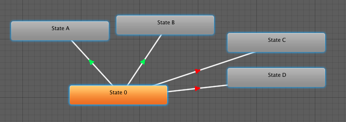

#Solo 和 Mute 功能

在复杂状态机中，分别预览状态机某些部分的运行情况是很有用的做法。为此，您可以使用 Mute（静音）/Solo（独奏）功能。Mute 表示将禁用过渡。而 Solo 功能将启用过渡，并与源自同一状态的其他过渡有关。您可以从 __Transition Inspector__ 或 __State Inspector__（推荐）窗口中设置静音和独奏状态（在此窗口中可查看源自该状态的所有过渡）。

 

独奏的过渡将以绿色显示，而静音的过渡将以红色显示，如下所示：

 

在上述示例中，如果您处于 `State 0`，只能过渡到 `State A` 和 `State B`。

* 基本的经验法则是，如果勾选一个 Solo，源自该状态的其余过渡将静音。
* 如果同时勾选 Solo 和 Mute，则 Mute 将优先执行。

已知问题：

* 控制器图当前并非始终反映引擎的内部静音状态。

