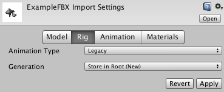

# 旧版动画系统

在引入 Mecanim 之前，Unity 使用过一种更简单的动画系统。为了向后兼容，该系统仍然可用。使用旧版动画系统的主要原因是可以继续直接处理旧项目，而无需为了 Mecanim 更新该项目。但是，建议不要将旧版系统用于新项目。

## 处理旧版动画

要导入旧版动画，必须先在 [Import Settings 窗口的 Rig 选项卡](FBXImporter-Rig.html)中将 __Animation Type__ 设置为 __Legacy__：

务必启用 [Animation 选项卡](class-AnimationClip.html)上的 __Import Animation__ 选项。

---

*  2018-04-25  Page amended with limited [editorial review](DocumentationEditorialReview.html)

