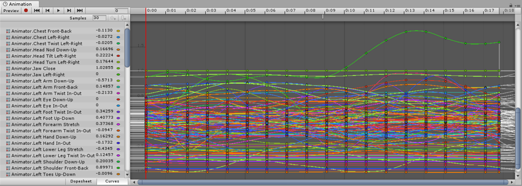

#外部来源的动画

外部来源的动画按照与常规 3D 文件相同的方式导入 Unity。这些文件（无论是通用 FBX 文件还是来自 Maya、Cinema 4D、3D Studio Max 等 3D 软件的原生格式）可包含动画数据，这些数据的形式为文件中对象移动的线性录制结果。

在某些情况下，要动画化的对象（例如角色）以及随附的动画可能存在于同一文件中。在其他情况下，动画可能存在于与动画化模型相分离的文件中。

动画可能是特定模型所特有的，不能在其他模型上复用。例如，游戏中的最终 boss 巨型章鱼可能具有独特的肢体和骨骼排列，因此有自己的一组动画。

在其他情况下，您可能拥有一个动画库，这些动画将用于场景中的各种不同模型。例如，许多不同的人形角色可能都使用相同的行走和奔跑动画。在这些情况下，为了预览动画文件，在这些文件中使用简单占位模型是很常见的做法。或者可以使用只有动画数据而没有几何体的动画文件。

导入多个动画时，每个动画可以在项目文件夹中以单独文件形式存在，或者如果先前以连续片段形式从 Motion Builder 或使用 Maya、Max 或其他 3D 包的插件/脚本导出了 FBX 文件，您可以从单个 FBX 文件提取多个动画剪辑。如果您的文件包含了在单个时间轴上排列的多个单独动画，您可能需要执行此操作。例如，长时间的运动捕捉时间轴可能包含几个不同跳跃动作的动画，而您可能希望剪切其中的某些部分以用作单个剪辑而丢弃其余部分。Unity 提供了动画剪切工具来实现此目的；当您在一个时间轴中导入所有动画时，这些工具允许您为每个剪辑选择帧范围。

##导入动画文件

在 Unity 中使用任何动画之前，必须先将其导入项目。Unity 可导入本机 Maya（.mb 或 .ma）、3D Studio Max (.max) 和 Cinema 4D (.c4d) 文件以及通用 FBX 文件（这些文件[可从大多数动画包中导出](HOWTO-exportFBX.html)）。

有关更多信息，请参阅[导入](ImportingAssets.html)。

##在导入的动画文件中查看和复制数据

您可以在 Animation 窗口中查看导入的动画剪辑的关键帧和曲线。有时，如果这些导入的剪辑存在带有大量关键帧的很多骨骼，信息量可能非常复杂。例如，下图是 Animation 窗口中的人形奔跑动画的情况：

 

为了简化视图，请选择您希望检查的特定骨骼。然后，Animation 窗口仅显示这些骨骼的关键帧或曲线。

查看导入的动画关键帧时，Animation 窗口提供动画数据的只读视图。要编辑此数据，请在 Unity 中创建新的空动画剪辑（请参阅[创建新动画剪辑](animeditor-CreatingANewAnimationClip.html)），然后选择、复制导入的动画剪辑的动画数据并将其粘贴到新的可写动画剪辑中。

---

*  2018-04-25  Page amended with limited [editorial review](DocumentationEditorialReview.html)

