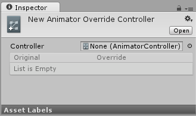
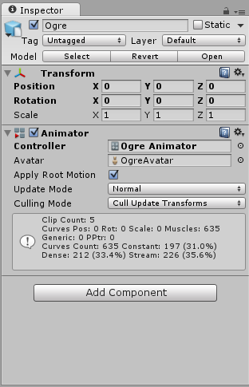

#Animator Override Controller

Animator Override Controller 是一种资源，它可让您扩展现有 Animator Controller，从而替换使用的特定动画但保留其原始结构、参数和逻辑。

因此，您可以创建同一个基本状态机的多个变体，但是每个变体使用不同的动画集。例如，您的游戏可能有各种各样的 NPC 类角色生活在世界上，但每种类型（小妖精、恶魔、小精灵等）都有自己独特的行走、空闲、坐定等动画。

通过创建一个包含所有 NPC 类型角色逻辑的“基础”Animator Controller，即可为每种角色类型创建一个重写，并放入各自的动画文件。

以下是一个用于演示的典型Animator Controller资源：

 

这代表一个Animator Controller，其中包含一个简单状态机，由混合树控制四个方向的动画，还有一个空闲动画，如下所示：

 

为了扩展此通用 NPC 状态机来使用仅适用于（比如）恶魔型角色的独特动画，您可以创建一个Animator Override Controller，并放入恶魔的动画剪辑以替换原始动画剪辑。恶魔可能有不同的空闲和四处游走方式，可能采取更缓慢、更狂暴和更有力的动作。但是，通过使用Animator Override Controller，如何在运动状态之间进行过渡和混合的基本逻辑可被具有不同动画集的不同角色所共享，从而减少构建和修改状态机本身所需的工作量。

要创建新的Animator Override Controller，请使用 **Assets > Create** 菜单，或 Project 视图中的 **Create** 按钮，然后选择 Animator Override Controller。

Animator Override Controller具有与Animator Controller非常相似的图标，不同之处在于它在图标角上带有“加号”而不是“播放”符号：

在检视面板中选择新的 Animator Override Controller 时，最初会处于未分配状态，如下所示：

要开始使用Override Controller，必须将原始控制器资源分配给检视面板中的新Override Controller。完成此操作后，原始控制器中使用的所有动画将在 Override Controller 的检视面板中显示为列表：

然后，您可以分配新动画剪辑以重写原始剪辑。在此示例中，已使用动画的“恶魔”(Ogre) 版本重写所有剪辑。

现在，此 Override Controller 可在Ogre角色的游戏对象的 Animator 组件中使用，就像它是 Animator Controller 一样。它将使用与原始 Animator Controller 相同的逻辑，但播放的是分配的新动画而不是原始动画。

