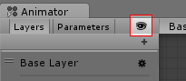

Animator 窗口
================================

在 Animator 窗口中可创建、查看和修改 Animator Controller 资源。

Animator 窗口有两个主要部分：主要网格化布局区域以及左侧 Layers 和 Parameters 面板。

带有深灰色网格的主要部分是布局区域。使用此区域可在[Animator Controller](Animator.html)中创建、排列和连接状态。

您可以右键单击该网格以创建新的状态节点。使用鼠标中键或按住 Alt/Option 键拖拽可平移视图。通过单击可选择状态节点以进行编辑，而通过单击并拖动状态节点可重新排列状态机的布局。

左侧面板可在 Parameters 视图和 Layers 视图之间切换。Parameters 视图
允许您创建、查看和编辑 [Animator Controller 参数](AnimationParameters.html)。这些参数是您定义的变量，充当状态机的输入。要添加参数，请单击加号图标，然后从弹出菜单中选择参数类型。要删除参数，请在列表中选择参数，然后按 Delete 键（在 macOS 上使用 fn-Delete 来删除所选参数）。

左侧面板切换到 Layers 视图时，您可以在 Animator Controller 中创建、查看和编辑[层](AnimationLayers.html)。因此，可在单个动画控制器中同时运行多个动画层，每个动画层由一个单独状态机控制。此情况的常见用途是在控制角色一般运动动画的基础层之上设置一个单独层来播放上身动画。

要添加层，请单击加号图标。要删除层，请选择该层并按 Delete 键。

单击“眼睛”图标开关即可显示或隐藏 Parameters 和 Layers 侧面板，从而为您提供更多空间来查看和编辑状态机。

当前状态机内的“示踪导航”分层位置。状态可包含[子状态](NestedStateMachines.html)和[树](class-BlendTree.html)，这些结构可以反复嵌套。当进入子状态时，此处会列出父状态的层级视图以及当前查看的状态。单击父状态可跳回到父状态或直接返回到状态机的基础层。

启用锁图标将使 Animator 窗口聚焦于当前状态机。锁图标为关闭状态时，如果单击新的 Animator 资源或带有 Animator 组件的游戏对象，则会切换 Animator 窗口以显示该项的状态机。锁定该窗口后，无论选择其他任何资源或游戏对象，Animator 窗口均一直显示同一状态机。

