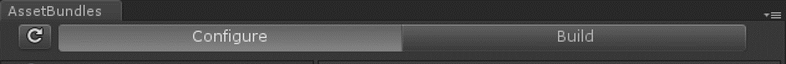
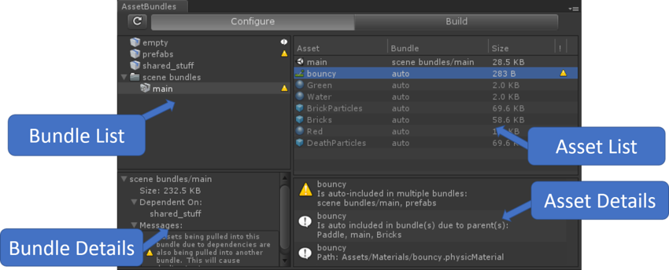

# Unity Asset Bundle Browser 工具

**注意**：此工具是 Unity 标准功能之外的额外功能。要访问此工具，必须从 [GitHub](https://github.com/Unity-Technologies/AssetBundles-Browser) 下载并安装，该过程独立于标准 Unity Editor 的下载和安装。

此工具使用户能够查看和编辑 Unity 项目的资源包的配置。它将阻止会创建无效捆绑包的编辑，并告知现有捆绑包的任何问题。此外还会提供基本的构建功能。

通过使用此工具，无需选择资源并在 Inspector 中手动设置资源包。它可以放入 5.6 或更高版本的任何 Unity 项目中。此工具将在 __Window__ > __AssetBundle Browser__ 中创建一个新菜单项。捆绑包的配置和构建功能在新窗口中拆分为两个选项卡。

 

### 需要 Unity 5.6+

# 用法 - 配置 (Configure)

注意：此实用程序处于预发布状态，因此我们建议在使用之前创建项目的备份。

此窗口提供了一个类似资源管理器的界面，用于管理和修改项目中的资源包。首次打开时，该工具将在后台解析所有捆绑包数据，缓慢标记所检测到的警告或错误。它会尽其所能与项目保持同步，但不能始终了解工具之外的活动。要强制快速刷新错误检测，或者使用外部更改来更新工具，请单击左上角的 Refresh 按钮。

该窗口分为四个部分：捆绑包列表、捆绑包详细信息、资源列表和资源详细信息。 

### 捆绑包列表

左侧面板显示项目中所有捆绑包的列表。可用功能：

* 选择一个或一组捆绑包在资源列表面板中查看捆绑包中的资源列表。

* 带变体的捆绑包为深灰色，可以展开来显示变体列表。

* 右键单击或慢速双击可重命名捆绑包或捆绑包文件夹。

* 如果捆绑包有任何错误、警告或信息消息，则右侧会出现一个图标。将鼠标悬停在图标上可获取更多信息。

* 如果一个捆绑包中至少有一个场景（使其成为一个场景捆绑包）和显式包含的非场景资源，它将被标记为有错误。在修复之前不会构建此捆绑包。

* 具有重复资源的捆绑包将标有警告（下面“资源列表”部分中提供关于重复的更多信息）

* 空捆绑包将标有信息消息。由于多种原因，空捆绑包不是很稳定，有时可能会从此列表中消失。

* 捆绑包的文件夹将使用包含的捆绑包中的最高消息进行标记。

* 要解决捆绑包中包含的重复资源，可以采取以下操作：

    * 右键单击单个捆绑包可将确定为重复的所有资源移动到新捆绑包中。

    * 右键单击多个捆绑包，将资源从所有选定的重复捆绑包移动到新捆绑包中，或仅移动到选定项中共享的捆绑包。

    * 还可以将重复资源从资源列表面板拖到捆绑包列表中，从而将它们显式包含在捆绑包中。如需了解与此相关的更多信息，请参阅下面的资源列表功能集。

* 右键单击或按 DEL 键可删除捆绑包。

* 拖动捆绑包可将它们移入和移出文件夹，或合并它们。

* 将资源从 Project Explorer 拖到捆绑包中可添加资源。

* 将资源拖到空白区域可创建新捆绑包。

* 右键单击可创建新捆绑包或捆绑包文件夹。

* 右键单击“Convert to Variant”可转换为变体

    * 这将为所选捆绑包添加一个变体（最初称为“newvariant”）。

    * 当前处于选定捆绑包中的所有资源都将移至新变体中

    * 即将发布：检测变体之间的不匹配。
    
图标表示捆绑包是标准捆绑包还是场景捆绑包。

### 捆绑包详细信息

左下方面板显示捆绑包列表面板中的选定捆绑包的详细信息。此面板将显示以下信息（如果有）：

* 捆绑包总大小。这是所有资源占用的磁盘大小总和。

* 当前捆绑包依赖的捆绑包

* 与当前捆绑包关联的任何消息（错误/警告/信息）。

### 资源列表

右上方面板提供捆绑包列表中选择的任何捆绑包中包含的资源列表。可用功能：

* 查看预计包含在捆绑包中的所有资源。按任何列标题对资源列表排序。

* 查看显式包含在捆绑包中的资源。这些是已显式分配给捆绑包的资源。Inspector 将反映包含的捆绑包，在此视图中，它们将在资源名称旁边显示捆绑包名称。

* 查看隐式包含在捆绑包中的资源。这些资源将对资源名称旁边的捆绑包的名称显示 *auto*。如果在 Inspector 中查看这些资源，它们将对分配的捆绑包显示 *None*。

    * 由于对另一个包含资源的依赖关系，这些资源已经添加到所选捆绑包。只有未显式分配给捆绑包的资源才会隐式包含在捆绑包中。

    * 请注意，此隐式包含列表可能不完整。材质和纹理存在并非始终正确显示的已知问题。

    * 由于多个资源可以共享依赖关系，因此将给定资源隐式包含在多个捆绑包中是很常见的。如果该工具检测到这种情况，将使用警告图标来标记捆绑包和相关资源。

    * 要修复重复包含项的警告，可以手动将资源移动到新捆绑包中，或者右键单击捆绑包并选择“Move duplicate”选项之一。

* 将资源从 Project Explorer 拖到此视图中可将它们添加到选定的捆绑包中。仅当选择了一个捆绑包并且资源类型可兼容（将场景拖放到场景捆绑包上等）时，此选项才有效。

* 将资源（显式或隐式）从资源列表拖到捆绑包列表中（将它们添加到不同的捆绑包或新创建的捆绑包）。

* 右键单击或按 DEL 键可从捆绑包中删除资源（不从项目中删除资源）。

* 选择或双击资源可在 Project Explorer 中显示它们。

请注意关于在捆绑包中包含文件夹的说明。可以将资源文件夹（从 Project Explorer）分配给捆绑包。在浏览器中查看时，文件夹本身将列为显式，而内容为隐式。这反映了用于将资源分配给捆绑包的优先级系统。例如，假设游戏在 Assets/Prefabs 中有五个预制件，然后将文件夹“Prefabs”标记为一个捆绑包，并将其中一个实际预制件（“PrefabA”）标记为另一个捆绑包。构建后，“PrefabA”将在一个捆绑包中，其他四个预制件将在另一个捆绑包中。

### 资源详细信息

右下方面板可显示在资源列表面板中选择的资源的详细信息。此面板不具有交互性，但会显示以下信息（如果有）：

* 资源的完整路径。

* 隐式包含在捆绑包中的原因（如果为隐式）。

* 警告的原因（如果有警告）。

* 错误的原因（如果有错误）。

### 故障排除

* *无法重命名或删除特定的捆绑包。*首次将此工具添加到现有项目时偶尔会导致此问题。请通过 Unity 菜单系统强制重新导入资源来刷新数据。

### 外部工具集成
可以将生成资源包数据的其他工具与浏览器集成。目前，主要的例子是[资源包图形工具 (Asset Bundle Graph Tool)](https://bitbucket.org/Unity-Technologies/assetbundlegraphtool)。如果检测到集成，则会在浏览器顶部附近显示一个选择栏。在此栏中可以选择默认数据源（Unity 的 AssetDatabase）或集成的工具。如果没有检测到，则选择器不显示，但可以通过右键单击选项卡标题并选择“Custom Sources”来添加工具。

# 用法 - 构建 (Build)

Build 选项卡提供基本构建功能来帮助您开始使用资源包。在大多数专业情况下，用户最后需要更高级的构建设置。如果无法满足需求，任何人都可以使用此工具中的构建代码作为一个起点来编写自己的代码。界面：

* *Build Target* - 构建捆绑包的目标平台

* *Output Path* - 用于保存构建的捆绑包的路径。默认为 AssetBundles/。可以手动编辑该路径，也可以选择“Browse”。要恢复默认命名约定，请点击“Reset”。

* *Clear Folders* - 在构建之前删除构建路径文件夹中的所有数据。

* *Copy to StreamingAssets* - 构建完成后，将结果复制到 Assets/StreamingAssets。对测试很有用，但不会用于生产。

* *Advanced Settings*

    * *Compression* - 在无压缩、标准 LZMA 压缩或基于块的 LZ4 压缩之间进行选择。

    * *Exclude Type Information* - 在资源包中不包括类型信息

    * *Force Rebuild* - 重新构建需要构建的捆绑包。与“Clear Folders”不同，因为此选项不会删除不再存在的捆绑包。

    * *Ignore Type Tree Changes* - 在执行增量构建检查时忽略类型树更改。

    * *Append Hash* - 将哈希附加到资源包名称。

    * *Strict Mode* - 如果在此期间报告任何错误，则构建无法成功。

    * *Dry Run Build* - 进行干运行构建。

* *Build* - 执行构建。

  

---

*  2017-05-18  Page published with limited [editorial review](DocumentationEditorialReview.html)

* 5.6 中的新功能
