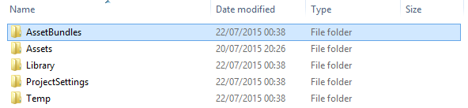

# AssetBundle Manager

The AssetBundle Manager is deprecated and is no longer available in the Asset Store. You can still download it from the AssetBundleDemo [Bitbucket repository](https://bitbucket.org/Unity-Technologies/assetbundledemo).

The AssetBundle Manager is a tool made by Unity to make using AssetBundles more streamlined.

下载和导入 AssetBundle Manager 软件包不仅会添加新的 API 调用来加载和使用 AssetBundle，还会添加一些 Editor 功能来简化工作流程。可以在 Assets 菜单选项下找到此功能。

这个新的部分将包含以下选项：

## 模拟模式

启用模拟模式允许 AssetBundle Manager 使用 AssetBundle，但不需要实际构建捆绑包本身。编辑器会查看已分配到 AssetBundle 的资源并直接使用资源，而不实际从 AssetBundle 中提取资源。

使用模拟模式的主要优点是可以修改、更新、添加和删除资源，而无需每次都重新构建和部署 AssetBundle。

值得注意的是，AssetBundle 变体不适用于模拟模式。如果需要使用变体，可以选择本地 AssetBundle 服务器 (Local AssetBundle Server)。

##本地 AssetBundle 服务器

AssetBundle Manager 还可以启动本地 AssetBundle 服务器，该服务器可用于在编辑器或本地构建（包括移动端）中测试 AssetBundle。

要让本地 AssetBundle 服务器工作，规定必须在项目的根目录中创建一个名为 AssetBundles 的文件夹，该文件夹与 Assets 文件夹应处于同一级别。例如：

 

创建文件夹后，需要将 AssetBundle 构建到此文件夹。为此，请从新菜单选项中选择 Build AssetBundles。随后会将资源包构建到该目录。

现在已经构建了 AssetBundle（或已决定使用模拟模式），并准备开始加载 AssetBundle。让我们看看通过 AssetBundle Manager 可以使用的新 API 调用。

## AssetBundleManager.Initialize()

此函数将加载 AssetBundleManifest 对象。开始使用 AssetBundle Manager 在资源中加载此对象之前，需要首先调用此对象。在一个非常简单的示例中，初始化 AssetBundle Manager 可能如下所示：

```
IEnumerator Start()

{
	yield return StartCoroutine(Initialize());
}
IEnumerator Initialize()
{
	var request = AssetBundleManager.Initialize();
if (request != null)
	yield return StartCoroutine(request);
}
```

AssetBundle Manager 使用在 Initialize() 期间加载的清单来帮助处理幕后的许多功能，包括依赖项管理。

## 加载资源

让我们直截了当一点。当前您正在使用 AssetBundle Manager，已对其进行初始化，现在已准备好加载一些资源。我们来看看如何加载 AssetBundle 并从该捆绑包实例化一个对象：

```
IEnumerator InstantiateGameObjectAsync (string assetBundleName, string assetName)

{
	// 从 assetBundle 加载资源。
	AssetBundleLoadAssetOperation request = AssetBundleManager.LoadAssetAsync(assetBundleName, assetName, typeof(GameObject) );
	if (request == null)
		yield break;
	yield return StartCoroutine(request);
	// 获取资源。
	GameObject prefab = request.GetAsset<GameObject> ();
	if (prefab != null)
		GameObject.Instantiate(prefab);
}
```

AssetBundle Manager 异步执行所有加载操作，因此会返回一个加载操作请求，该请求在调用 yield return StartCoroutine(request); 时加载包。此后我们需要做的就是调用 GetAsset\<T\>() 以从 AssetBundle 中加载游戏对象。

## 加载场景

如果有一个 AssetBundle 名称分配给一个场景，而且需要加载该场景，那么需要遵循一个稍微不同的代码路径。模式大致相同，但略有区别。从 AssetBundle 加载场景的方法如下：

```
IEnumerator InitializeLevelAsync (string levelName, bool isAdditive)

{
	// 从 assetBundle 加载关卡。
	AssetBundleLoadOperation request = AssetBundleManager.LoadLevelAsync(sceneAssetBundle, levelName, isAdditive);
	if (request == null)
		yield break;
	yield return StartCoroutine(request);
}
```

如您所见，加载场景也是异步的，LoadLevelAsync 返回一个加载操作请求，需要将其传递给 StartCoroutine 以加载场景。

## 加载变体

使用 AssetBundle Manager 加载变体实际上并不会更改在场景或资源中加载的代码。只需要设置 AssetBundleManager 的 ActiveVariants 属性即可。

ActiveVariants 属性是一个字符串数组。只需构建一个字符串数组，在其中包含在将它们分配给资源时创建的变体的名称。使用 hd 变量加载场景 AssetBundle 的方法如下。

```
IEnumerator InitializeLevelAsync (string levelName, bool isAdditive, string[] variants)

{
	//设置 activeVariants。
	AssetBundleManager.ActiveVariants = variants;
	// 从 assetBundle 加载关卡。
	AssetBundleLoadOperation request = AssetBundleManager.LoadLevelAsync(variantSceneAssetBundle, levelName, isAdditive);
	if (request == null)
		yield break;
	yield return StartCoroutine(request);
}
```

此处将会传入在代码中其他位置构建的字符串数组（可能来自按钮点击或其他情况）。这样将会加载与设定的活动变体相匹配的捆绑包（如果可用）。

---
* <span class="page-edit">2017-05-15  Page published with no [editorial review](DocumentationEditorialReview.html)
</span>


