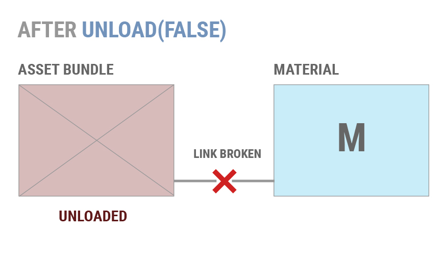
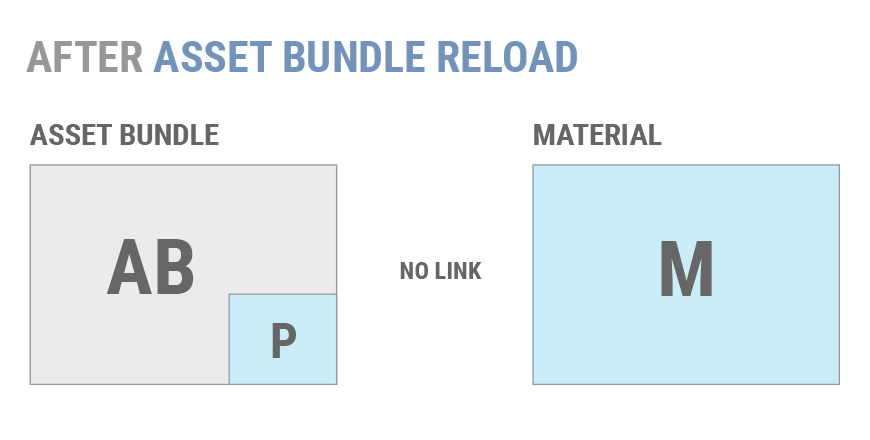

# 本机使用 AssetBundle

可以使用四种不同的 API 来加载 AssetBundle。它们的行为根据加载捆绑包的平台和构建 AssetBundle 时使用的压缩方法（未压缩、LZMA 和 LZ4）而有所不同。

我们必须使用的四个 API 是：

* [AssetBundle.LoadFromMemoryAsync](https://docs.unity3d.com/ScriptReference/AssetBundle.LoadFromMemoryAsync.html?_ga=1.226802969.563709772.1479226228)
* [AssetBundle.LoadFromFile](https://docs.unity3d.com/ScriptReference/AssetBundle.LoadFromFile.html?_ga=1.259297550.563709772.1479226228)
* [WWW.LoadfromCacheOrDownload](https://docs.unity3d.com/ScriptReference/WWW.LoadFromCacheOrDownload.html?_ga=1.226802969.563709772.1479226228)
* [UnityWebRequest](https://docs.unity3d.com/ScriptReference/Networking.UnityWebRequest.html?_ga=1.259297550.563709772.1479226228) 的 [DownloadHandlerAssetBundle ](https://docs.unity3d.com/ScriptReference/Networking.DownloadHandlerAssetBundle.html?_ga=1.264500235.563709772.1479226228)（Unity 5.3 或更高版本）

## AssetBundle.LoadFromMemoryAsync

[AssetBundle.LoadFromMemoryAsync](../ScriptReference/AssetBundle.LoadFromMemoryAsync.html)

此函数采用包含 AssetBundle 数据的字节数组。也可以根据需要传递 CRC 值。如果捆绑包采用的是 LZMA 压缩方式，将在加载时解压缩 AssetBundle。LZ4 压缩包则会以压缩状态加载。

以下是如何使用此方法的一个示例：

```
using UnityEngine;
using System.Collections;
using System.IO;

public class Example : MonoBehaviour
{
    IEnumerator LoadFromMemoryAsync(string path)
    {
        AssetBundleCreateRequest createRequest = AssetBundle.LoadFromMemoryAsync(File.ReadAllBytes(path));
        yield return createRequest;
        AssetBundle bundle = createRequest.assetBundle;
        var prefab = bundle.LoadAsset<GameObject>("MyObject");
        Instantiate(prefab);
    }
}
```

但是，这不是实现 LoadFromMemoryAsync 的唯一策略。File.ReadAllBytes(path) 可以替换为获得字节数组的任何所需过程。

## AssetBundle.LoadFromFile
[AssetBundle.LoadFromFile](../ScriptReference/AssetBundle.LoadFromFile.html)

从本地存储中加载未压缩的捆绑包时，此 API 非常高效。如果捆绑包未压缩或采用了数据块 (LZ4) 压缩方式，LoadFromFile 将直接从磁盘加载捆绑包。使用此方法加载完全压缩的 (LZMA) 捆绑包将首先解压缩捆绑包，然后再将其加载到内存中。

如何使用 `LoadFromFile` 的一个示例：

```
public class LoadFromFileExample extends MonoBehaviour {
	function Start() {
		var myLoadedAssetBundle = AssetBundle.LoadFromFile(Path.Combine(Application.streamingAssetsPath, "myassetBundle"));
		if (myLoadedAssetBundle == null) {
			Debug.Log("Failed to load AssetBundle!");
			return;
		}
		var prefab = myLoadedAssetBundle.LoadAsset.<GameObject>("MyObject");
		Instantiate(prefab);
	}
}
```

注意：在使用 Unity 5.3 或更早版本的 Android 设备上，尝试从流媒体资源 (Streaming Assets) 路径加载 AssetBundle 时，此 API 将失败。这是因为该路径的内容将驻留在压缩的 .jar 文件中。Unity 5.4 和更高版本则可以将此 API 调用与流媒体资源一起使用。

## WWW.LoadFromCacheOrDownload
[WWW.LoadFromCacheOrDownload](../ScriptReference/WWW.LoadFromCacheOrDownload.html)

__即将弃用（使用 UnityWebRequest）__

此 API 对于从远程服务器下载 AssetBundle 或加载本地 AssetBundle 非常有用。这是一个陈旧且不太理想的 UnityWebRequest API 版本。

从远程位置加载 AssetBundle 将自动缓存 AssetBundle。如果 AssetBundle 被压缩，则将启动工作线程来解压缩捆绑包并将其写入缓存。一旦捆绑包被解压缩并缓存，它就会像 AssetBundle.LoadFromFile 一样加载。

如何使用 `LoadFromCacheOrDownload` 的一个示例：

```
using UnityEngine;
using System.Collections;

public class LoadFromCacheOrDownloadExample : MonoBehaviour
{
    IEnumerator Start ()
    {
            while (!Caching.ready)
                    yield return null;

        var www = WWW.LoadFromCacheOrDownload("http://myserver.com/myassetBundle", 5);
        yield return www;
        if(!string.IsNullOrEmpty(www.error))
        {
            Debug.Log(www.error);
            yield return;
        }
        var myLoadedAssetBundle = www.assetBundle;

        var asset = myLoadedAssetBundle.mainAsset;
    }
}
```

由于在 WWW 对象中缓存 AssetBundle 字节所需的内存开销，建议所有使用 WWW.LoadFromCacheOrDownload 的开发人员都应该确保自己的 AssetBundle 保持较小的大小 - 最多只有几兆字节。此外，还建议在有限内存平台（如移动设备）上运行的开发人员确保其代码一次只下载一个 AssetBundle，以此避免内存峰值。

如果缓存文件夹没有任何空间来缓存其他文件，LoadFromCacheOrDownload 将以迭代方式从缓存中删除最近最少使用的 AssetBundle，直到有足够的空间来存储新的 AssetBundle。如果无法腾出空间（因为硬盘已满，或者缓存中的所有文件当前都处于使用状态），LoadFromCacheOrDownload() 将不会使用缓存，而将文件流式传输到内存中

为了强制执行 LoadFromCacheOrDownload，需要更改版本参数（第二个参数）。仅当传递给函数的版本与当前缓存的 AssetBundle 的版本匹配，才会从缓存加载 AssetBundle。

## UnityWebRequest

[UnityWebRequest](../ScriptReference/Networking.UnityWebRequest.GetAssetBundle.html)

UnityWebRequest 有一个特定 API 调用来处理 AssetBundle。首先，需要使用 `UnityWebRequest.GetAssetBundle` 来创建 Web 请求。返回请求后，请将请求对象传递给 `DownloadHandlerAssetBundle.GetContent(UnityWebRequest)`。`GetContent` 调用将返回 AssetBundle 对象。

下载捆绑包后，还可以在 [DownloadHandlerAssetBundle](../ScriptReference/Networking.DownloadHandlerAssetBundle.html) 类上使用 `assetBundle` 属性，从而以 `AssetBundle.LoadFromFile` 的效率加载 AssetBundle。

以下示例说明了如何加载包含两个游戏对象的 AssetBundle 并实例化这些游戏对象。要开始这个过程，我们只需要调用 `StartCoroutine(InstantiateObject())`;

```
IEnumerator InstantiateObject()

    {
        string uri = "file:///" + Application.dataPath + "/AssetBundles/" + assetBundleName;        UnityEngine.Networking.UnityWebRequest request = UnityEngine.Networking.UnityWebRequest.GetAssetBundle(uri, 0);
        yield return request.Send();
        AssetBundle bundle = DownloadHandlerAssetBundle.GetContent(request);
        GameObject cube = bundle.LoadAsset<GameObject>("Cube");
        GameObject sprite = bundle.LoadAsset<GameObject>("Sprite");
        Instantiate(cube);
        Instantiate(sprite);
    }
```

使用 UnityWebRequest 的优点在于，它允许开发人员以更灵活的方式处理下载的数据，并可能消除不必要的内存使用。这是比 UnityEngine.WWW 类更新和更优的 API。

#### 从 AssetBundle 加载资源

现在已经成功下载 AssetBundle，因此是时候最终加载一些资源了。

通用代码片段：

```
T objectFromBundle = bundleObject.LoadAsset<T>(assetName);
```

T 是尝试加载的资源类型。

决定如何加载资源时有几个选项。我们有 `LoadAsset`、`LoadAllAssets` 及其各自的异步对应选项 `LoadAssetAsync` 和 `LoadAllAssetsAsync`。

同步从 AssetBundle 加载资源的方法如下：

加载单个游戏对象：

```
GameObject gameObject = loadedAssetBundle.LoadAsset<GameObject>(assetName);
```

加载所有资源：

```
Unity.Object[] objectArray = loadedAssetBundle.LoadAllAssets();
```

现在，在前面显示的方法返回要加载的对象类型或对象数组的情况下，异步方法返回 [AssetBundleRequest](../ScriptReference/AssetBundleRequest.html)。在访问资源之前，需要等待此操作完成。加载资源：

```
AssetBundleRequest request = loadedAssetBundleObject.LoadAssetAsync<GameObject>(assetName);
yield return request;
var loadedAsset = request.asset;
```

以及

```
AssetBundleRequest request = loadedAssetBundle.LoadAllAssetsAsync();
yield return request;
var loadedAssets = request.allAssets;
```

加载资源后，就可以开始了！可以像使用 Unity 中的任何对象一样使用加载的对象。

#### 加载 AssetBundle 清单

加载 AssetBundle 清单可能非常有用。特别是在处理 AssetBundle 依赖关系时。

要获得可用的 [AssetBundleManifest](../ScriptReference/AssetBundleManifest.html) 对象，需要加载另外的 AssetBundle（与其所在的文件夹名称相同的那个）并从中加载 AssetBundleManifest 类型的对象。

加载清单本身的操作方法与 AssetBundle 中的任何其他资源完全相同：

```
AssetBundle assetBundle = AssetBundle.LoadFromFile(manifestFilePath);
AssetBundleManifest manifest = assetBundle.LoadAsset<AssetBundleManifest>("AssetBundleManifest");
```

现在，可以通过上面示例中的清单对象访问 `AssetBundleManifest` API 调用。从这里，可以使用清单获取所构建的 AssetBundle 的相关信息。此信息包括 AssetBundle 的依赖项数据、哈希数据和变体数据。

别忘了在前面的部分中，我们讨论过 AssetBundle 依赖项以及如果一个捆绑包对另一个捆绑包有依赖性，那么在从原始捆绑包加载任何资源之前，需要加载哪些捆绑包？清单对象可以动态地查找加载依赖项。假设我们想要为名为“assetBundle”的 AssetBundle 加载所有依赖项。

```
AssetBundle assetBundle = AssetBundle.LoadFromFile(manifestFilePath);
AssetBundleManifest manifest = assetBundle.LoadAsset<AssetBundleManifest>("AssetBundleManifest");
string[] dependencies = manifest.GetAllDependencies("assetBundle"); //传递想要依赖项的捆绑包的名称。
foreach(string dependency in dependencies)
{
	AssetBundle.LoadFromFile(Path.Combine(assetBundlePath, dependency));
}
```

现在已经加载 AssetBundle、AssetBundle 依赖项和资源，因此是时候讨论如何管理所有这些已加载的 AssetBundle 了。

##管理已加载的 AssetBundle

另请参阅：Unity 学习教程 - [管理已加载的 AssetBundle (Managing Loaded AssetBundles)](https://unity3d.com/fr/learn/tutorials/topics/best-practices/assetbundle-usage-patterns#Managing_Loaded_Assets)

从活动场景中删除对象时，Unity 不会自动卸载对象。资源清理在特定时间触发，也可以手动触发。

了解何时加载和卸载 AssetBundle 非常重要。不正确地卸载 AssetBundle 会导致在内存中复制对象或其他不良情况，例如缺少纹理。

关于 AssetBundle 管理最重要的事情就是何时调用

[AssetBundle.Unload(bool)](../ScriptReference/AssetBundle.Unload.html); 以及应该将 true 还是 false 传递给函数调用。Unload 是一个非静态函数，可用于卸载 AssetBundle。此 API 会卸载正在调用的 AssetBundle 的标头信息。该参数指示是否还要卸载通过此 AssetBundle 实例化的所有对象。

`AssetBundle.Unload(true)` 卸载从 AssetBundle 加载的所有游戏对象（及其依赖项）。这不包括复制的游戏对象（例如实例化的游戏对象），因为它们不再属于 AssetBundle。发生这种情况时，从该 AssetBundle 加载的纹理（并且仍然属于它）会从场景中的游戏对象消失，因此 Unity 将它们视为缺少纹理。

假设材质 M 是从 AssetBundle AB 加载的，如下所示。

如果调用 AB.Unload(true)，活动场景中的任何 M 实例也将被卸载并销毁。

如果改作调用 AB.Unload(false)，那么将会中断 M 和 AB 当前实例的链接关系。

 

如果稍后再次加载 AB 并且调用 AB.LoadAsset()，则 Unity 不会将现有 M 副本重新链接到新加载的材质。而是将加载 M 的两个副本。

 

 

通常，使用 `AssetBundle.Unload(false)` 不会带来理想情况。大多数项目应该使用 `AssetBundle.Unload(true)` 来防止在内存中复制对象。

大多数项目应该使用 `AssetBundle.Unload(true)` 并采用一种方法来确保对象不会重复。两种常用方法是：

* 在应用程序生命周期中具有明确定义的卸载瞬态 AssetBundle 的时间点，例如在关卡之间或在加载屏幕期间。

* 维护单个对象的引用计数，仅当未使用所有组成对象时才卸载 AssetBundle。这允许应用程序卸载和重新加载单个对象，而无需复制内存。

如果应用程序必须使用 `AssetBundle.Unload(false)`，则只能以两种方式卸载单个对象：

* 在场景和代码中消除对不需要的对象的所有引用。完成此操作后，调用 [Resources.UnloadUnusedAssets](../ScriptReference/Resources.UnloadUnusedAssets.html)。

* 以非附加方式加载场景。这样会销毁当前场景中的所有对象并自动调用 [Resources.UnloadUnusedAssets](../ScriptReference/Resources.UnloadUnusedAssets.html)。

如果不想自己管理加载资源包、依赖项和资源，可能需要使用 AssetBundle Manager。

---

* <span class="page-edit">2017-05-15  Page published with no [editorial review](DocumentationEditorialReview.html)
</span>
