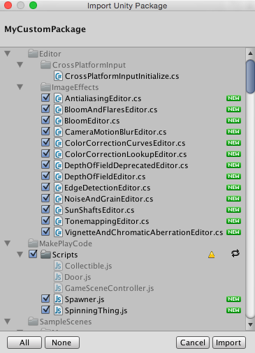

# 资源包

Unity 使用两种类型的资源包：

* Unity __Asset Store__ 中提供的**资源包**，允许共享和重复使用 Unity 项目和资源集合。
* **Unity 资源包**，可通过 [Package Manager 窗口](https://docs.unity3d.com/Packages/com.unity.package-manager-ui@latest/index.html)获取。可以使用此类型的资源包导入各种资源，包括直接在 Unity 中导入插件。

本部分提供有关在 Unity 中使用资源包的信息。

## 资源包

Unity __标准资源 (Standard Assets)__ 和 Unity __Asset Store__ 中的项以资源包的形式提供，
这些资源包是 Unity 项目中的文件和数据的集合，或项目的元素，
它们被压缩并存储在一个类似于 zip 文件的文件中。
与 zip 文件一样，资源包在解压缩后保持其原始目录结构，
其中还包括资源的元数据（例如导入设置和指向其他资源的链接）。

在 Unity 中，菜单选项 __Export Package__ 可压缩并存储这些集合，
而 __Import Package__ 将集合解压缩到当前打开的 Unity 项目中。

本页面包含以下相关信息：

* [导入资源包](#ImportingPackages)（__标准资源__包和自定义资源包）
* [导出资源包](#ExportingPackages)（新的和更新的资源包）

 
## 导入资源包
可以导入__标准资源包__（即预先创建并随附于 Unity 的资源集合）和__自定义资源包__（由用户使用 Unity 创建而成）。

选择 __Assets__ &gt; __Import Package__ 可导入这两种类型的资源包。

 
### 导入标准资源

Unity __标准资源__包括多种不同资源包：
__2D、Cameras、Characters、CrossPlatformInput、Effects、Environment、ParticleSystems、Prototyping、Utility、Vehicles__。

要导入新的__标准资源__包，请执行以下操作：

1.打开要向其中导入资源的项目。

2.选择 __Assets__ &gt; __Import Package__，然后从列表中选择要导入的资源包的名称。
此时将显示 __Import Unity Package__ 对话框，并且预先选中了资源包中的所有项，
可以直接安装。（请参阅*图 2：全新安装 Import Unity Package 对话框*。）

3.选择 __Import__，然后 Unity 会将资源包的内容放入到 __Standard Asset__ 文件夹中；
可以从 __Project 视图__中访问此文件夹。

### 导入自定义资源包

可以导入已从自己的项目或其他 Unity 用户创建的项目导出的自定义资源包。

要导入新的自定义资源包，请执行以下操作：

1.打开要向其中导入资源的项目。

2.选择 __Assets__ &gt; __Import Package__ &gt; __Custom Package...__ 以调出文件资源管理器 (Windows) 或 Finder (Mac)。

3.从资源管理器或 Finder 中选择所需的资源包，此时将显示 __Import Unity Package__ 对话框，
其中预先选中了资源包中的所有项，可以直接安装。（请参阅*图 4：全新安装 Import Unity Package 对话框*。）

4.选择 __Import__，然后 Unity 会将资源包的内容放入到 __Assets__ 文件夹中；
可以从 __Project 视图__中访问此文件夹。

### 升级标准资源

在升级 Editor 时不会自动升级标准资源。

在 Unity 中创建新项目时，可以选择在项目中包含__标准资源__集合。Unity 会将所选的资源从 Unity 安装文件夹复制到新项目的文件夹。这意味着，如果将 Unity Editor 升级到较新版本，则已导入项目的__标准资源__不会升级：必须手动升级这些资源。

***提示：***在现有安装中，更高版本的__标准资源__在行为方面可能有所不同（例如，出于性能或质量原因）。更高版本可能会使项目在外观或行为方面有所不同，因此可能需要重新调整其参数。在决定重新安装之前，请检查资源包内容和 Unity 的发行说明。

 
## 导出资源包

使用 __Export Package__ 可创建您自己的__自定义资源包__。

1.打开要从中导出资源的项目。

2.从菜单中选择 __Assets &gt; Export Package...__ 以弹出 __Exporting Package__ 对话框。
（请参阅*图 4：Exporting Package 对话框*。）

3.在此对话框中，通过单击复选框来选择要包含在资源包中的资源。

4.将 __include dependencies__ 复选框保持选中状态，即可自动选择所选资源使用的所有资源。

5.单击 __Export__ 以打开文件资源管理器 (Windows) 或 Finder (Mac)，然后选择要存储资源包文件的位置。

6.为资源包命名，并将其保存任何所需位置。

***提示：***导出资源包时，Unity 也可以导出所有依赖项。
因此，例如，如果选择一个场景并导出包含所有依赖项的资源包，那么也将导出场景中出现的所有模型、
纹理和其他资源。
这是导出大量资源的快捷方法，无需手动定位所有资源。

### 更新资源包

有时可能希望更改资源包的内容并创建资源包的更新版本。
为此需要执行以下操作：

1.选择希望纳入资源包中的资源文件（选择未更改的文件和新文件）。

2.如上文的***导出资源包***中所述，导出文件。

***注意：***可以重命名更新的资源包，而 Unity 会将其识别为更新，因此可以使用增量式命名方式，例如：MyAssetPackageVer1、MyAssetPackageVer2。

***提示：***不建议从资源包中删除文件，然后使用相同名称来替换这些文件：
Unity 会将这些文件识别为不同且可能发生冲突的文件，因此在导入这些文件时会显示警告符号。
如果已删除文件，随后决定恢复此文件，最好给此文件提供一个与原名不同但相关的名称。

重新安装标准资源, 升级标准资源, 升级 Standard Assets, 安装标准资源, 安装 Standard Assets, 导入标准资源, 导入 Standard Assets

---

*  2018-04-25  Page amended with limited [editorial review](DocumentationEditorialReview.html)

