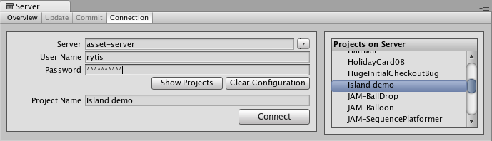
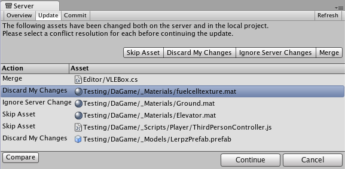
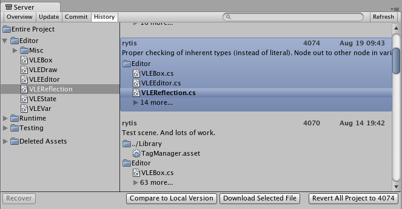
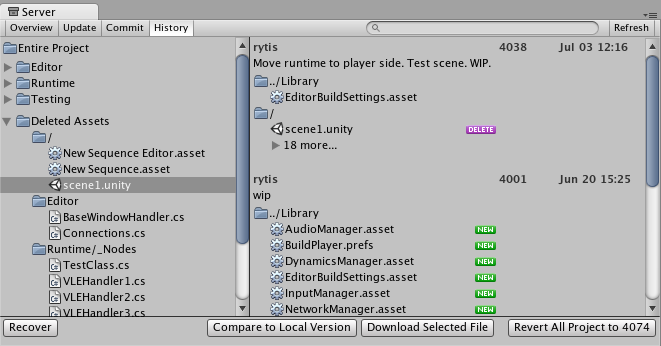

Asset Server（团队许可证）
=======================

|**警告：这是旧版文档** |
|:---|
|注意，从 2017.1 版开始，Asset Server 已被弃用。我们建议在您的Unity项目中使用 Plastic SCM 或 Perforce 进行版本控制。2017-06-30|

Unity Asset Server 概述
---------------------------

[PlasticSCM](plasticSCMIntegration.html)
[PerForce](perForceIntegration.html)

__Unity Asset Server__ 是一个资源和版本控制系统，具有集成到 Unity 中的图形用户界面。团队成员可以借助它进行不同计算机上的项目合作（无论是面对面还是远程的）。为了应对数千兆字节的大型项目文件夹，Asset Server 针对处理大型二进制资源进行了高度优化。上传资源时，还会将每个资源相关的__导入设置 (Import Settings)__ 和其他元数据上传到 Asset Server。对文件进行重命名和移动是该系统的核心，并得到很好的支持。

只有团队许可证用户可使用该产品。要购买团队许可证（如果在 Unity Pro 中未包含该许可证），请访问 Unity 商店进行购买，网址为：[http://unity3d.com/store](http://unity3d.com/store)

请注意，Asset Server 是旧版产品，不再对其进行维护。

Source Control 新手？
----------------------

如果您以前从未使用过 Source Control，那么刚开始使用任何的版本控制系统时都可能会有点不适应。Source Control 是将所有资源（网格、纹理、材质、脚本等等）的完整集合存储在某种服务器上的数据库中。该服务器可以是您用于运行 Unity 的同一台家用计算机，可以是本地网络中的其他计算机，可以是位于世界其他地区的远程机器，甚至可以是虚拟机。有很多选择，但服务器的位置完全不重要。重要的是，您可以通过网络以某种方式访问该服务器，并且该服务器上存储了您的游戏数据。

在某种程度上，Asset Server 用作项目文件夹的备份。在开发过程中，您不直接操作 Asset Server 的内容。您先在本地更改项目，完成后，再__提交更改__到服务器上的项目。这样可使本地项目和 Asset Server 项目完全相同。

现在，当您的同事进行更改时，Asset Server 与他们的项目而不是与您的项目保持一致。为了同步您的本地项目，您需要请求__从服务器更新__。现在，您的团队成员所做的所有更改都将从服务器下载到您的本地项目。

这便是使用 Asset Server 的基本工作流程。除此基本功能外，Asset Server 还允许回滚到资源以前的版本，详细的文件比较，合并两个不同的脚本，解决冲突，以及恢复已删除的资源。

设置 Asset Server
---------------------------

Asset Server 需要一次性的服务器设置和针对每个用户的客户端配置。有关如何配置，请阅读 [Asset Server 设置页面](SettinguptheAssetServer.html)。

本指南的其余部分将介绍如何部署、管理和日常使用 Asset Server。

##Asset Server 的日常使用

本部分介绍日常使用 Asset Server 的常见任务、工作流程和最佳实践。

准备开始
---------------

如果您要加入已经在 Asset Server 上存储了大量工作的团队，正确开始并运行的最快速的方法如下。

1.新建一个未导入任何资源包的空项目
1.打开 __Edit &gt; Project Settings &gt; Editor__ 并选择 __Asset Server__ 作为版本控制模式
1.从菜单栏中选择 __Window &gt; Version Control__
1.单击 __Connection__ 按钮
1.输入您的用户名和密码（由 Asset Server 管理员提供）
1.单击 __Show Projects__ 并选择所需的项目
1.单击 __Connect__
1.单击 __Update__ 选项卡
1.单击 __Update__ 按钮
1.如果发生冲突，放弃所有本地版本
1.等待更新完成
1.您准备好了

工作流程基础知识
---------------------

在多人团队中使用 Asset Server 时，最好在开始工作时从服务器更新所有已更改的资源，并在一天结束时或在完成工作时提交更改。在某个方面取得重大进展时，即使一天的工作尚未结束，您也应提交更改。建议定期并经常提交更改。

了解 Server 视图
-----------------------------

__Server 视图__是您进入所连接的 Asset Server 的窗口。通过选择 __Window &gt; Version Control__ 即可打开 Server 视图。

Server 视图分为多个选项卡：__Overview__、__Update__ 和 __Commit__。__Overview__ 将显示您的本地项目与服务器上的最新版本之间的差异，并提供了快速提交本地更改或下载最新更新的选项。__Update__ 将显示服务器上的最新远程更改，并允许您将它们下载到本地项目。__Commit__ 允许您创建__变更集 (Changeset)__ 并将其提交到服务器供其他人下载。

###连接到服务器

必须先连接到 Asset Server 后才能使用它。为此，请单击 __Connection__ 按钮，随后将显示连接界面：

在此处需要填入：

1.服务器地址
1.用户名
1.密码

通过单击 __Show projects__，现在可看到 Asset Server 上的可用项目，并可通过单击 __Connect__ 选择要连接的项目。请注意，您使用的用户名和密码可以从系统管理员处获得。系统管理员在安装 Asset Server 时创建了帐户。

###从服务器更新

要从服务器下载所有更新，请从 Overview 选项卡中选择 __Update__ 选项卡，随后将显示最新提交的变更集列表。通过选择其中一个变更集，可查看项目中进行的更改以及提供的提交消息。单击 __Update__ 即可开始下载所有变更集更新。

###将更改提交到服务器

当您对本地项目进行了更改并希望将这些更改存储在服务器上时，可使用顶部的 __Commit__ 选项卡。

现在，您将能够看到自上次更新以来在本地对项目所做的所有更改，并且能够选择要上传到服务器的更改。您可以将更改添加到变更集，方法是手动将更改拖到 Changeset 字段中，或者使用 Commit Message 字段下方的按钮。切记，应输入提交消息，此消息将为您在以后比较版本或还原到早期版本时提供帮助信息，这两个问题将在下面讨论。

###解决冲突

多人同时处理同一个数据集合时，不可避免地会出现冲突。切记，没有必要恐慌！如果存在冲突，则在更新项目时将显示 __Conflict Resolution__ 对话框。

在这里将显示每个冲突，并提供解决每个冲突的不同选项。对于任何一个冲突，您可以选择 __Skip Asset__（将不会从服务器下载该资源）、__Discard My Changes__（将完全覆盖该资源的本地版本）或 __Ignore Server Changes__（将忽略其他人对资源所做的更改，并在进行此更新后，您将能够提交本地更改以覆盖服务器上的版本）。此外，对于文本资源（如脚本），可以选择 __Merge__，以将服务器版本与本地版本合并。

**注意：**如果选择放弃更改，资源将更新为服务器上的最新版本（即，资源将包含其他用户在您工作时所做的更改）。如果您希望将资源恢复到您开始工作时的状态，应还原到先前签出的特定版本。（请参阅下面的_浏览修订历史并还原资源_。）

如果在提交本地更改时遇到冲突，Unity 将拒绝提交更改并通知您存在冲突。要解决冲突，请选择 __Update__。您的本地更改不会自动被覆盖。此时将显示 __Conflict Resolution__ 对话框，可按照上一段落中的说明进行操作。

###浏览修订历史和还原资源

Asset Server 会在其数据库中保留资源的所有上传版本，因此您可以随时将本地版本还原为某个早期版本。您可以选择还原整个项目或单个文件。要将一个资源或项目还原为某个旧版本，请选择 Overview 选项卡，然后单击 Asset Server Actions 下面列出的 __Show History__。现在，您将看到所有提交操作的列表，并能够选择任何文件或整个项目并还原到旧版本。

在此处可查看每个资源或项目版本的版本号和添加的备注。这正是描述性注释很有用的一个原因。请选择任一资源来查看其历史记录，或选择 __Entire Project__ 以查看项目中所做的所有更改。找到所需的修订版本。您可以选择整个修订版或修订版中的特定资源。然后，单击 __Download Selected File__ 将本地资源替换为所选修订版的副本。__Revert All Project__ 将把整个项目还原为所选修订版。

在还原之前，如果本地版本与所选服务器版本之间存在任何差异，则在还原本地版本时将丢失这些更改。

如果您只想放弃对本地副本所做的更改，则不必还原。您可以通过在 Asset Server 主窗口中选择 __Discard Changes__ 来放弃这些本地修改。这样将立即从服务器下载项目的当前版本到本地项目。

###比较资源版本

如果希望查看两个特定版本之间的差异，您可以显式地比较它们。为进行此操作，请打开 __History__ 窗口，选择要比较的修订版和资源，然后按 __Compare to Local Version__。如果需要比较资源的两个不同修订版，请右键单击资源，在上下文菜单中选择 __Compare to Another Revision__，然后找到要比较的修订版并选择它。

_注意_：此功能要求事先安装一个受支持的文件差异/合并工具。支持的工具为：

* Windows 上：
    * TortoiseMerge：属于 [TortoiseSVN](http://tortoisesvn.net/) 的一部分，或从 [项目站点](http://sourceforge.net/project/showfiles.php?group_id=138498)单独下载。
    * [WinMerge](http://winmerge.org/)。
    * [SourceGear Diff/Merge](http://www.sourcegear.com/diffmerge/)。
    * [Perforce Merge (p4merge)](http://www.perforce.com/perforce/products/merge.html)：属于 Perforce 可视化客户端套件 (P4V) 的一部分。
    * [TkDiff](http://sourceforge.net/projects/tkdiff/)。
* Mac OS X 上：
    * [SourceGear Diff/Merge](http://www.sourcegear.com/diffmerge/)。
    * FileMerge：属于 Apple 的 [XCode 开发工具](http://developer.apple.com)的一部分。
    * [TkDiff](http://sourceforge.net/projects/tkdiff/)。
    * [Perforce Merge (p4merge)](http://www.perforce.com/perforce/products/merge.html)：属于 Perforce 可视化客户端套件 (P4V) 的一部分。

###恢复已删除的资源

删除本地资源并将删除操作提交到服务器时，实际上不会永久删除资源。正如可通过 Overview 选项卡中的 __History__ 窗口恢复资源的先前版本一样。

展开 __Deleted Assets__ 项，从列表中找到并选择资源，再点击 __Recover__，随后将下载所选资源并将其重新添加到本地项目中。如果资源删除前所在的文件夹现在仍然存在，则资源将恢复到原始位置，否则将该资源添加到本地项目 Assets 文件夹的根目录。

###最佳做法和常见问题

下面总结了一些最佳做法和问题解决方案，可在您使用 Asset Server 时提供帮助：

1.务必进行备份
    * 对数据库进行备份。此操作非常重要。在遇到硬件问题、病毒、用户错误等不幸状况时，您可能会丢失所有工作进展。因此，请务必设置一个备份系统。网上有许多可用于设置备份系统的资源。

1.在关机之前停止服务器
    * 这样可防止在 PostgreSQL (Asset Server) 日志中生成“快速关闭”(fast shutdowns) 记录。如果发生这种情况，由于关机不当，Asset Server 必须进行恢复。如果是一个包含很多提交记录的大型项目，此过程可能需要很长时间。

1.从控制台重置密码
    * 您可以使用以下命令直接从 shell、控制台或命令行重置密码：
  

	 psql -U unitysrv -d template1 -c"alter role admin with password 'MYPASSWORD'"

1.无法连接到 Asset Server
    * 密码可能已到期。尝试重置密码。
    * 另外，用户名区分大小写："Admin" != "admin"。确保大小写正确。
    * 确保服务器正在实际运行：
        * 在 OS X 或 Linux 上，可在终端上输入：ps -aux
        * 在 Windows 上，可使用任务管理器。
    * 确认 Asset Server 未在网络中的多台计算机上运行。否则您可能会连接到错误的服务器。

1.Asset Server 不能在 64 位 Linux 上正常工作
    * Asset Server 可以在 64 位 Linux 计算机上正常运行（如果安装了 32 位版本的所需软件包）。为此，可使用 "dpkg -i --force-architecture"。

1.使用 Asset Server 日志获取更多信息
    * Windows：
        * `ProgramFiles\Unity\AssetServer\log`
    * OS X：
        * `/Library/UnityAssetServer/log`

1.Windows XP 中显示“The application failed to initialize properly (0xc0000135)”
    * 在此情况下，需要 Service Pack 2，并安装 .NET 2.0。

Asset Server 培训完成
------------------------------

您现在应该具备了有效使用 Asset Server 所需的知识。请开始使用该产品，务必遵循工作流程基本原则。经常提交更改，这样就无须担心丢失任何内容。

 
 

-----
*  2017-06-30  Page amended with no [editorial review](DocumentationEditorialReview.html)

*  在 [2017.1](https://docs.unity3d.com/2017.1/Documentation/Manual/30_search.html?q=newin20171) 中已弃用 Asset Server NewIn20171

