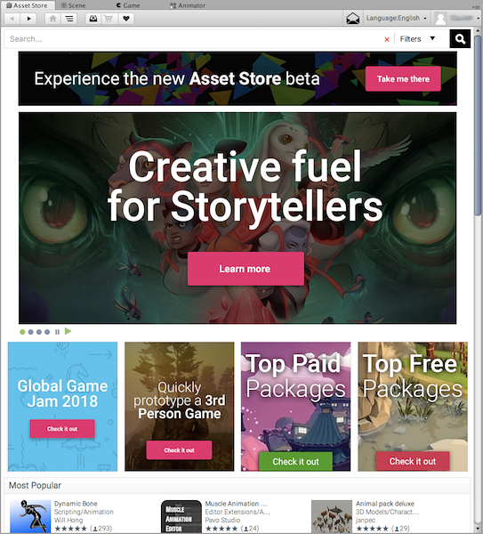
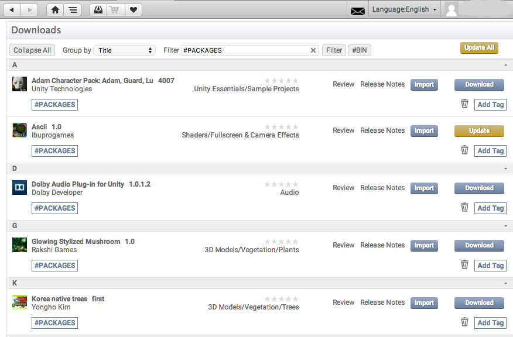

# 使用 Asset Store

Unity __Asset Store__ 是一个不断增长的资源库，其中包含了 Unity Technologies 和社区成员创建的免费资源和商业资源。此处提供各种各样的资源，涵盖从纹理、模型和动画到整个项目示例、教程和 Editor 扩展的所有内容。可以从 Unity Editor 中内置的简单界面访问这些资源，这个界面可直接[将资源下载和导入](AssetPackages.html#ImportingPackages)到项目中。

Unity 用户可以成为 Asset Store 上的发布者，并出售自己创建的内容。要了解更多信息，请参阅 Asset Store 中有关 [Asset Store 发布 (Asset Store Publishing)](https://unity3d.com/asset-store/sell-assets) 的信息。

## Asset Store 访问和导航

要打开 Asset Store 窗口，请从 Unity 的主菜单中选择 __Window__ &gt; __Asset Store__。在首次访问期间，可以创建一个免费用户帐户，这个帐户允许您在以后访问时登录 Asset Store 并跟踪以前购买和下载的内容。

Asset Store 提供类似浏览器的界面，允许通过自由文本搜索或浏览资源包和类别的方式进行导航。标准导航按钮显示在主工具栏的左侧，可用于查看浏览历史记录：

 

Download Manager 和 Shopping Cart 按钮显示在导航按钮的右侧，可用于打开 [Download Manager](#downloadmgr) 或查看购物车的当前内容：

 

Download Manager 可用于查看已购买的资源包以及查找和安装更新。还可以用于查看 Unity 提供的标准资源包，并将它们添加到项目中。

## 下载的资源文件的位置

很少需要直接访问从 Asset Store 下载的文件。但是，如果确实需要，可以在以下路径中找到这些文件：

* macOS：`~/Library/Unity/Asset Store`
* Windows：`C:\Users\accountName\AppData\Roaming\Unity\Asset Store`

这些文件夹包含与特定 Asset Store 供应商对应的子文件夹。实际的资源文件以资源包发布者定义的结构包含在子文件夹中。

---

*  2018-05-11  Page amended with limited [editorial review](DocumentationEditorialReview.html)

*  2018-04-25  Page amended with limited [editorial review](DocumentationEditorialReview.html)

*  2018-01-31  Page amended with limited [editorial review](DocumentationEditorialReview.html)

