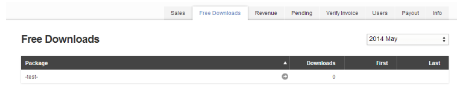
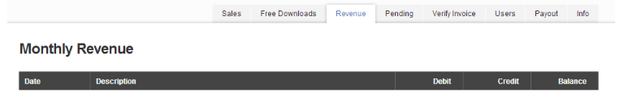
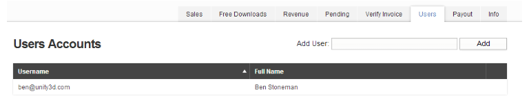
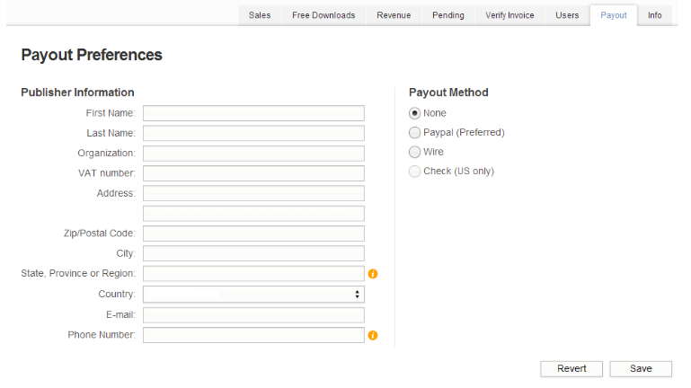
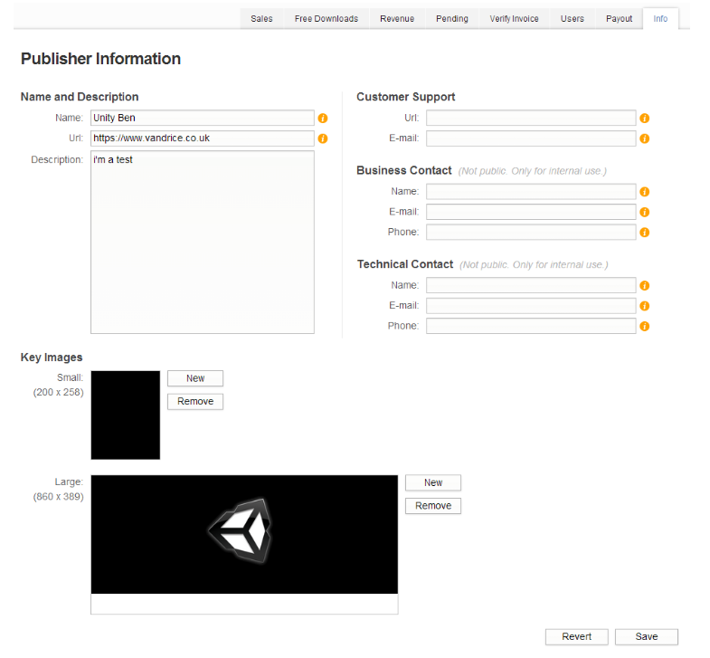

Publisher Admin 部分概述
======================

Publisher Administration 部分是作为发布者执行管理的界面。本节将介绍 Publisher Admin 部分中的每一个选项卡的概念以及使用方法。

Packages
-----

Packages 选项卡的作用是管理资源和创建要提交的新资源包。请参阅 [*Asset Store 发布指南*](AssetStorePublishingGuide.html)了解有关提交到商店的更多帮助，并参阅*更新资源包*了解有关管理和更新现有资源的更多帮助。

Sales
-----

 

在 Sales 选项卡中可以查看所有资源的销售数据，其中将显示所选月份的销售总额和净额。可以通过下拉框更改月份来查看不同月份的销售数据。

|||
|:---|:---|
| **Package:** | 资源的名称。*包含一个链接到资源的按钮*|
| **Price:** | 此行中的信息记录了产品卖出时的价格。 |
| **Qty:** | 此行中的信息记录了资源的购买数量。 |
| **Refunds:** | 此行中的信息记录了资源已完成的退款数量。 |
| **Chargebacks:** | 此行中的信息记录了资源已完成的退款数量。退单拒付 (chargeback) 是指信用卡提供者要求零售商弥补欺诈交易或有争议交易的损失。 |
| **Gross:** | 此行中的信息记录了资源销售的总金额。 |
| **First:** | 此行中的信息记录了资源在所选月份内的第一次购买日期。 |
| **Last:** | 此行中的信息记录了资源在所选月份内的最后一次购买日期。 |

Free Downloads（免费下载）
----------

 

此页面显示下载过的免费资源。显示以下内容：

* 您发布供免费使用的所有资源包的名称。
* 该资源包的下载次数。
* 第一次下载的日期。
* 最后一次下载的日期。

Revenue
-------

 

在 Revenue 选项卡中可以查看每个月的收入，还可以查看收入付给您银行或 PayPal 帐户的时间。

Pending
-------

 

在 Pending 选项卡中可以查看已提交资源的状态。该表显示以下内容：

 **Package：**显示已提交的资源名称。
 
 **Size：**已提交资源包的总大小。
 
 **Status：**资源的状态。这些状态如下：

* **Pending Review：**此状态表示资源已经收到并且位于提交队列中，正在等待审核团队进行审查。仅当提交资源后的 10 工作日内仍未执行审查时，才应联系 assetstore@unity3d.com。
* **Uploaded：**如果资源显示为 Uploaded 状态超过 2 小时，则需要重新提交该资源。
* **Draft：**此状态表示资源尚未提交，目前处于提交前阶段。

Verify Invoice
-----------

 

在 **Verify Invoice** 选项卡中可以输入 Asset Store 客户的发票号码以验证该发票是否有效。

发票上显示了资源以及资源已经退款的情况下，该选项卡也会显示这些资源。

Users
-----

 

在 Users 选项卡中可以查看 Unity 帐户以及将帐户添加到 Publisher Admin 部分。这意味着，如果您有一个团队，则可以根据需要添加每个人的帐户。

当您代表客户申请退款时，支持部门将检查用户帐户以确认该请求来自与相应发布者帐户相关的有效电子邮件地址。

Payout
-------

 

在 Payout 选项卡中可以管理发布者信息以及该发布者帐户获得的收入的付款选项。

Info
----

 

在 Info 选项卡中可以编辑发布者帐户的配置文件。该页面中的信息一目了然，但此处简要介绍一下这些部分：

**Name and Description：**编辑发布者名称、描述和主要网页。

**Customer Support：**提供支持网页和/或支持电子邮件地址。

**Business Contact：**提供与业务相关的联系人信息。仅供内部使用。

**Technical Contact：**提供与技术方面相关的联系人信息。仅供内部使用。

**Key Images：**发布者页面上显示的关键图像。目前不使用小尺寸的关键图像。
