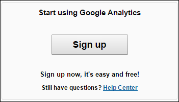
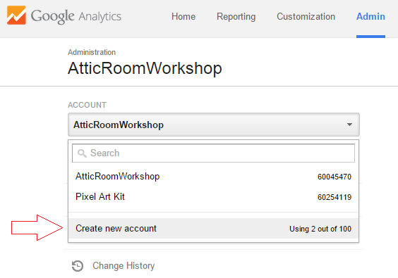
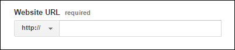
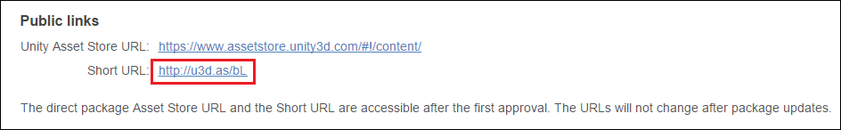
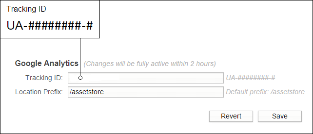

# 设置 Google Analytics

##什么是 Google Analytics？

Google Analytics 是一个基于 Web 的信息中心，用来显示网站和网页的统计信息。作为发布者，可能会看到 Asset Store __Publisher Administration__ 部分的 Info 选项卡下的 __Tracking ID__ 文本字段。

##如何设置？

**1.登录或注册**

转到 [Google Analytics](http://www.google.com/analytics/) 主页，然后用您的 Gmail 帐户登录。

 

**2.创建新的 Google Analytics 帐户**

在 Google Analytics 中，“新帐户”是指要跟踪的新链接或 URL。如果这是您第一次登录 Google Analytics，该网站会提示您自动执行此操作。

要创建新帐户，请转到 **Admin** > **Accounts** > **New Account**。

 

**3.新帐户表单**

Google Analytics 新帐户表单会要求您添加网站 URL。

 

此处需要输入资源的 Short URL。要查找 Short URL，单击 Asset Store Publisher Administration 部分的 __Packages__ 选项卡中的资源名称，然后滚动到页面底部：

 

**4.Tracking ID**

创建新帐户时将生成 Tracking ID。请将 Tracking ID 复制并粘贴到 Asset Store Publisher Administration 部分的 **Info** 选项卡底部的 **Tracking ID** 文本字段中。对于 **Loction Prefix**，可选择保留默认值“/assetstore”。

 
