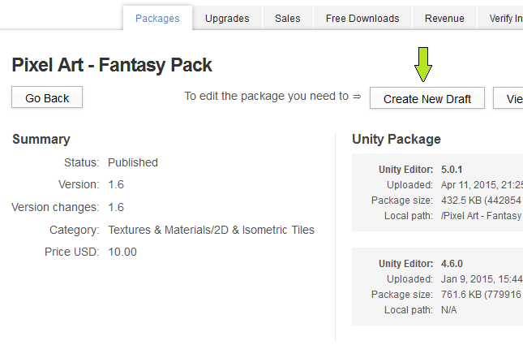
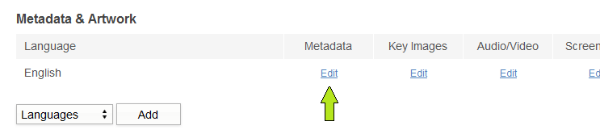
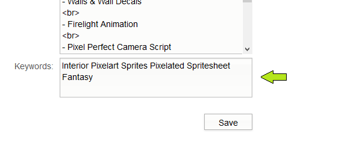
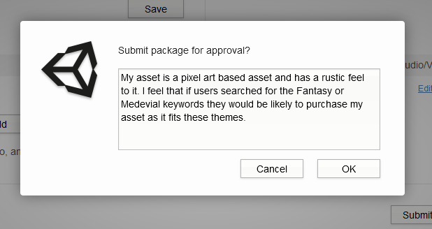

向资源添加关键字
======================

什么是关键字？
-----

关键字只是一个以空格分隔的关键字列表，发布者使用这些关键字来影响 Asset Store 资源的检索结果。不超过 255 个字符。
 
如何向资源添加关键字
-----

关键字的添加过程很简单。关键字对您的资源非常有利，因为通过这些关键字，潜在客户在使用搜索栏时更容易在Asset Store中找到您的资源。

**步骤 1：**登录 [Publisher Admin 区域](https://publisher.assetstore.unity3d.com/)。

**步骤 2：**导航到“Packages”选项卡。

 

**步骤 3：**接下来需要创建要添加关键字的资源草案，以便为资源的提交和审查做好准备。

蓝色箭头表示资源已有草案。我们将为绿色箭头所指示的资源创建草案。

 

**步骤 4：**单击资源名称来显示下面的页面，然后单击“Create New Draft”按钮。

 

**步骤 5：**有了草案后，我们可以编辑资源包。单击 Metadata Edit 按钮。

 

**步骤 6：**在此页面的底部，可以输入关键字。

在您（发布者）为资源添加关键字之前，请思考您希望开发者使用哪种搜索字词来查找您的资源。想一想用户会如何搜索。挑选正确的关键字与描述文字相结合，您将能够操作您的 SEO。如果您的资源是 3D 模型，那么使用“3D”可能就浪费了关键字。

*注意：关键字由空格分隔，不超过 255 个字符*

 

**步骤 7：**输入所有关键字并对选择的关键字感到满意后，可单击“Save”按钮。

**步骤 8：**当您觉得自己准备好可以提交时，返回到草案，然后提交资源包进行审批。

请添加供 Asset Store 专家查看的提交备注（单击“Submit package for approval”后会立即弹出），说明选择关键字的原因。这将是他们用来做出决策并加快更新的重要信息。

我们的 Asset Store 专家将审核关键字，以确保它们与资源相关。由于有很多发布者，预计任何更新都大约需要 5 个工作日才能通过我们的审核流程。

 
