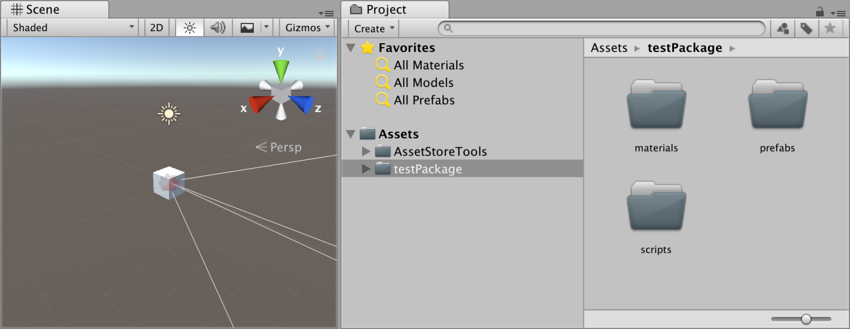
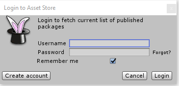
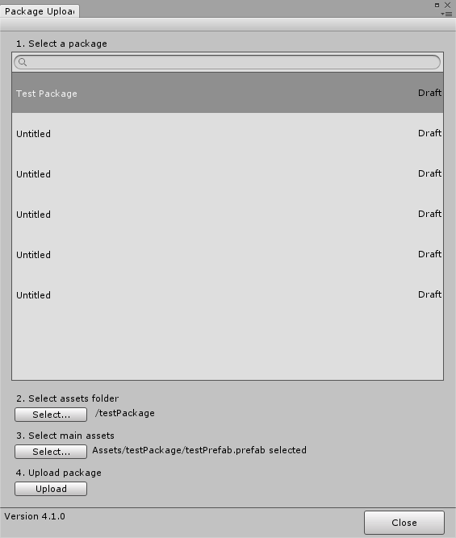
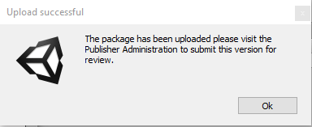
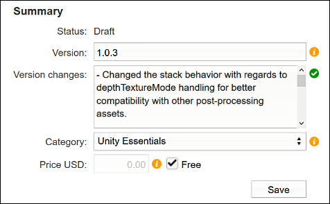
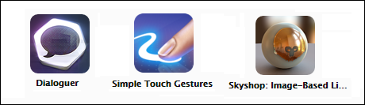
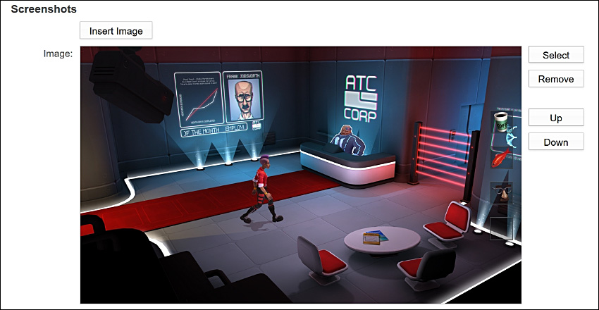
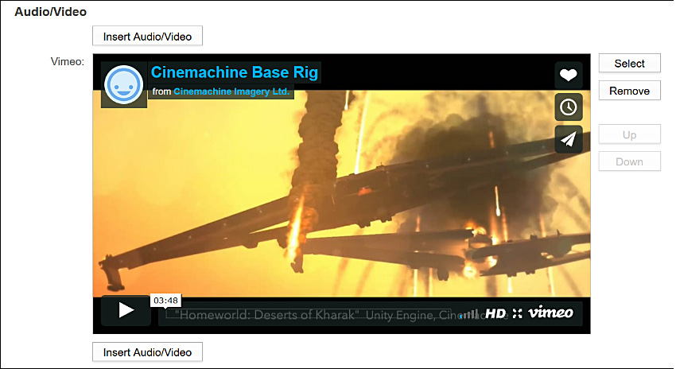

Asset Store 发布指南
======================

创建发布者帐户 (Publisher Account)
-----

访问 [Publisher Administration](https://publisher.assetstore.unity3d.com/) 页面，然后使用 Unity 帐户登录。如果您还不是发布者，系统将提示创建 Asset Store 发布者帐户。请填写表单并保存数据来创建您的帐户。除非另有说明，否则提供的信息将显示在 Asset Store 面向客户的发布者页面上（[*示例*](https://www.assetstore.unity3d.com/en/#!/publisher/1950)）。

创建新的资源包
-----

如果准备好提交资源，首先要做的就是为资源包创建草案。转到 [Publisher Administration](https://publisher.assetstore.unity3d.com/packages.html) 页面的 Packages 选项卡，然后单击*“Create New Package”*按钮

 

## Uploading a package

To prevent confusion during upload and import for your users, make sure that your submission content is inside a top-level folder that has the same title as your submission. This folder contains all of the components for your Project:

To upload your Asset to the Publisher Administration portal:

1. In the Unity Editor, import the [Asset Store Tools](https://assetstore.unity.com/packages/KATEGORY-MISSING/asset-store-tools-115) into your Project.

1. Go to __Asset Store Tools > Package Upload__. This dialog box appears:

    

1. Enter your Unity Publisher account information into this box. The Package Upload tool fetches your drafts and packages via your Publisher Portal. When the tool has fetched your packages from the Portal, the Package Upload window appears. 

1. Select the folder that contains your entire Project, and then select an Asset to showcase within that Project. If you have multiple draft packages in your publisher account, make sure you click on the package for the Asset you are submitting. The Package Upload window shows the folder and Assets you are uploading:

    

1. Click __Upload__ to connect your Assets to your Publisher Portal. The status bar next to the title of your selected folder shows the progress of the upload. 

When upload is complete, the Editor displays a dialog box to verify that the package is now on your Publisher Portal:

Your package is now available on the Publisher Portal:

Continue to prepare your package submission for review on the Publisher Portal.

摘要 (Summary)
-----

在资源摘要中，可以更改资源的 ***Version Number*** 和 ***Price USD*** 等信息。

 

| | |
|:---|:---|
| **Status:** | 资源的当前状态。（*Draft、Published、Declined、Pending*）|
| **Version:** | 资源的版本号（*例如 1.5、1.6、1.7*） |
| **Version Changes:** | 在此处输入资源更改备注（*主要用于更新*） |
| **Price USD:** | 希望客户购买资源的价格。 |

为资源命名以及添加描述
-----
单击 **Metadata and Artwork** 下的*“Metadata”*选项卡下方的 Edit 链接，可以更改资源的名称。

| | |
|:---|:---|
| **Title:** | 这是资源的名称。*这是必填字段*|
| **Description:** | 这是资源的描述（*描述只能包含 EM、STRONG、A、P 和 BR 标记*） |

**为描述添加标记：**

资源的描述部分需要借助标记才能使用粗体文本或换行。请参考下表的帮助信息。

| | |
|:---|:---|:---|
| **粗体 (Bold)：** |将包含的文字加粗 | &lt;strong&gt;Bold Text&lt;/strong&gt;|
| **斜体 (Italic)：** | 将包含的文字变为斜体|&lt;e&gt;italic text &lt;/em&gt; |
| **链接 (Link)：** | 添加 URL 链接|&lt;a href = "url"&gt;My Link&lt;/a&gt;|
| **换行 (Break)：** |进行换行| &lt;br&gt;|
| **段落 (Paragraph)：** | 定义段落| &lt;p&gt;A Paragraph &lt;/p&gt;|

 

添加关键图像
-----

单击 **Metadata & Artwork** 下的***“Key Images”***选项卡下方的 Edit 链接，可以更改资源的关键图像。

**上传和删除图像：**
单击 ***Select*** 按钮可上传图像，而单击 ***Clear*** 可删除图像。

 

**图标和关键图像大小：**

| | |
|:---|:---|
| **图标 (Icon)：** | 128 x 128（*像素*）|
| **小 (Small)：** | 200 x 258（*像素*） |
| **大 (Large)：** | 860 x 389（*像素*） |

**引人注目：**
这些关键图像必须能够吸引客户的目光，就像彩色卡通能够吸引儿童的目光一样。许多客户在浏览 Asset Store 时，通常可能会在冲动下购买。您的关键图像必须帮助您的资源脱颖而出。

图标图像：

图标图像是用户最常看到的关键图像。以下是 Asset Store 中一些制作精良的图标图像，供您参考：

 

添加截屏
-----
单击 **Metadata & Artwork** 下的***“Screenshots”***选项卡下方的 Edit 链接，可以更改附加到资源的截屏。

单击**“Insert Image”**按钮即可上传图像并将其添加为资源的截屏。可通过这种方式添加多个截屏。如果要删除截屏，单击该图像旁边的**“Remove”**按钮即可删除图像。

使用**“Up”**和**“Down”**按钮可以按照任意顺序对截屏排序。

**如何选取截屏：**

截屏在销售资源时与关键图像一样重要。您的资源可能是世界上最好的资源，但如果截屏不能传达这一点，则可能销售不好。

 

添加截屏并通过截屏促进资源销售

添加音频和视频
-----

单击 **Metadata & Artwork** 下的***“Audio/Video”***选项卡下方的 Edit 链接，可以更改资源的名称。

这样可以将音频或视频添加到资源，并将音频或视频与资源截屏一起嵌入到宣传片中。通过提供以下任一服务的链接即可达到此目的：

| |
|:---|
| **YouTube** |
| **Vimeo** |
| **SoundCloud** |
| **MixCloud** |
| **SketchFab** |

向资源添加音频/视频

 

删除草案
-----

要删除草案，可单击 [Publisher Administration](https://publisher.assetstore.unity3d.com/) 页面的 Packages 选项卡下方的下拉文本字段，然后选择草案。随后将显示您的草案。

单击要删除的草案的名称，然后单击 **Metadata & Artwork** 部分下方的***“Delete Draft”***按钮（位于页面底部）。

----
* 2018-06-29 Page published with limited [editorial review](DocumentationEditorialReview.html)

