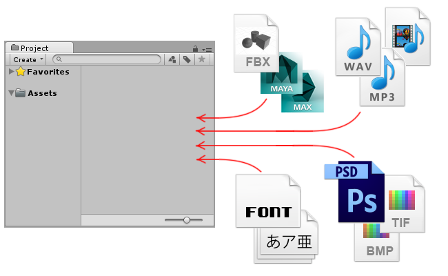

资源工作流程
==============

以下步骤将概要介绍在 Unity 中使用资源的基本原则。

资源表示可以在游戏或项目中使用的任何项。资源可能来自 Unity 外部创建的文件，例如 3D 模型、音频文件、图像或 Unity 支持的任何其他类型的文件。还有一些可以在 Unity 中创建的资源类型，例如动画控制器 (Animator Controller)、混音器 (Audio Mixer) 或渲染纹理 (Render Texture)。

