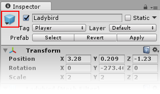
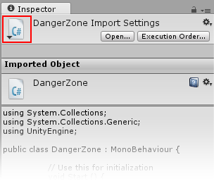
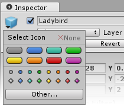
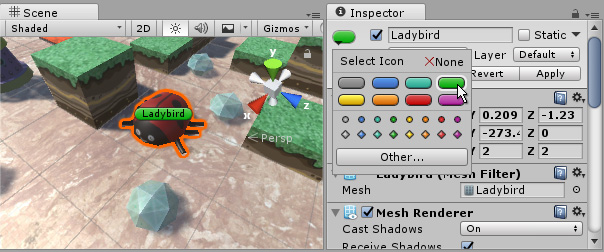
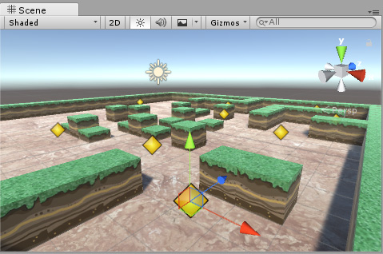
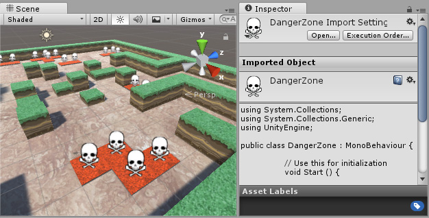

# 分配图标

Unity 允许为游戏对象和脚本分配自定义图标。这些图标与光源和摄像机等的内置图标一起显示在 Scene 视图中。使用 [Gizmos 菜单](GizmosMenu.html)可控制在 Scene 视图中绘制图标的方式。

### 游戏对象 Select Icon 按钮

要更改游戏对象的图标，请在 Hierarchy 窗口或 Scene 视图中选择游戏对象，然后在 Inspector 窗口中的游戏对象名称左侧单击 __Select Icon__ 按钮（蓝色立方体，在下图中用红色方框突出显示）。

将图标分配给游戏对象后，图标将在 Scene 视图中显示在该游戏对象（以及之后的任何重复项）的上方。还可以将图标分配给预制件，从而将图标应用于场景中该预制件的所有实例。

### 脚本 Select Icon 按钮

要为脚本指定自定义图标，请在 Project 窗口中选择脚本，然后在 Inspector 窗口中的脚本名称左侧单击 __Select Icon__ 按钮（C# 文件图标，在下图中以红色方框突出显示）。

为脚本分配某个图标后，Scene 视图中任何附加了此脚本的游戏对象上方都会显示此图标。

## Select Icon 菜单

无论是为游戏对象还是脚本分配图标，弹出的 __Select Icon__ 菜单都是相同的：

 

__Select Icon__ 菜单包含若干个内置图标。单击某个图标将其选中，或单击 __Other…__ 从项目资源中选择要用作图标的图像。

内置图标分为两类：__标签图标__和__纯图像图标__。

__标签图标__

 

将标签图标分配给游戏对象或脚本，可在 Scene 视图中显示游戏对象的名称。

__纯图像图标__

 

纯图像图标不显示游戏对象的名称。这些图标对于分配可能没有可视表示的游戏对象（例如，导航路点）非常有用。分配图标后，即可在 Scene 视图中查看并单击该图标来选择和移动本来不可见的游戏对象。

项目中的任何资源图像也可以用作图标。例如，骷髅头图标可用于指示关卡中的危险区域。

**注意：**更改资源的图标后，资源本身会被标记为已修改，因此会被版本控制系统选中。
