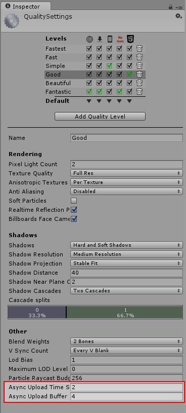

#异步纹理上传

异步纹理上传 (Asynchronous Texture Upload) 允许从磁盘异步加载纹理数据，并允许在Render-thread 上以时间切片的方式上传至 GPU。由此缩短了主线程中的 GPU 上传等待时间。异步纹理上传将自动应用于所有未启用读/写权限的纹理，因此无需直接操作即可使用此功能。但是，异步上传操作的某些方面可由您进行控制，因此为了能够使用这些控制，了解一些该过程是很有用的。

项目构建完成后，可异步加载的纹理的纹理数据将存储为流媒体资源文件并异步加载。

## 对内存和时间切片的简单和完全控制

此过程重复使用单个环形缓冲区来加载纹理数据并将其上传到 GPU，因此可减少所需的内存分配量。例如，如果您有 20 个小纹理，Unity 将一次性为这 20 个纹理设置一个异步加载请求。如果您有一个大型纹理，Unity 仅会设置一个请求。

如果缓冲区大小不足以容纳所请求的纹理，它将自动调整大小来满足需求，但最佳做法是尽可能设置合理的大小，确保从一开始就能容纳即将上传的最大纹理，以免缓冲区为容纳遇到的每个新的更大纹理而需要重新调整大小。

每一帧纹理上传所使用的时间是可控的；数值越大，纹理就会越快在 GPU 上准备就绪，但代价是在这些帧期间需要更长的 CPU 时间来进行其他处理。仅当缓冲区中有纹理等待上传至 GPU 时，才会使用该 CPU 时间。
  
缓冲区大小和时间片可通过 Quality Settings 面板进行指定：

## 异步纹理上传脚本 API

我们提供了从脚本中控制缓冲区大小 (Buffer Size) 和时间片 (Time-Slice) 值的功能。

### 时间片
请参阅脚本参考：[QualitySettings.asyncUploadTimeSlice](../ScriptReference/QualitySettings-asyncUploadTimeSlice.html)。

设置每一帧异步纹理上传所用的 CPU 时间的时间片（以毫秒为单位）。根据不同的目标平台和 API，您可能需要进行该设置。仅当存在要上传的纹理时，函数调用才会消耗时间，否则将提前退出。

### 缓冲区大小
请参阅脚本参考：[QualitySettings.asyncUploadBufferSize](../ScriptReference/QualitySettings-asyncUploadBufferSize.html)

为异步纹理上传设置环形缓冲区大小。此大小以兆字节 (MB) 为单位。请确保根据目标平台设置合理的大小。另外，请确保该大小始终足以在游戏中加载任何大型纹理。例如，如果您有一个大小为 22MB 的立方体贴图，而将环形缓冲区 (RingBuffer) 的大小设置为 16MB，则应用程序会在加载该场景时自动将环形缓冲区的大小调整为 22MB。

## 注意

对于未启用读/写权限的纹理，TextureData 是 resS（流媒体资源）的一部分，现在上传操作在 Render-Thread 上进行。跟以前一样，在调用 AwakeFromLoad 的过程中可以保证纹理的可用性，因此渲染时的纹理加载顺序或纹理可用性方面没有变化。

对于其他类型的纹理加载，例如已启用读/写权限的纹理、直接通过 LoadImage(byte[] data) 函数加载的纹理，或者从 Resources 文件夹加载的纹理，不采用异步缓冲区加载，而是采用较早的同步方法。

