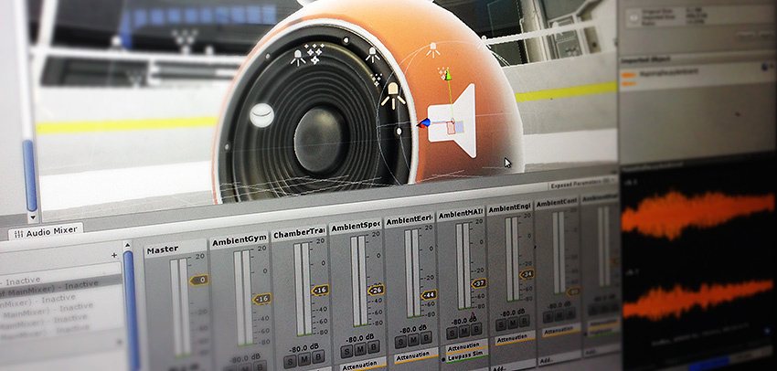

#音频

 

Unity 的音频功能包括全 3D 空间音效、实时混音和母带制作、混音器层级视图、快照、预定义效果等等。

请阅读本节来了解 Unity 中的音频功能，包括音频剪辑、音频源、监听器、导入和声音设置。

**相关教程：**[音频](http://unity3d.com/learn/tutorials/topics/audio)

请参阅[知识库的“音频”(Audio) 部分](https://support.unity3d.com/hc/en-us/sections/201377883-Audio)了解提示、技巧和故障排除信息。
