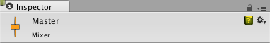
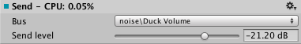
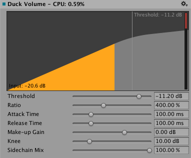
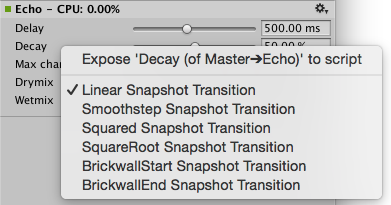

#音频组检视面板 (AudioGroup Inspector)

在 AudioGroup 层级视图、AudioGroup 视图或 Project 窗口中选择某个音频组（作为子资源）将显示此音频组的检视面板。

音频组的检视面板包含多个元素：

##检视面板标题

音频组（AudioGroup）检视面板的顶部是音频组（AudioGroup）的名称，还包含所有对象检视面板通用的齿轮下拉菜单。

 

齿轮菜单包含以下功能：

*“Copy all effect settings to all snapshots”- 用于将此音频组的所有效果参数、音量和音高设置复制到混音器 (AudioMixer) 中存在的所有其他快照。该功能可以对此音频组快速创建所有“与此类似”的快照。
*“Toggle CPU usage display”- 用于切换音频组检视面板中存在的所有效果的 CPU 性能信息。此功能可以让用户了解 DSP 设置中的哪些效果正在使用最多资源。

##Edit in Playmode

 

在 Unity 中处于 Playmode 时，音频组的检视面板在顶部包含一个名为“Edit in Playmode”的按钮。默认情况下，混音器的参数值在 Playmode 下无法编辑，并且完全由游戏中的当前快照来控制。

Edit in Playmode 可让您覆盖快照系统，并在 Playmode 期间直接对当前快照进行编辑。若要在玩游玩时实时对游戏进行混音和母带制作，这是一种不错的方法。

##Pitch 滑动条
音频组检视面板顶部有一个滑动条，用于通过该音频组来定义播放音高。要更改音高，请使用滑动条，或者在右侧的文本字段中手动输入音高。

 

##衰减单元 (Attenuation Unit)

混音器中的每个音频组只包含 1 个衰减单元。

在衰减单元中，您可以对通过音频组的音频信号应用衰减/增益。对衰减的计算并将其应用于信号都是在单元内进行的（不会与其他衰减设置合并，也不会应用于语音源）。因此，通过与发送/接收单元和非线性 DSP 效果组合后，可创建非常复杂且有趣的设置。应用衰减后可降低至 -80dB（静音），而应用增益后可提高至 +20dB。

 

每个衰减单元在检视面板中都有一个 VU 计量表。此计量表显示信号链中此时刻（即刚应用衰减之后）的音频信号水平。这意味着，如果在衰减单元之后设置了 DSP 效果或接收单元，则您在此音频组的 AudioGroup 条带中看到的计量信息将不同于在衰减单元中看到的计量信息。您可以通过在处理链中上下拖动衰减单元来查看不同位置的计量信息，因此这是一种非常不错的音频组信号链调试方法。

VU 计量表将同时显示 RMS 值和峰值保持值。

* 要在信号链中上下移动衰减单元（或任何效果），请单击该单元的标题，然后上下拖动检视面板以对其重新定位。
* 要更改衰减设置，请移动计量信息上方的滑动条，或在文本框中输入值。

##效果单元

效果单元 (Effect Unit) 提供常规 DSP 效果，可修改通过音频组播放的音频信号，例如高通 (Highpass) 或混响 (Reverb)。效果单元还可以处理从发送单元 (Send Unit) 发送到效果单元的旁链信号信息。每个效果单元的界面各有不同，但大部分都显示了一组可供修改的参数，通过修改参数即可更改对信号应用效果的方式。例如，参数均衡器 (Parameter EQ) 效果有 3 个参数可用于修改信号的处理方式：

 

Unity 附带了一组可在音频组中使用的内置效果。此外，还能创建可在混音器中使用的自定义 DSP 效果插件。

* 要向音频组中添加效果，请单击音频组检视面板 (AudioGroup Inspector) 底部的“Add Effect”按钮。

 

* 要更改效果在音频组中的排序，请左键单击效果标题，然后通过上下拖动将其放在不同位置。

* 要从音频组中删除效果，请右键单击效果标题，然后选择“Remove this effect”。

##发送单元 (Send Unit)

发送单元可用于分发音频信号流，并可发送可能衰减的信号副本以用作另一个效果单元（如旁链比较器压缩器）中的旁链。您可以在信号链中的任何位置插入发送单元，从而能够在任何点分发信号。

 

发送单元首次添加到音频组时，不会向任何对象发送信号，而且 Send Level 设置为 80dB。要发送到另一个效果单元，必须事先存在一个效果单元可在混音器中的某个位置接受旁链信号。在选择目标效果单元后，用户需要增大 Send Level 才能将信号发送到目标。

* 要向音频组中添加发送单元，请单击音频组检视面板底部的“Add Effect”按钮，然后选择“Send”。
* 要将发送单元连接到另一个效果单元（能够接收信号），请从发送单元检视面板 (Send Unit Inspector) 的下拉菜单中选择目标。
* 使用“Send Level”来设置发送到目标的信号水平

##接收单元 (Receive Unit)

接收单元是发送单元的信号接收器，直接获取从发送单元发送到接收单元的音频信号，并将此信号与通过音频组的电流信号混合。接收单元没有参数。

 

**注意**，如果将接收单元设为 Solo，则会使声音播放停止。这是有意设计的。

##减弱音量单元 (Duck Volume Unit)

减弱音量单元可通过发送单元发出的信号来创建旁链压缩。若要根据混音器中其他位置所播放的音频来控制信号的衰减，减弱音量 (Duck Volume) 是一种很不错的方法。

 

可以像任何其他效果单元一样添加减弱音量单元，并且必须至少从一个发送单元向减弱音量单元发送信号才能使用。

##通用选项

音频组检视面板中的每个单元都包含一些通用特性。

###齿轮选项

* **Allow Wet Mixing** - 开启此选项可围绕效果创建干声道。启用此选项后显示的滑动条表示传递到湿/干分量的信号百分比。启用此选项会提高内存使用量和 CPU 开销。此选项仅对某些单元可用。
* **Bypass** - 开启此选项将完全绕过效果单元，从而在信号链中有效禁用该单元。
* **Copy Effect Settings to all Snapshots** - 选择此选项可将此效果单元中的所有参数值复制到混音器中的所有其他快照。此选项在下列情况下很有用：添加新的效果单元，对该效果单元进行更改，希望这些设置在所有快照中均相同。
* **Add Effect Before** - 允许在音频组中的当前效果单元之前插入一个效果单元。从显示的菜单中选择所需效果。
* **Add Effect After** - 允许在音频组中的当前效果单元之后插入一个效果单元。从显示的菜单中选择所需效果。
* **Remove This Effect** - 从混音器中完全删除此效果单元。无法从音频组中删除衰减单元。

###湿混 (Wet Mixing)

通过对 DSP 效果使用湿混，可确定要进入音效的音频信号中实际有多少信号量由该效果处理。启用湿混实际上将围绕效果创建干声道。然后，可单击效果字段，并进行左右拖动以增大或减小通过 DSP 效果单元处理的音频信号百分比。其余信号将通过干声道。下图说明了此概念：

如果用户希望控制某一效果对于混音的影响并保留一定比例的原始信号，湿混将很有用。

 

###暴露的参数 (Exposed Parameters)

通过暴露的参数，您可以绕过混音器的快照系统，并通过脚本来设置混音器中任何参数的值。通过脚本来设置某个暴露的参数时，该参数将锁定为该值，不会随着游戏切换快照而更改。

可以在音频组检视面板中通过混音器来暴露参数。对于检视面板中显示的任何参数（包括 Pitch、Volume、Send Level 和 Wet Level），都可以单击参数名称，然后选择“Expose X to script”。

 

在暴露某个参数后，该参数将显示在 AudioMixer 窗口右上角的 Exposed Parameter 下拉选单中。单击此下拉选单将在混音器中显示所有已暴露的参数。

 

* 要重命名某个暴露的参数，请右键单击此暴露参数的名称，然后单击“Rename”。在混音器 API 中可通过此名称来引用参数。
*要删除某个暴露的参数，请右键单击此暴露参数的名称，然后单击“Delete”。

###过渡覆盖

在快照之间过渡时，默认情况下，所有过渡都通过线性插值（从开始值到目标值）来完成。但在某些情况下，这一过渡行为不是我们想要的，例如，有时更希望将更改限制在过渡的开始或结束位置。

混音器中可用的所有参数都可以更改过渡行为。过渡行为是根据快照来定义的，用目标快照来定义过渡行为。

要为当前快照的特定参数设置过渡覆盖，请右键单击参数名称，然后选择所需的过渡类型。

  

#混音器(AudioMixer)检视面板

混音器资源自身包含一个检视面板，可用于指定混音器的总体激活/暂停行为。混音器用作资源，只要任何音频源在混音器中播放，混音器基本上就会被激活，而且只要有这样一个驱动因素向混音器提供音频数据，混音器就会一直处于活动状态。由于还可通过 Scene 视图中的音频预览按钮来激活混音器，因此激活行为不同于场景对象（比如 MonoBehavior）的激活行为。所以，即使在停止模式下，混音器也可能处于激活状态（继而耗用 CPU）。

如果某个项目中包含大量混音器，而这些混音器不应该全部同时运行（例如，由于特定级别使用某些专门的混音器），为了避免在该项目中耗尽 CPU 资源，混音器可通过内置的功能将自身置于暂停模式，使所有处理都停止。为了以自然的方式实现这一点，从而避免可听见的人为声音（如卡嗒声）或缺少混响/回声尾音，每个混音器均使用以下策略：

只要有任何音频源在此混音器中播放，或者混音器正在从其他子混音器中接收音频数据，混音器就会保持自身处于激活状态。在最后一个声源播放完毕后，混音器将等待一秒钟，然后继续使用响度测量结果作为自己的输出，以确定是否应暂停自身。这是有必要的，因为混响和回声尾音有可能非常缓慢地衰减。混音器暂停自身时所依据的响度阈值通过以下方式确定：从项目浏览器中选择混音器资源（并非选择混音器组或快照等子资源），然后在显示的混音器资源检视面板上启用 Auto Mixer Suspend 并设置 Threshold Volume 参数。默认值为 -80 dB，此值与混音器中推子的最低值匹配。实际上，通常可将其设置为大得多的值，这样可以更快停用并避免中途出现 CPU 使用率激增（这可能导致卡顿）。

