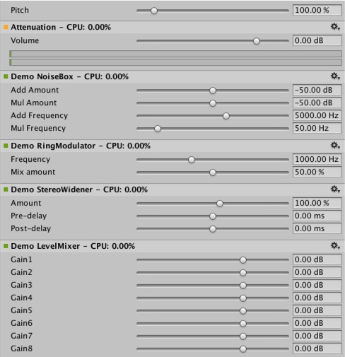
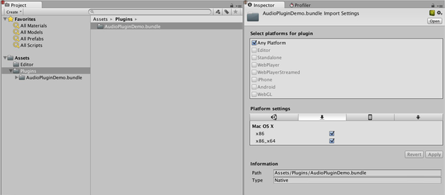
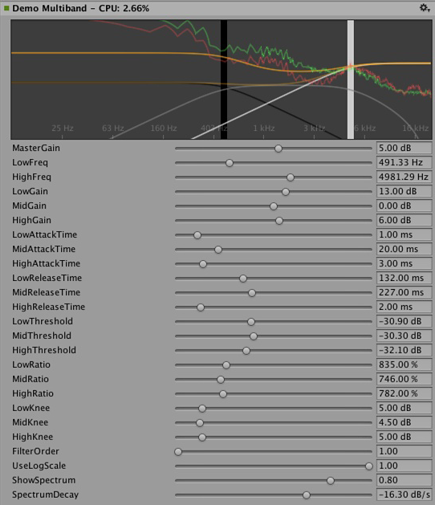

#原生音频插件 SDK

本文档介绍 Unity 5.0 的内置原生音频插件接口。为此，我们将展示一些具体示例插件，并按顺序逐步推进复杂程度。因此，我们从很基本的概念开始，在文档将要结束时介绍复杂的用例。

##下载

首先需要从[这里](https://bitbucket.org/Unity-Technologies/nativeaudioplugins)下载最新的音频插件 SDK。

##概述

原生音频插件系统由两部分组成：

1.原生 DSP（数字信号处理）插件，此插件必须以 .dll（对于 Windows）或 .dylib（对于 OSX）形式使用 C 或 C++ 来实现。此插件不同于脚本，而且由于对性能的高要求，必须针对您要支持的任何平台来编译此插件，可能还需要进行特定于平台的优化。

1.用 C# 开发的 GUI。请注意，GUI 是可选的，所以您随时可以通过创建基本原生 DSP 插件来开始插件开发，然后让 Unity 根据原生插件暴露的参数描述来显示基于滑动条的默认 UI。我们建议采用此方法启动项目开发。

请注意，开始时可通过 .cs 文件形式构建 C# GUI 的原型，只需将 .cs 文件放到 Assets/Editor 文件夹中（就像任何其他编辑器脚本一样）。此后，随着代码开始增长并需要更好的模块化和更好的 IDE（集成开发环境）支持，您便可以将此文件移动到合适的 Visual Studio 项目中。如此一来，可将该文件编译为 .dll，以便用户更轻松地将文件拖入项目中，并且还能保护您的代码。

另外还要注意，原生 DSP 和 GUI DLL 都能包含多个插件，而且绑定时仅采用插件中效果的名称，与调用的 DLL 文件无关。

##都有哪些文件？

插件 SDK 的本地端实际上仅包含一个文件 (AudioPluginInterface.h)，但为了在同一个 DLL 中提供多个插件效果，我们添加了支持代码，从而以一种简单、统一的方式来处理效果定义和参数注册（AudioPluginUtil.h 和 AudioPluginUtil.cpp）。清注意，NativePluginDemo 项目包含多个示例插件以供您入门，并且显示了游戏上下文中有用的各种不同插件类型。我们将此代码放在公共域中，请尽管使用此代码作为创建自有项目的起点。

开发插件时，第一步是定义插件应具备的参数。您不需要在开始之前就制定有关插件将包含的所有参数的详细总计划，但大致构思一下您所期望的用户体验以及需要的组件会很有帮助。

我们提供的示例插件中具有众多实用函数可以让您轻松实现目标。
我们来看看“Ring Modulator”示例插件。这个简单插件将传入信号乘以某个正弦波，因此将产生类似于无线电噪声/信号接收中断的奇妙效果，特别是多个具有不同频率的环形调制效果链接在一起时。

示例插件中处理参数的基本方案是，将参数定义为枚举值，我们在浮点数组中将这些枚举值用作索引，这样既简洁又方便。

````
enum Param
{
    P_FREQ,
    P_MIX,
    P_NUM
};

int InternalRegisterEffectDefinition(UnityAudioEffectDefinition& definition)
{
    int numparams = P_NUM;
    definition.paramdefs = new UnityAudioParameterDefinition [numparams];
    RegisterParameter(definition, "Frequency", "Hz",
        0.0f, kMaxSampleRate, 1000.0f,
        1.0f, 3.0f,
        P_FREQ);
    RegisterParameter(definition, "Mix amount", "%",
        0.0f, 1.0f, 0.5f,
        100.0f, 1.0f,
        P_MIX);
    return numparams;
}
````

RegisterParameter 调用中的数字表示最小值、最大值和默认值，后跟仅用于显示用途的比例因子，例如，如果是百分比值，实际值是从 0 到 1，显示时乘以 100。此情况中没有自定义 GUI 代码，但如上所述，Unity 将根据这些基本参数定义来生成一个默认 GUI。请注意，不会对未定义参数执行任何检查，因此 AudioPluginUtil 系统期望所有声明的枚举值（`P_NUM` 除外）都与对应的参数定义匹配。

RegisterParameter 函数在后台填充与该插件相关联的 UnityAudioEffectDefinition 结构的 UnityAudioParameterDefinition 数组中的条目（请参阅“AudioEffectPluginInterface.h”）。UnityAudioEffectDefinition 中需要设置的其他内容是对各种函数的回调，这些函数负责实例化插件 (CreateCallback)、设置/获取参数 (`SetFloatParameterCallback/UnityAudioEffect_GetFloatParameterCallback`)、执行实际处理 (`UnityAudioEffect_ProcessCallback`) 以及在完成后最终销毁插件实例 (`UnityAudioEffect_ReleaseCallback`)。

为了便于在同一个 DLL 中包含多个插件，每个插件都位于自己的命名空间中，并且使用回调函数的特定命名约定，以便 `DEFINE_EFFECT` 和 `DECLARE_EFFECT` 宏可以填充 UnityAudioEffectDefinition 结构。在底层中，所有效果定义都存储在一个数组中，仅 UnityGetAudioEffectDefinitions 库的入口点可以返回该数组的指针。

如果您希望开发桥接插件（在其他插件格式（比如 VST 或 AudioUnit）与 Unity 音频插件接口之间进行映射），那么了解上面的内容很有帮助，在这种情况下，您需要开发一种更加动态的方法在加载时设置参数描述。

###实例化插件

接下来是插件实例的数据。在示例插件中，我们将其全部都放到了 EffectData 结构中。必须在对应的 CreateCallback 中进行这种分配（对混音器中插件的每个实例调用 CreateCallback）。在这个简单示例中，只有一个扩展到多个声道的正弦波，其他更高级的插件需要为每个输入声道分配额外数据。

````
struct EffectData
{
    struct Data
    {
        float p[P_NUM]; // 参数
        float s;        // 振荡器的正弦输出
        float c;        // 振荡器的余弦输出
    };
    union
    {
        Data data;
        unsigned char pad[(sizeof(Data) + 15) & ~15];
    };
};
````


````
UNITY_AUDIODSP_RESULT UNITY_AUDIODSP_CALLBACK CreateCallback(
    UnityAudioEffectState* state)
{
    EffectData* effectdata = new EffectData;
    memset(effectdata, 0, sizeof(EffectData));
    effectdata->data.c = 1.0f;
    state->effectdata = effectdata;
    InitParametersFromDefinitions(
        InternalRegisterEffectDefinition, effectdata->data.p);
    return UNITY_AUDIODSP_OK;
}
````

UnityAudioEffectState 包含来自主机的各种数据（比如采样率、已处理的样本总数（用于计时）或者是否绕过了插件），并传递到所有回调函数。

显然，也有一个对应的函数用于释放插件实例：

````
UNITY_AUDIODSP_RESULT UNITY_AUDIODSP_CALLBACK ReleaseCallback(
    UnityAudioEffectState* state)
{
    EffectData::Data* data = &state->GetEffectData<EffectData>()->data;
    delete data;
    return UNITY_AUDIODSP_OK;
}
````

音频的主要处理工作在 ProcessCallback 中进行：

````
UNITY_AUDIODSP_RESULT UNITY_AUDIODSP_CALLBACK ProcessCallback(
    UnityAudioEffectState* state,
    float* inbuffer, float* outbuffer,
    unsigned int length,
    int inchannels, int outchannels)
{
    EffectData::Data* data = &state->GetEffectData<EffectData>()->data;
 
    float w = 2.0f * sinf(kPI * data->p[P_FREQ] / state->samplerate);
    for(unsigned int n = 0; n < length; n++)
    {
        for(int i = 0; i < outchannels; i++)
        {
            outbuffer[n * outchannels + i] =
                inbuffer[n * outchannels + i] *
                (1.0f - data->p[P_MIX] + data->p[P_MIX] * data->s);
        }
        data->s += data->c * w; // 计算正弦波的低成本方法
        data->c -= data->s * w;
    }
 
    return UNITY_AUDIODSP_OK;
}
````

顶部的 GetEffectData 函数只是一个 helper 函数，用于将 state 变量的 effectdata 字段转换为我们之前声明的结构中的 EffectData::Data。

包括的另外两个简单插件是 NoiseBox 插件和 Lofinator 插件，前者将输入信号与可变频率下的白噪声相加或相乘，后者对信号进行简单的下采样和量化。所有这些插件都可以结合使用，也可与游戏驱动的动画参数一起使用，从而模拟各种声音，包括手机、对讲机信号接收不良、扩音器损坏等等的声音。

StereoWidener 可将立体声输入信号分解为具有可变延迟的单声道分量和侧向分量，然后重新组合这些分量以改善感知的立体声效果。



##哪个插件在哪个平台上加载？

原生音频插件使用与其他原生或托管插件相同的方案，因为它们都必须通过插件导入器检视面板与其各自的平台相关联。您可以在[这里](PluginsForDesktop.html)进一步了解用于放置插件的子文件夹。必须进行平台关联，这样系统才能知道在独立构建中每个构建目标上要包含哪些插件，并且随着 64 位支持的引入，甚至必须在平台内指定平台关联。OSX 插件在这方面具有特殊性，因为通用二进制格式允许 OSX 插件在同一个 Bundle 中包含 32 位和 64 位变体。

从托管代码调用的 Unity 内部原生插件通过 [DllImport] 属性来加载（此属性引用要从原生 DLL 中导入的函数）。但如果是原生音频插件，则情况不同。此处出现的特殊问题是，需要先加载音频插件，然后 Unity 才能开始创建可能需要插件效果的混音器资源。编辑器中不存在这样的问题，因为我们可以重新加载和重新构建依赖于插件的混音器，但在独立构建中，必须先加载插件后再创建混音器资源。为了解决这个问题，目前的惯例是在插件“audioplugin”中添加前缀 DLL（不区分大小写），以便系统可以检测到这一点，并将其添加到将在启动后自动加载的插件列表中。请记住，只有插件中的定义才能定义效果在 Unity 混音器中的显示名称，因此 DLL 可以是任何名称，但它需要以字符串“audioplugin”开头才能被检测到。

对于像 IOS 这样的平台，插件代码需要静态链接到由生成的 XCode 项目产生的 Unity 二进制文件中，而在此位置，就像插件呈现设备一样，必须将插件注册显式添加到应用程序的启动代码中。

 

在 OSX 上，一个 Bundle 可同时包含插件的 32 位和 64 位版本。也可以拆分它们以节省空间。

###包含自定义 GUI 的插件

现在让我们看一些更高级的内容：均衡和多频段压缩的效果。相比前一节中介绍的简单插件，这些插件具有更多的参数，并且参数之间存在某种物理耦合关系，因此需要更好的方式来可视化参数，而不仅仅是一堆简单的滑动条。例如，假设有一个均衡器：每个频段有 3 个不同的滤波器，它们共同作用于最终的均衡曲线，每个滤波器都有 3 个参数：频率、Q 因子和增益，这三个参数有物理关联性，定义了每个滤波器的形状。因此，如果均衡器插件有一个出色的大型显示界面来显示结果曲线、每个滤波器影响，并且操作方式变为通过在控件上的简单拖动操作便可以同时设置多个参数（而不是一次改变一个滑动条），这样将对用户大有帮助。

 

均衡器插件的自定义 GUI。拖动三个波段可更改滤波器曲线的增益和频率。按住 Shift 进行拖动可以更改每个波段的形状。

因此，定义、初始化、取消初始化和参数处理再次遵循简单插件使用的完全相同的基于枚举的方法，甚至 ProcessCallback 代码也相当简短。现在，我们不再看本机代码，而是在 Visual Studio 中打开 AudioPluginDemoGUI.sln 项目。在这里，找到 GUI 代码的相关 C# 类。工作方式很简单：一旦 Unity 加载了原生插件 DLL 并注册了包含的音频插件，就会开始寻找与所注册插件的名称相匹配的对应 GUI。此过程通过 EqualizerCustomGUI 类的 Name 属性进行（与所有自定义插件 GUI 一样，该类必须继承自 IAudioEffectPluginGUI）。此类中只有一个重要的函数，也就是 bool OnGUI(IAudioEffectPlugin plugin) 函数。通过 IAudioEffectPlugin 插件参数，该函数可获取原生插件的句柄，通过此句柄可读取和写入原生插件已定义的参数。为读取参数，它会调用：

````
plugin.GetFloatParameter("MasterGain", out masterGain);
````
如果找到参数，则返回 true；为设置参数，它将调用：

````
plugin.SetFloatParameter("MasterGain", masterGain);
````

如果参数存在，也返回 true。这基本上是 GUI 和本机代码之间最重要的绑定关系。也可以使用以下函数

````
plugin.GetFloatParameterInfo("NAME", out minVal, out maxVal, out defVal);
````
来查询参数“NAME”以获得其最小值、最大值和默认值，从而避免在本机代码和 UI 代码中重复出现这些的定义。请注意，如果 OnGUI 函数返回 true，则检视面板将在自定义 GUI 下方显示默认 UI 滑动条。同样，这对于启动 GUI 开发非常有帮助，因为您在开发自定义 GUI 时拥有了所有可用参数，并且可以轻松检查对其执行的正确操作是否会产生预期的参数变化。

我们不会在这里讨论均衡器插件和多频段插件中将要进行的 DSP 处理的细节，对于感兴趣的用户，请知悉这些滤波器取自于 Robert Bristow Johnson 的杰作：Audio EQ Cookbook（音频均衡器说明书），而为了绘制曲线，Unity 还提供了一些内部 API 函数来为频率响应绘制抗锯齿曲线。

还有一点值得一提的是，均衡器插件和多频段插件都提供了用于覆盖输入和输出频谱的代码，旨在将插件的效果可视化，这就产生了一件有意思的事情：与音频处理速度比较，GUI 代码以低得多的更新速度（帧率）运行，并且无法访问音频流，那么我们如何读取这些数据呢？对此，本机代码中有一个特殊函数可解决此问题：
 
````
UNITY_AUDIODSP_RESULT UNITY_AUDIODSP_CALLBACK GetFloatParameterCallback(
    UnityAudioEffectState* state,
    int index,
    float* value,
    char *valuestr)
{
    EffectData::Data* data = &state->GetEffectData<EffectData>()->data;
    if(index >= P_NUM)
        return UNITY_AUDIODSP_ERR_UNSUPPORTED;
    if(value != NULL)
        *value = data->p[index];
    if(valuestr != NULL)
        valuestr[0] = 0;
  return UNITY_AUDIODSP_OK;
}
````

此函数的作用就是实现从原生插件读取浮点数据数组。插件系统不在乎数据是什么，但前提是请求不会大幅减慢 UI 或本机代码的运行速度。对于均衡器和多频段代码，有一个名为 FFTAnalyzer 的实用程序类，可轻松从插件中馈入输入和输出数据并获得频谱。此频谱数据随后由 GetFloatBufferCallback 重新采样，然后传递到 C# UI 代码。需要重新采样数据的原因是 FFTAnalyzer 以固定的频率分辨率运行分析，而 GetFloatBufferCallback 只返回请求样本的数量，这取决于显示数据的视图宽度。对于具有最少量 DSP 代码的非常简单的插件，您还可以了解 CorrelationMeter 插件，该插件简单地绘制左声道幅度与右声道幅度的关系图，以便显示信号的“立体声程度”。

 

 

左：CorrelationMeter 插件的自定义 GUI。

右：覆盖了频谱分析的均衡器 GUI（绿色曲线表示源，红色表示已处理）。

至此，我们还要指出的是，均衡器效果和多频段效果都是有意保持简单并且未进行优化，但我们认为它们是插件系统支持的更复杂 UI 的参考典范。显然还需要执行大量工作来进行特定于平台的相关优化，并执行大量参数调整以使其真正合理并以最具音乐性的方式响应，等等。我们也可能在某些时候在 Unity 中将上述其中某些效果作为内置插件实现，这样做只是为了方便增加 Unity 的标准插件库，但我们真诚希望读者也能接受挑战，制作一些非常棒的插件，说不定它们以后可能变为内置插件。;-)

 

卷积混响示例插件。脉冲响应是衰减的随机噪声
（由参数定义）。此插件仅用于演示目的，因为生产插件
应该允许用户加载任意记录的脉冲，但底层卷积算法
仍然相同。

 

在 3 个不同时间标度测量响度的响度监测工具的示例。
同样仅用于演示目的，但这是构建符合
现代响度标准的监测工具的良好起点。Unity 中内置了曲线渲染代码。

###与 DSP 时钟同步

是时候进行一些有趣的练习了。为何仅仅处理声音而不使用插件系统来生成声音呢？让我们尝试做一些简单的低音和鼓合成器（喜欢听迷幻风格的人应该很熟悉），这是用于定义这种音乐流派的部分主要合成器的简单克隆。请看一下 Plugin_TeeBee.cpp 和 Plugin_TeeDee.cpp。这些简单的合成器只生成带有随机音符的图谱，并具有一些参数可用于在合成引擎中调整滤波器、包络等。同样，我们不会在这里讨论这些细节，仅指出在 ProcessCallback 中读取 state->dsptick 参数来确定“song”中的位置。此计数器是一个全局样本位置，因此我们只需将其除以样本中指定的每个音符的长度，并在该除法的余数为零时向合成引擎触发音符事件。这样，所有插件效果都与同一个基于样本的时钟保持同步，如果您想通过这样的效果播放具有已知节拍的预录制音乐，则可以使用该时序信息来对音乐应用节拍同步的滤波器效果或延迟。

  
 


##空间化

原生音频插件 SDK 是空间化 SDK 的基础，用于开发根据每个音频源进行实例化的自定义空间化效果。
可在[此处](AudioSpatializerSDK.html)找到更多相关信息。

##前景

这只是将声音系统部分提升到高性能本机代码的努力的开始。我们计划进一步集成到 Unity 的其他部分，以便在混音器之外也能使用这些效果，并扩展 SDK 以便支持除浮点之外的其他参数类型，能够支持更出色的默认 GUI 以及二进制数据的存储。

创建自己的插件其乐无穷。希望在 Asset Store 中看到您的大作。;-)

##“免责声明”

虽然设计中有许多相似之处，但 Unity 原生音频 SDK 并非基于其他插件 SDK（如 Steinberg VST 或 Apple AudioUnit）。应该注意的是，感兴趣的读者很容易使用这个 SDK 实现这些插件的基本包装器，从而允许在 Unity 中使用这些插件。这不是 Unity 开发团队计划内的工作。正确托管插件的工作很快就会变得非常复杂，而为了处理预期调用顺序的所有复杂性以及处理基于本机代码的自定义 GUI 窗口，相关工作会迅速发生跨越式增长，这使得它作为示例代码的实用性降低。

虽然我们确实了解加载 VST或 AU 插件可能非常有用，即使仅使用效果来模拟/测试声音设计也是如此，但请注意，使用 VST/AU 也会让您局限于几个特定平台。基于 Unity SDK 编写音频插件的潜在好处在于，它能扩展到支持软件混音和动态加载的本机代码的所有平台。也就是说，在决定花时间开发自定义插件之前，可参考一些有效的用例来使用您最喜欢的工具模拟早期声音设计（或者只是为了能够在编辑器中使用不会在任何情况下改变声音的计量插件），所以如果有人想为此开发一种很好的解决方案，我们非常欢迎。

---
* <span class="page-edit">2018-03-19  Page amended with limited [editorial review](DocumentationEditorialReview.html)
</span>

* <span class="page-history">从 2018.1 开始，MonoDevelop 由 Visual Studio 取代</span>

