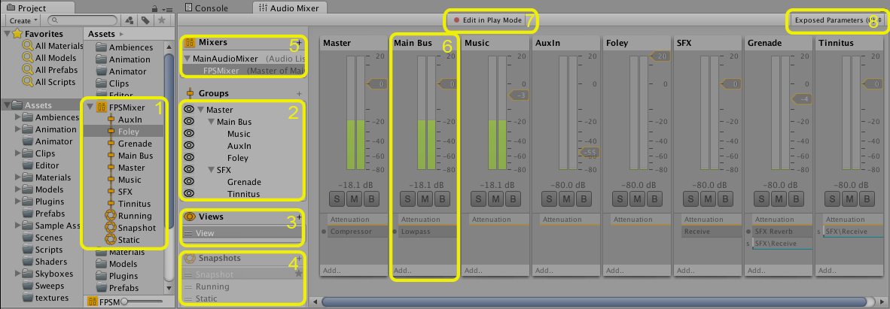
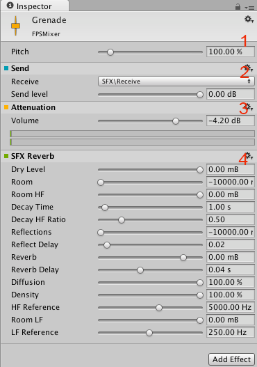
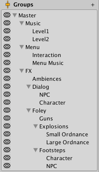

#概念和混音器 (AudioMixer) 的概述

混音器是一种可由音频源 (AudioSource) 引用的资源，能够对通过音频源生成的音频信号进行更复杂的线路规划和混音。这一类混音是通过用户在资源内部构造的音频组层级视图来完成的。

DSP 效果和其他音频母带制作概念可应用于音频信号，因为音频信号是从音频源路由到音频监听器 (AudioListener)。

##混音器视图

 

1.资源 - 包含所有音频组 (AudioGroup) 和作为子资源的音频快照 (AudioSnapshot)。
1.Hierarchy 视图 - 包含混音器中音频组的整个混音层级结构。
1.混音器视图 - 此处列出混音器缓存的可见性设置。每个视图仅显示主混音器窗口中整个层级视图的一个子集。
1.快照 - 这是混音器资源中所有音频快照的列表。快照捕获了混音器中所有参数设置的状态，并且可以在运行时切换。
1.输出混音器 - 可将混音器混合到其他混音器的音频组。此属性字段可用于定义要将此混音器信号路由到的输出音频组。
1.音频组条带视图 - 显示音频组的概述，包括当前 VU 级别、衰减（音量）设置、静音 (Mute)、独奏 (Solo) 和绕过效果 (Effect Bypass) 设置以及音频组 DSP 效果列表。
1.Edit In Play Mode - 这是一个开关，播放模式下可以编辑混音器，禁止编辑时可在游戏运行时控制混音器的状态。
1.Exposed Parameters - 显示暴露的参数（混音器中的任何参数都可以通过字符串名称暴露给脚本）及其对应字符串名称的列表。

##混音器检视面板

 

1.所有音频组顶部都会显示音高 (Pitch) 和闪避 (Ducking) 设置。
1.发送效果 (Send Effect) 示例，位于应用衰减之前。
1.这里对音频组进行了衰减（音量设置）。可在效果堆栈中的任何位置应用衰减。这里的 VU 计量表显示效果堆栈中此时刻的音量级别（不同于混音器视图中显示的 VU 计量表，此计量表显示了在信号离开音频组时的级别）。
1.包含参数的示例效果，在本示例中为“混响”(Reverb)。要暴露参数，可右键单击参数，然后选择暴露参数即可。

##概念

###路由和混音

[http://en.wikipedia.org/wiki/Audio_mixing](http://en.wikipedia.org/wiki/Audio_mixing)

音频路线规划是指获取一定数量的输入音频信号并输出 1 个或多个输出信号的过程。这里的“信号”一词指的是连续的数字音频数据流，可以分解为数字音频声道（比如立体声或 5.1（6 声道））。

在内部通常会对这些信号进行一些处理工作，例如混音、应用效果、衰减等。由于各种原因（后面会讲到），这是音频处理的一个重要方面，这也是混音器的设计用途。

除了“发送”(Sends) 和“返回”(Returns)（后面会讲到）之外，混音器还包含音频组，音频组允许任何数量的输入信号，混合这些信号，并且只有 1 路输出。

 

在音频处理领域，这种路线和混音通常在与场景图形层级视图正交的情况下完成，因为音频的行为以及设计者与音频的交互方式与场景中显示的对象和概念非常不同。

在以前版本的 Unity 中，不存在路线和混音的概念。用户以前可以将音频源放置在场景中，并且音频源产生的音频信号（例如通过音频剪辑）被直接添加到音频监听器，所有音频信号在一个点上混合起来。此处需要注意的是，这些操作与场景图正交进行，无论音频源在场景中的什么地方。

混音器现在位于音频信号处理空间中的音频源和音频监听器之间，可以从音频源获取输出信号，执行期望的任何路线和混音操作，直到最终所有音频都输出到音频监听器并从扬声器中听到。

####这些有什么用途？

通过混音和路线，可以将游戏中的音频分类为所有需求的类型。一旦将声音混合到这些类别中，效果和其他操作就可以作为一个整体应用于这些类别。这一功能很强大，不仅可以将游戏逻辑更改应用于各种声音类别，而且还允许设计人员调整混音的各个方面以便在运行时对整个音景动态地执行所谓的“母带制作”(Mastering)。

####与 3D 空间衰减的关系

某些声音概念与场景图和 3D 世界有关。其中最明显的是基于 3D 距离、与音频监听器的相对速度和环境混响效果进行的衰减应用。

由于这些操作与场景有关，而与混音器中的声音类别无关，因此在信号进入混音器之前，效果将应用于音频源。例如，基于音频源与音频监听器的距离应用于音频源的衰减将在信号离开音频源之前应用于信号，并被路由到混音器。

###声音类别

如上所述，混音器允许有效地对声音类型进行分类并对这些类别执行操作。这是一个重要的概念，因为如果没有这样的分类，整个声景很快变成一堆难以区分的噪音，因为每个声音都是平等地播放，而没有对它们应用混音。借助诸如闪避之类的概念，声音类别也可以相互影响，为混音增加额外的丰富性。

例如，设计人员可能希望对类别执行以下操作：

* 对一组环境声音应用衰减。
* 触发游戏中所有拟音的低通滤波器，模拟水下效果。
* 衰减游戏中的所有声音，但菜单音乐和交互声音除外。
* 降低游戏中所有枪声和爆炸声的音量，以确保可听到玩家与 NPC 之间的交谈。
* 等等
 
这些类别实际上与游戏紧密相关，并且在不同的项目之间有所不同，但这种分类可以借鉴如下所述的方式：

* 所有声音都路由到“Master”音频组
* 在 Master 组中，存在以下类别：Music（音乐）、Menu（菜单）声音和所有游戏声音
* 游戏声音组分为：与 NPC 的对话、周围的环境声音以及其他拟音（比如枪声和脚步声）
* 可以根据需要来进一步细分这些类别

此布局的类别层级视图如下所示：

 

请注意，场景图布局看起来与声音类别的布局完全不同。

###混音的情绪和主题

游戏声音的混音和路由也可用于创建设计师所寻找的沉浸感。例如，可以将混响应用于所有游戏声音，并使音乐衰减以产生身处洞穴中的感觉。

混音器可以有效地用于在游戏中营造情绪。通过在游戏中使用快照（后面会介绍）和其他不同混音器等概念，游戏可以轻松转换其情绪并使玩家感受到设计师所期望的感受，这在游戏的沉浸体验中是超级强大的。

###全局混音

混音器用于控制游戏中所有声音的总体混音。这些混音器将控制全局混音，可视为路由声音实例的静态单声道混音。

也就是说，混音器始终存在于场景的生命周期中，声音实例随着游戏的进行而创建和销毁，并通过这些全局混音器播放。

###快照

快照可以捕获混音器的状态，并随着游戏的进行在这些不同的状态之间转换。要定义混音的情绪或主题，并随着玩家在游戏中的进展而改变这些情绪，这是一种很棒的方法。

快照可捕获混音器中所有参数的值：

* 音量
* 音高
* 发送级别
* 湿混音级别
* 效果参数

要改变音景的多个方面，一种很棒方法是将快照与游戏逻辑相结合。
