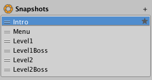
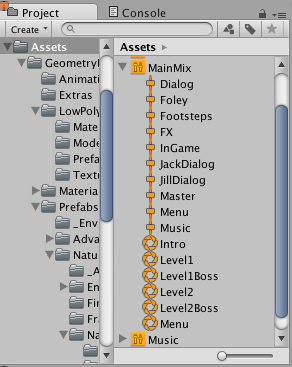

#AudioMixer 窗口上的具体内容

##Mixers 面板

Mixers 面板显示项目中所有混音器的完整列表。在此面板中选择可以快速切换混音器。在此面板中，还可以将一个混音器路线混合到另一个混音器的音频组。

通过单击面板右上角的“+”图标在项目中创建新的混音器。

 

###将混音器路线混合到其他混音器

Unity 支持在一个场景中同时使用多个混音器。默认情况下，每个混音器将音频信号直接输出到音频监听器。

开发者还可以选择将混音器的音频输出路线混合到另一个混音器的音频组。这可以在游戏运行时实现灵活且动态的动态路线层级视图。

将混音器路线混合到另一个音频组可以通过两种方式实现：第一种是在 Mixers 面板中的编辑器中进行，另一种是在运行时使用混音器 API 动态地实现。

* 要在编辑器中更改混音器的输出，只需在 Mixers 面板中单击混音器，然后将其拖到另一个混音器上。
* 在对话框中，可以选择路线混合到指定混音器的音频组。
* 选择输出音频组后，此面板将显示混音器的父子关系。此面板还将在混音器名称旁边显示目标音频组。

 

##层级视图面板

可在层级视图中定义混音器的声音类别和混合结构。如上所述，该视图可用于定义音频源可连接到并播放的自定义类别。

 

###在层级视图中添加和配置音频组
添加和修改混音器的拓扑是在音频组的层级视图面板中完成的。

* 可通过 2 种方式将新的音频组添加到层级视图中：
    * 右键单击现有音频组（混音器中必须至少有一个）并选择“Add child group”或“Add sibling group”。
    * 选择要将子项添加到的音频组，然后单击面板右上角的“+”图标。这将在所选音频组下面的混音器旁边添加一个新组。
* 要更改音频组的拓扑，请在面板中单击音频组，并将其拖动到另一个音频组上即可，这将变为目标音频组的父代，高于所选音频组。
* 可通过 2 种方式删除音频组（包括其子项）：
    * 选择要删除的组，然后按 Delete 键。
    * 右键单击要删除的组，然后选择“Remove Group (and children)”选项。
* 要复制音频组（并使其成为同代），请右键单击要复制的音频组，然后选择“Duplicate Group (and children)”。这将完全复制组和子组，包括组中包含的效果。
* 要重命名音频组，请右键单击该组并选择“Rename”。

##音频组视图

 

音频组视图显示混音器中音频组的平面排列方式。这种排列在视图中以水平方式组织。音频组视图中显示的组由当前视图选择情况决定（稍后介绍）。

视图中的每个音频组都表示为垂直“条带”。条带的布局和外观与数字音频工作站 (Digital Audio Workstations) 及其他音频编辑软件包相同。选择此布局是为了便于音频工程师进行从音乐和视频背景的转换，以及用作音频硬件集成的并行视图。

条带由标题栏组成，后面是垂直 VU 计量表，表示通过该音频组的当前音频级别。VU 计量表旁边是音量选择器，采用与 VU 计量表相同的比例来输入音频组衰减（以 dB 级别表示）。

VU 计量表下方是 3 个按钮，具有以下功能：

* **独奏 (Solo)** - 此开关用于选择收听整个混音，还是仅在正在独奏的音频组的子项中播放的音频源。
* **静音 (Mute)** - 此开关用于选择播放的混音包含当前音频组还是使其在全局混音中静音。
* **绕过 (Bypass)** - 此开关可用于绕过或启用音频组中存在的所有效果。

音频组还包含音频组中 DSP 效果单元和衰减单元的列表。衰减可应用于音频组中效果单元链内的任何位置，选择需要应用音量调整的准确位置。这对于非线性效果以及发送单元和接收单元（稍后介绍）非常有用。

每个效果单元 (Effect Unit) 字段包含以下功能：

* 显示所应用的效果单元的名称
* 在效果的左侧显示一个圆圈，可进行切换以启用或绕过个别效果。
* 如果右键单击效果并选择“Allow Wet Mixing”，效果底部的彩色栏变为活动状态，表示在效果中传递的湿信号数量。
* 可在音频组内上下拖动效果以优化其顺序，也可以跨音频组将效果移动到另一个音频组。

通过以下方式添加新的效果单元：右键单击现有效果以在其之前或之后添加效果单元，或单击条带底部的“Add..”按钮。

##Snapshot 面板

Snapshot 面板允许在混音器中创建、切换和调整不同的快照。始终至少有一个快照处于活动状态，并且在 Snapshot 面板中选择了某个快照即表明对混音器的进一步编辑便是对该快照的编辑。

Snapshot 面板中定义的快照也显示为混音器的子资源。允许在编辑器的其他位置以及脚本中访问快照。

 

 

也可以定义“开始快照”(Start Snapshot)（由快照列表右侧的星形图标表示）。开始快照是加载时混音器初始化的快照（例如，场景启动时）

* 要创建新快照，请单击面板右上角的“+”小图标。输入新快照的名称。
* 要定义不同的开始快照，请右键单击所需的快照，然后选择“Set as Start Snapshot”。

##Views 面板

视图 (Views) 允许在混音器中创建若干组可见的音频组。通过视图，可以创建感兴趣的混音器透视角度，而不是始终显示完整的层级视图。视图纯粹用于工作流程优化，不会影响运行时的设置或性能。

与 Snapshot 面板一样，始终会选定一个视图，并在当前显示在音频组视图中。默认情况下，所有音频组在默认视图中都可见。视图中包含的内容由层级视图面板中的“眼睛图标”控制（参见上文）。

* 要将新视图添加到视图列表，请单击 Views 面板右上角的“+”小图标。输入新视图的名称。
* 通过在 View 面板中的视图列表中进行选择来更改当前视图。
* 要删除视图，请右键单击视图并选择“'Delete”
* 要使用所有当前视图设置来复制视图，请右键单击视图并选择“Duplicate”

###音频组的“眼睛”图标

层级视图面板中的每个音频组在组的左侧都有一个眼睛小图标。此图标有 2 个作用：

* 单击眼睛图标可切换此音频组在当前所选视图中的可见性。
* 通过右键单击眼睛图标，可以从一系列颜色中选择用于标记此音频组的颜色。选择“No Colour”以外的颜色将在眼睛图标的左侧显示一个小的彩色标记，还会在音频组视图的音频组名称下面显示一个彩色标记。这些颜色标记可以很好地在混音器中以直观方式将音频组的不同概念和集合进行分组。
 

