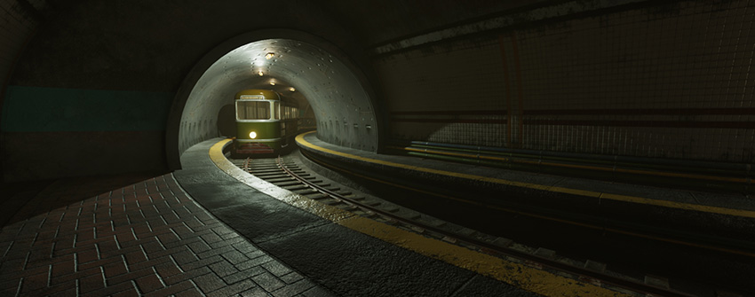

# 在 Unity 中制作可信的视觉效果

 

本最佳实践指南将介绍如何通过一些基本步骤针对可信的视觉效果建立合理基准。本指南中的建议由 Unity 的聚光灯 (Spotlight) 团队提供。聚光灯团队帮助开发者和内容创作者实现他们项目所需的外观和品质。他们聆听整个行业的故事，能够辨识客户面临的常见问题。制作场景时经常出现的问题是“我们如何构建一个相当逼真的标准视觉效果？”以及“我们如何在 Unity 中创建一个看起来可信的场景？”。

光照、纹理、比例和材质需要全部协调起来才能使数字内容看起来真实可信。由于存在大量可调整的功能、函数、选项、属性、系统和变量，您可能会问“我从哪里开始？”以及“我要以什么顺序进行？”。本指南的目的就是回答这些问题。

##内容

1.[为 Unity 准备资源](BestPracticeMakingBelievableVisuals1.html)
2.[在 Unity 中准备渲染设置](BestPracticeMakingBelievableVisuals2.html)
3.[光照策略](BestPracticeMakingBelievableVisuals3.html)
4.[建模](BestPracticeMakingBelievableVisuals4.html)
5.[着色](BestPracticeMakingBelievableVisuals5.html)
6.[室外光照和场景设置](BestPracticeMakingBelievableVisuals6.html)
7.[室内和局部光照](BestPracticeMakingBelievableVisuals7.html)
8.[了解后期处理](BestPracticeMakingBelievableVisuals8.html)
9.[动态光照](BestPracticeMakingBelievableVisuals9.html)

## 示例场景

本指南附有 [Spotlight Tunnel 示例场景](https://drive.google.com/a/unity3d.com/file/d/1UB1T5ahERIBVyj0HHPawjN45ASFyxgYF/view?usp=sharing)：

 

要使用此示例场景，请将项目提取到文件夹中，并在 Unity 中打开该项目。

**注意**：Spotlight Tunnel 项目是使用 Unity 2017.1.0f3 制作的。要在更新版本的 Unity 中使用此项目，请重新生成光照，因为版本之间可能存在某些光照数据格式不兼容的问题。要在 Unity Editor 中重新生成光照，请选择 __Window__ > __Lighting__ > __Settings__，然后在 Lighting 窗口的底部单击 __Generate Lighting__ 按钮。

此示例项目中提供的所有资源仅应当用于使用 Unity 开发的项目。

---

* 2018-03-23  Page published with limited [editorial review](DocumentationEditorialReview.html)

* 在 Unity [2017.3](https://docs.unity3d.com/2017.3/Documentation/Manual/30_search.html?q=newin20173) 中添加了制作可信视觉效果最佳实践指南 NewIn20173
