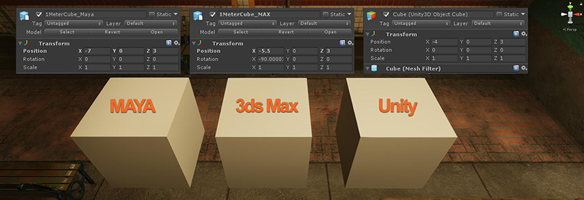
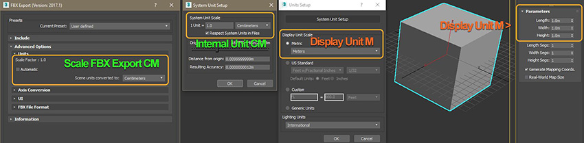
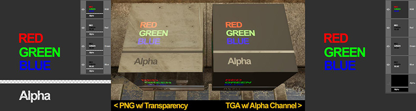

# 为 Unity 准备资源

第一步是将资源转换为符合您需求的格式。为了从 3D 建模应用程序（如 3ds Max、Maya、Blender 和 Houdini）转换到 Unity，建立适当的工作流程非常重要。[从 3D 建模应用程序导出资源以便导入 Unity](HOWTO-importObject.html) 时，需要考虑以下方面：

* [比例和单位](#scale)
* [参考点比例模型](#scaleModel)
* [纹理输出和通道](#textures)
* [法线贴图方向](#normalMap)

 
## 比例和单位

项目缩放比例和您偏好的测量单位在制作可信场景时起着非常重要的作用。在许多“真实世界”设置中，我们建议您假设 1 个 Unity 单位 = 1 米（100 厘米），因为许多物理系统都采用此单位大小。有关更多建议，请参阅[艺术资源最佳实践指南](HOWTO-ArtAssetBestPracticeGuide.html)。

为了保持 3D 建模应用程序与 Unity 之间的一致性，请始终验证导入的游戏对象比例和大小。3D 建模应用程序在 FBX 导出配置中有单位和比例设置（请参阅 3D 建模软件的文档以了解配置建议）。通常情况下，导入 Unity 时匹配比例的最佳方法是将这些工具设置为以厘米为单位并采用自动比例导出 FBX。但是，在启动新项目时，应始终检查单位和比例设置是否匹配。

要快速验证导出设置，
请在 3D 建模应用程序中创建一个简单的 1x1x1m 立方体，并将其导入 Unity。
在 Unity 中，创建默认的立方体 (__GameObject__ > __3D Object__ > __Cube__)。此立方体为 1x1x1m。将此立方体用作比例参考，与导入的模型进行比较。
当 Inspector 中的变换组件的 __Scale__ 属性设置为 1,1,1 时，这些立方体应该看起来完全相同：

**注意**：

* Maya 和 3ds Max 可以覆盖您的默认单位，具体取决于上次打开的文件。
* 3D 建模应用程序可以将工作空间中的不同单位显示为其内部单位设置，这可能会导致一定程度的混淆。

 
## 参考点比例模型

通过占位体或草绘几何体阻挡场景时，使用参考点比例模型可能会有所帮助。请选择适合正在制作的场景的参考点比例模型。在 Spotlight Tunnel 示例场景案例中，我们使用了公园长椅：

场景不必使用与现实生活完全相同的比例。使用参考点比例模型可以在游戏对象之间确保相对的比例一致性，即使场景试图使用夸大的比例也没有关系。

 
## 纹理输出和通道

纹理内部的信息需要包含正确的信息，以便在添加到材质时提供正确的结果。纹理创作软件（如 Photoshop 和 Substance Painter）在经过正确配置后可输出一致且可预测的纹理。

以下是 Substance Painter 预设配置的示例，此示例将输出与 Unity 标准不透明材质结合使用的纹理：

 

Unity 标准材质中的纹理分配为：

|**用于导出的输出映射** |**Unity 标准着色器材质中的分配** |
|:---|:---|
|$textureSet_Albedo| 分配给 Albedo。 |
|$textureSet_MetallicAOGloss | 分配给 Metallic 且 Occlusion.Smoothness Source 设置为 Metallic Alpha。 |
|$textureSet_Normal | 分配给 Normal Map 字段。 |

**注意**：与将环境光遮挡 (AO) 导出为单独的纹理相比，将多个通道打包到单个纹理（例如 MetallicAOGloss）可节省纹理内存。这是使用 Unity 标准材质的最佳方式。

创建纹理时，不得混淆 Alpha 通道。下面的示例显示了因为 Photoshop 处理 PNG Alpha 通道的方式问题（不使用外部插件），PNG 文件中的透明度如何在 Photoshop 中让创作者感到困惑。在这种情况下，具有专用 Alpha 通道的未压缩 32 位 TGA 可能是更好的选择（假设源纹理文件大小不是问题）：

 

上面显示的透明 PNG 文件是在 Photoshop 中创建的，其 Alpha 通道显示为黑色值。具有专用 Alpha 通道的 TGA 显示了预期值。如上所示，当分配给标准着色器材质的每个纹理从 Alpha 通道读取平滑度数据时，具有 PNG 纹理的材质的平滑度意外反转，而具有 TGA 纹理的材质的平滑度是正常的。

 
## 法线贴图方向

Unity 读取切线空间法线贴图时采用以下解释：

* 红色通道 X+ 表示 __Right__
* 绿色通道 Y+ 表示 __Up__

例如，3ds Max __Render to Texture__ 法线贴图在默认情况下将绿色通道 Y+ 输出为 __Down__。这会导致沿 Y 轴反转的表面方向，并在照亮时产生错误结果。要验证法线贴图方向，请创建一个带凹形斜面的简单平面（下例中的中间图片）并将其烘焙到平坦平面。然后将烘焙后的法线贴图分配到 Unity 中具有可识别光源方向的平面内，并查看是否有任何轴被反转。

有关轴设置的建议，请参阅 3D 建模应用程序的文档。

---

* 2018-04-19  Page published with limited [editorial review](DocumentationEditorialReview.html)

* 在 Unity 2017.3 中添加了制作可信视觉效果最佳实践指南
