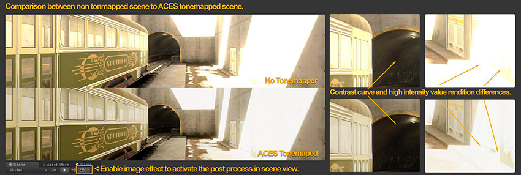

# 在 Unity 中准备渲染设置

以下建议可帮助您了解如何使用 Unity 的渲染功能逼真地模拟现实世界，并快速实现项目的可信视觉效果目标。这包括：

* [线性渲染模式](#linear)
* [渲染模式](#rendering)
* [启用后期处理](#enablePP)
* [高动态范围 (HDR) 摄像机](#hdrCamera)
* [HDR 光照贴图编码（可选）](#hdrLightmap)
* [为视口启用图像效果](#imageEffects)

有关更深入的信息，请参阅 Unity 的[光照和渲染教程](https://unity3d.com/learn/tutorials/topics/graphics/introduction-lighting-and-rendering)。

 
## 线性渲染模式

简单来说，线性渲染模式使 Unity 能够在将最终输出转换为最适合显示屏的格式之前使用物理上精确的数学进行光照和着色计算。

要指定伽马或线性工作流程，请执行以下操作：

1.在 Unity 中，选择 __Edit__ > __Project Settings__ > __Player__ 并打开 __Player Settings__。

2.选择 __Other Settings__ > __Rendering__ 并将 __Color Space__ 更改为 __Linear__。

定义颜色空间应该是项目中最早的决策之一，因为它会对最终的着色和光照结果产生巨大影响。有关每个工作流程的更多建议，请参阅[线性或伽马工作流程](LinearRendering-LinearOrGammaWorkflow.html)。

 
## 渲染模式

Spotlight Tunnel 示例场景使用延迟着色渲染路径。因此，您可以：

* 高效使用多个动态光照

* 组合多个反射立方体贴图

* 使用 Unity 2017+ 中的现有屏幕空间反射功能

要在 Editor 中设置渲染路径，请选择 __Edit__ > __Project Settings__ > __Graphics__ 或在场景中选择 __Main Camera__，然后在 Inspector 窗口中设置 __Rendering Path__。

有关渲染模式的更多信息，请参阅[渲染管线详细信息](Rendering-Tech.html)。

 
## 启用后期处理

要正确显示 HDR 光照，请在项目中安装 [Unity 后期处理栈 V1](https://assetstore.unity.com/packages/essentials/post-processing-stack-83912)，然后按以下步骤对其进行设置并启用色调映射：

1.在项目中创建 __Post-Processing Profile__ 资源并对其进行配置：

    * 启用 __Color Grading__ > __Tonemapper__ > __Filmic (ACES)__（学院色彩编码标准）。有关使用 ACES 色调映射来处理高强度颜色值（如彩色光或火焰）的建议，请参阅[高强度颜色](BestPracticeMakingBelievableVisuals8.html#highIntensityColor)。
    * __启用抖动__。通过抖动功能，场景可减轻由 HDR 场景的 8 位/通道输出所引入的带状瑕疵。现代引擎使用这种技术来规避 16M 色彩输出的限制。
    * 将 __Tonemapper__ 设置的其余部分保留为默认值。

1.在场景中选择 __Main Camera__，单击 Inspector 窗口中的 __Add Component__，然后选择 __Post-Processing Behaviour__。

1.在 __Profile__ 字段中，输入您创建的后处理配置文件。

Spotlight Tunnel 示例场景使用的是后期处理栈 V1。有关使用后期处理栈 V2 的建议，请参阅[包自述文件](https://github.com/Unity-Technologies/PostProcessing)。

 
## 高动态范围 (HDR) 摄像机

渲染可信光照时，您需要处理亮度高于 1（高动态范围）的光照值和发光表面，就像现实生活一样。然后，您需要将这些值重新映射到适当的屏幕范围（请参阅[色调映射](PostProcessing-ColorGrading.html)）。高动态范围设置至关重要，因为它允许 Unity 摄像机处理高值，而不是修剪它们。
要启用 HDR，请在场景中选择 __Main Camera__，并确保选中 Inspector 窗口中的 __Allow HDR__ 复选框。

 
## HDR 光照贴图射编码（可选）

Spotlight Tunnel 示例场景不使用烘焙光照。但是，如果您计划使用 HDR 烘焙光照，请将光照贴图编码设置为 HDR 光照贴图以获得一致的结果。

要在 Unity 中设置光照贴图编码，请选择 __Edit__ > __Project__ > __Player__ > __Other Settingspost__ > __Lightmap Encoding__。有关更多信息，请参阅[光照贴图：技术信息](Lightmaps-TechnicalInformation.html)。

 
## 在视口中启用图像效果

要在使用场景时查看色调映射器，请在 Scene 视图顶部的下拉工具栏菜单中启用 __Image Effects__。在下图中，请注意色调映射场景中的高光再现和黑暗隧道值分离改进情况。如果观察非色调映射场景，您可以看到高光如何不聚合到统一的颜色（在此处为黄色烈日）。

此设置在本质上试图复制数码相机以固定曝光值捕获场景的情况（未启用曝光适应/人眼适应功能）。

到目前为止，您已完成适当的基础场景渲染设置，应该能为广泛的内容提供可信结果：

 

---

* 2018-03-23  Page published with limited [editorial review](DocumentationEditorialReview.html)

* 在 Unity 2017.3 中添加了制作可信视觉效果最佳实践指南

