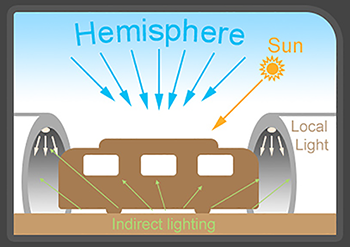
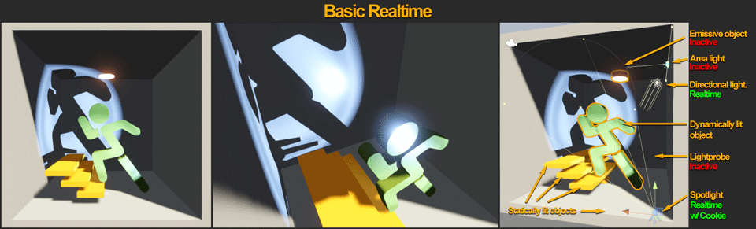
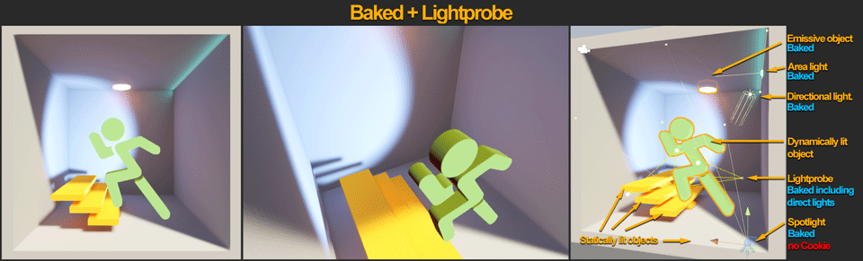
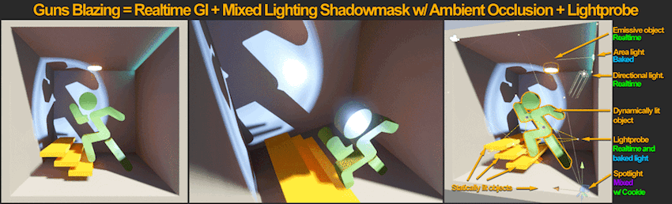

# 光照策略

在开始为场景创建最终资源并处理光照之前，您需要弄清楚自己的光照策略。在开发后期改变光照策略会对工作流程产生很大影响。在您进入生产之前花些时间确定好光照策略可以节省整体时间，还能让您获得更好的性能和更高的视觉保真度。

与所有开发一样，每项设置几乎总是存在优缺点，需要在二者之间进行权衡。但有时，某些技术会为您提供在特定约束条件下减少这些折中的选项。了解每个功能的利弊可以让您选择最适合项目的功能。

一个具有室外区域的典型白天场景拥有以下光照组件：

* 半球光照（天空贡献值）
* 直射光（太阳 + 局部光照）
* 间接光（反弹和反射光照）

 

这三个组件看起来似乎很简单。但是，由于您可以混搭__实时__光照、__混合__光照、__烘焙__光照、静态游戏对象和动态游戏对象，因此最后可得出多种光照选择。

Unity 支持许多不同的光照策略和项目场景。要了解光照模式和设置，请参阅有关[光照模式](LightModes.html)的文档。

对于新手来说，要弄清楚哪种设置最适合他们的场景以及如何权衡取舍，可能会让他们不知所措。因此，让我们考虑最常用的光照设置：

* [基本实时光照](#realtime)：有可见的光源镜面高光，但没有间接光照。
* [烘焙光照](#baked)：有可见的柔和烘焙阴影，在高分辨率下有可见的静态间接光照，但没有光源镜面高光，而且动态光照游戏对象不投射阴影。
* [混合光照](#mixed)：与__烘焙__光照类似，但是光源会产生镜面反应，而且动态光照游戏对象会投射阴影。
* [实时光照和 GI（全局光照）](#realtimeGI)：有可见的适当间接光照反应和镜面反应，光源全部都可以移动和更新，但不存在有角度的柔和阴影。
* [启用所有选项](#all)：根据每个光源的设置，您可以实现上述所有选项的组合。

以下图像显示了这些设置之间的显著差异：

__注意__：__实时 GI__ 不能烘焙静态环境光遮挡，因此未包括在内。

 
## 基本实时光照和环境光（无实时 GI 和烘焙 GI）

基本实时光照通常用于可视化风格的项目以及原型设计阶段。

**典型的平台目标**：游戏主机和 PC

**优点**：

* 所有直射光和阴影都是实时应用的，因此可移动。
* 允许快速迭代，因为没有预计算、烘焙和网格准备过程。
* 动态和静态游戏对象以相同的方法照亮，因此不需要光照探针 (Light Probes)。

**缺点**：

* 无半球遮挡，只有天空盒/环境光值，并且区域中的颜色不会被直接光照照亮。
* 如果没有 GI 或间接光照组件，场景可能无法实现最佳视觉效果。

 
## 所有烘焙光照和光照探针

烘焙光照通常适用于存在运行时性能问题但还有可利用的内存空间的游戏，例如自上而下的等距移动端游戏和高帧率 VR 游戏。

**典型的平台目标**：移动平台、VR、游戏主机和低端 PC

**优点**：

* 为静态游戏对象烘焙所有光源。它们会产生环境光遮挡和间接光照。
* Unity 可以将面光源烘焙支持和柔和阴影角度烘焙到静态照亮的游戏对象上。
* 在此处列出的常见设置中具有最快的运行时性能。

**缺点**：

* 可能减慢光照迭代，因为光源会被烘焙，这意味着 Unity 需要在场景发生变化时重新计算光源（除非您使用的是渐进光照贴图 (Progressive Lightmapper)）
* 动态照亮的游戏对象仅使用光照探针照亮。
* 镜面高光仅依赖于立方体贴图和反射，而不依赖于光源。
* 动态游戏对象不产生阴影。
* 可能需要大量的运行时内存，具体取决于场景中使用的光照贴图纹理数量。
* 如果游戏对象纹理图表发生重叠，可能需要创建纹理坐标通道 2（用于光照贴图的 UV2）。

 
## 采用阴影遮罩和光照探针的混合光照

混合光照通常在日常光照（例如太阳运动）不重要的游戏中有用。

**典型的平台目标**：VR、游戏主机和 PC

**优点**：

* 与所有烘焙光照类似，但在混合光照中，动态游戏对象可获得实时镜面光照并投射实时阴影，而静态游戏对象可获得烘焙阴影，从而产生更好的视觉品质。

**缺点**：

* 游戏对象的阴影遮罩数量不超过 4。额外的阴影投射光源将被烘焙。
* 运行时渲染实时光源会更加消耗资源。
* 混合光源在某些设置下会严重影响性能。

有关阴影遮罩光照的更多信息，请参阅[阴影遮罩](LightMode-Mixed-Shadowmask.html)。

 
## 采用实时 GI 和光照探针的实时光照

此设置在开放区域游戏中非常有用，在此类游戏中，您需要日常光照更新（例如太阳移动）和动态光照效果。

**典型的平台目标**：游戏主机和 PC

**优点**：

* 此设置支持通过实时间接光照进行快速光照迭代。
* 动态和静态游戏对象可获得实时镜面光照和阴影。
* 在间接光照中可使用比烘焙光照更少的内存。
* 在更新全局光照时具有固定的 CPU 性能影响。

**缺点**：

* 遮挡的细节化程度不如烘焙光照，通常必须通过屏幕空间环境光遮挡 (SSAO) 和具体对象纹理烘焙 AO 进行增强。
* 静态游戏对象没有区域/光源角度柔和阴影。
* 实时光照在某些设置下会严重影响性能。
* 如果有太多游戏对象对静态光照产生影响，预计算时间可能会花费大量时间，尤其是在没有优化 UV 设置的情况下。有关更多信息，请参阅[全局光照 UV](LightingGiUvs.html)。

有关优化__实时 GI__ 的深入信息，请参阅 Unity 提供的[预计算的实时 GI 简介](https://unity3d.com/learn/tutorials/topics/graphics/introduction-precomputed-realtime-gi)教程。

 
## 启用所有选项

通常情况下，您只希望在严格控制内存使用量和限制性能并具有高保真要求的游戏中启用所有光照选项。仅当您完全了解每个系统并知道如何处理每个光照组合的情况下，才应这样做。

**典型的平台目标**：游戏主机和 PC

**优点**：

* 这是一整套光照特性，为您提供全部功能。

**缺点**：

* 在运行时具有高性能要求，并具有高内存使用量。
* 需要更多 UV 创作和烘焙时间，因此增加了工作流程时间。

为了帮助您了解光照，Spotlight Tunnel 示例场景使用具有实时 GI 的实时光照。这种情况下可提供各种各样的镜面反应和良好的反弹光照，并允许您快速迭代光照。

---

* 2018-03-21  Page published with limited [editorial review](DocumentationEditorialReview.html)

* 在 Unity 2017.3 中添加了制作可信视觉效果最佳实践指南
