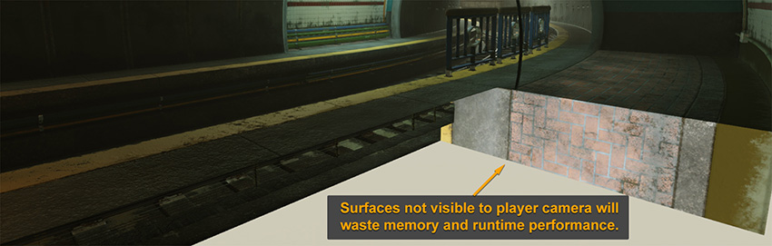
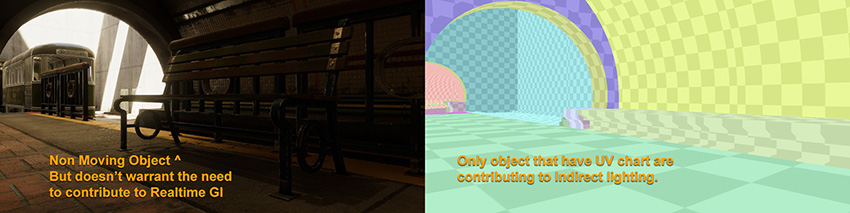
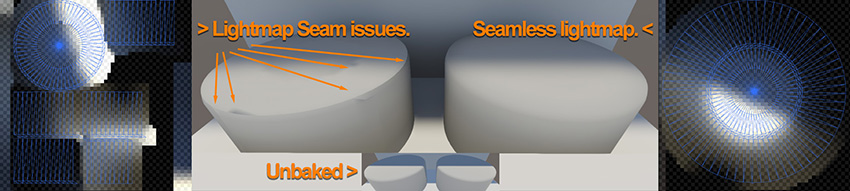
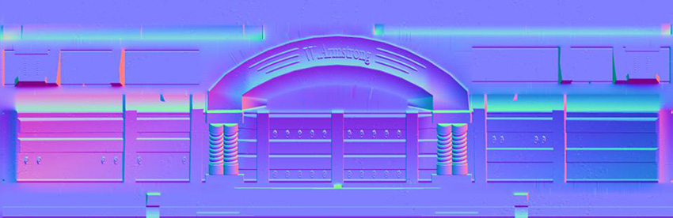
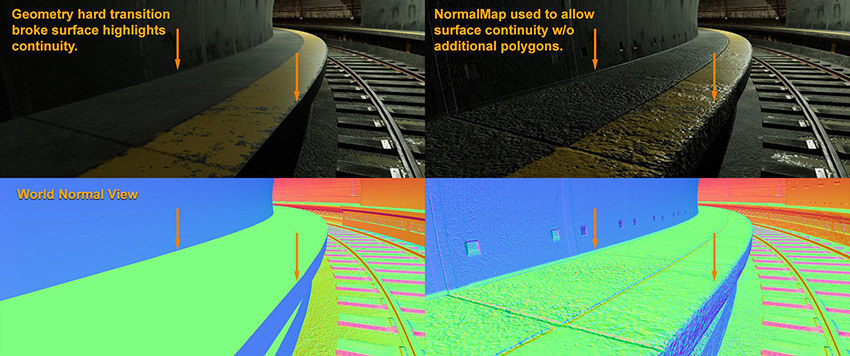
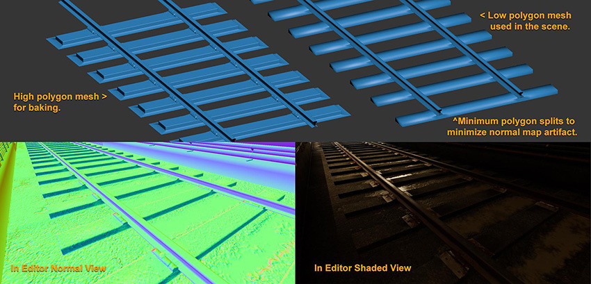

# 建模

在建模之前提前制定计划非常重要。快速制作的模型在预产期间或用于粗制空间时都表现良好，但在需要最终确定资源来制作适当场景时，请注意以下几点：

* [每个多边形都至关重要](#polygon)
* [游戏对象对光照的影响](#GameObject)
* [模型 UV 布局策略](#modelUV)
* [几何体细节](#geometry)
* [平滑组（多边形的硬/软边）](#smoothingGroup)

 
## 每个多边形都至关重要

尽管现代硬件比以往任何时候都更强大，但在场景中使用简单几何体总是有好处的。对于实时设置而言，不必要的曲面细分和复杂几何体是很难管理的，并可能会影响性能和使用不必要的内存。以下示例演示了玩家从未见过的几何体如何浪费光照贴图和过度绘制等资源并导致漏光：

 
## 游戏对象对光照的影响

如果要将烘焙光照或实时 GI（全局光照）与光照探针结合使用，则需要确定游戏对象对场景中的光照有影响，还是仅接收场景中的间接/烘焙光照。

### 对光照有影响的游戏对象

要设置游戏对象来影响光照，请确保在 Inspector 窗口中选中__Lightmap Static__。这样可以提供更简单和更平滑的表面区域，而由于在光照贴图纹理的空间使用效率方面的优势，这些区域将带来更好的间接反弹/烘焙光照。请注意：

* 如果自动光照贴图 UV 提供效率低下的图表或产生不合适的接缝，则可能需要在进行光照烘焙时为几何体创作 UV2。
* 您可能需要为几何体创建 UV3 以便在实时 GI 中获得有效结果。

有时，在实时 GI 中，您可以简化网格的 UV 以使几何体显著减少使用的资源，并获得最佳效果和更少瑕疵。

### 仅接收场景光照的游戏对象

当游戏对象仅接收来自实时光照和光照探针的光照时，几何体没有光照贴图 UV 限制。如果几何体很大，仍然需要特别注意几何体，因为单个光照探针可能无法正确照亮几何体，可能需要[光照探针代理体 (Light Probe Proxy Volume) 组件](class-LightProbeProxyVolume.html)将多个探针光照定义拼接到一起。

并非总是需要使用光照贴图或使用实时 GI 来处理非移动的游戏对象。如果游戏对象很小，或者不存在会反射大量光的表面，则可能不需要将其包含在光照贴图中。下面显示的长椅和栏杆就是很好的例子：

 
## 模型 UV 布局策略

UV 布局有助于在使用相同大小的内存进行法线贴图烘焙（通常为 UV1）、光照贴图烘焙 (UV2) 和实时光照贴图 (UV3) 时提高视觉品质，尤其适合具有不可平铺纹理的几何体。

以下是制定 UV 布局策略时需要注意的一些提示：

* 对于 UV1 图表，请在必要时才拆分 UV 壳，并尝试尽可能有效地调整 UV 图表布局，以防在法线贴图烘焙时浪费纹理空间。换句话说，无论您是否在纹理中添加细节，1024 正方形纹理均使用相同大小的内存。

* 对于光照贴图 (UV2)，请尝试制作边框会接触但不重叠的完整光照贴图图表，以免光照烘焙中出现扩散或接缝。在 UV 图表/壳之间保持一致的比例对于在模型中均匀分布光照贴图纹理像素非常重要。

* 对于实时 GI (UV3)，应为大型区域（表示模型中的大型表面）的 UV 空间设定高优先级，以便减少内存使用量并避免接缝。在许多情况下，模型中的自动 UV 设置确实可以帮助优化图表。有关实时 GI 的图表优化的深入信息，请参阅 Unity 提供的[优化 Unity 的自动展开](https://unity3d.com/learn/tutorials/topics/graphics/optimizing-unitys-auto-unwrapping?playlist=17102)教程。

* 对于不需要光照贴图的游戏对象，除非自定义着色器需要，否则不要创作其他 UV 以免浪费内存和时间。

 
## 几何体细节

真实世界的游戏对象具有高度细节化特点。要创建实时几何体，您需要确定要在几何体中添加的细节，以及要在法线贴图和纹理中添加的细节。在为实时场景开发资源时，将复杂多边形烘焙到简单多边形法线贴图是很正常的。

需要记住的一个重要细节是游戏对象上的边缘获得高光的方式。在现实生活中很难找到具有非常锋利边缘、具有非倾斜边缘或没有详细边缘定义的物体。复制逼真的边缘效果可提高场景的可信度。

 
## 平滑组（多边形的硬/软边）

您可以使用适当的平滑组来提高模型和法线贴图的效率。以下是使用平滑组的一些提示：

* 处理从复杂多边形到简单多边形的法线贴图烘焙时，请对平滑组使用简单配置而不是使用多个多面多边形。这是因为切线法线贴图需要在从简单多边形几何体上硬拆分表面法线时使拆分位置弯曲。

* 具有良好法线贴图的平滑多边形可节省顶点数，相当于渲染更高效的几何体。下面一个简单示例比较了以下设置：

    * 具有拆分平滑组的单个平面（等于 36 个顶点）。

    * 位于 1 个平滑组内的简单 18 三角平面（等于 16 个顶点）。

 

单个平面和三角平面顶点数比较

* 平滑多边形省去了光照贴图烘焙和实时 GI 中的图表拆分，带来更平滑的视觉效果。

---

* 2018-03-21  Page published with limited [editorial review](DocumentationEditorialReview.html)

* 在 Unity 2017.3 中添加了制作可信视觉效果最佳实践指南
