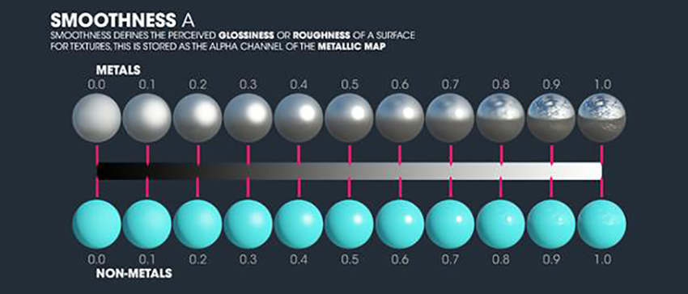
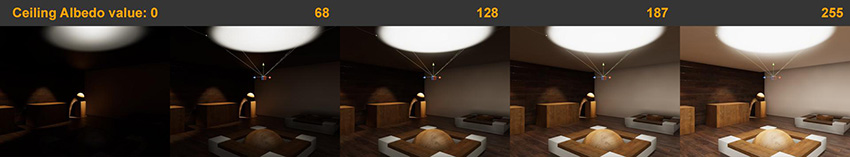
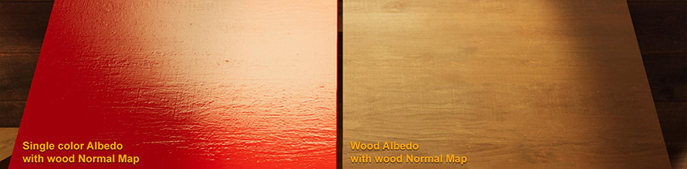
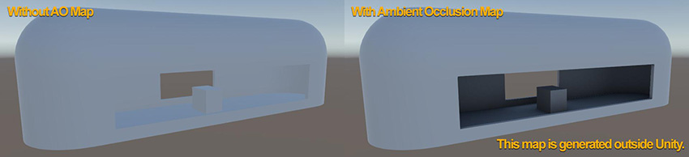
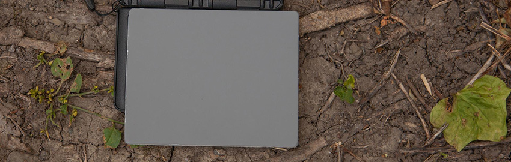
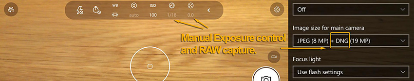
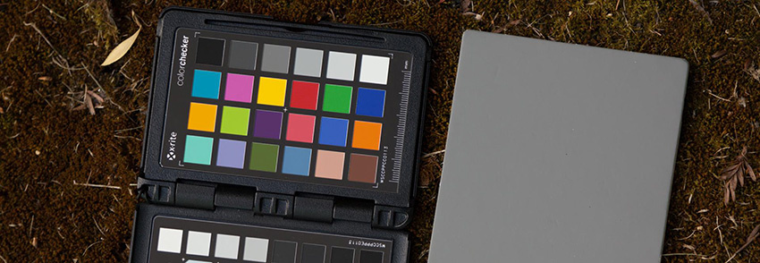

# 着色

材质定义了光照与模型表面的相互影响，是制作可信视觉效果的重要组成部分。创建模型后，应使用着色器定义其表面属性。Unity [标准着色器](shader-StandardShader.html)是一种内置着色器，具有全面的功能，因此可让您轻松创建合理的材质，并采用称为“基于物理着色”(PBS) 的高级光照模型。在 ShaderLab、ShaderGraph（可编程渲染管线）或其他着色器创建工具中制作自定义表面着色器之前，您应掌握标准着色器的用法。

大多数现实生活中的表面都是由多种材质组成的，因此在使用 Unity 标准着色器对游戏对象进行纹理处理时，您需要考虑：

* [标准或标准镜面反射设置](#setup)
* [反照率值和材质验证器](#albedo)
* [金属性值](#metallic)
* [平滑度值](#smoothnessValue)
* [法线贴图](#normalMap)
* [遮挡贴图](#occlusionMap)
* [参考图片、色卡和照片来源](#photo)

**注意**：此处仅介绍反照率、平滑度、法线贴图和 AO。有关进一步的建议，请参阅[标准着色器材质参数](StandardShaderMaterialParameters.html)文档。

 
## 标准或标准镜面反射设置

在 Unity 中，可将材质设置为__标准 (Standard)__ 或__标准镜面反射 (Standard Specular)__。使用其中任何一种设置时，请注意使用标准材质通常更容易，因为镜面亮度和颜色是根据反照率 (Albedo)、平滑度 (Smoothness) 和金属性 (Metallic) 输入自动计算的。

在标准设置材质中，将 Metallic 设置为 1 表示由反照率驱动镜面反射颜色并将其亮度与光滑度相配合，从而调整表面的亮度和光泽度。

如果要将镜面反射颜色与材质的反照率取消关联，请使用标准镜面反射。非金属材质或非标准金属材质就属于这种情况，此类情况下最好手动控制镜面反射颜色。有关更多信息，请参阅 [Specular 模式：Specular 参数](StandardShaderMaterialParameterSpecular.html)。

 
## 反照率值和材质验证器

虽然基于物理着色 (Physically Based Shader) 会尽量根据光照自动计算镜面亮度和分布，但是材质的反照率需要合理。材质的反照率会影响直接光照和间接光照，并在场景光照的其余部分传播不切实际的值。

非常暗的反照率将显著吸收光照，并产生不寻常的光照反应。太亮的反照率将反射现实生活中不会出现的大量光照和间接颜色。

非金属涂漆表面没有确定的值，而此类表面在现实生活中是很常见的。例如，您可以选择用炭黑或雪白的颜色粉刷木墙，但该墙壁反照率没有一个明确的值。为帮助您确定反照率值，我们提供了一个 PBS 值图表（请参阅[材质图表](StandardShaderMaterialCharts.html)）。根据一般准则，对于非金属涂漆表面，低于 0.2 的反照率值太暗，而高于 0.8 的反照率值太亮。有关较暗介电材质的信息，请参阅[材质制作指南 1：深色介电材质 (PDF)](https://docs.unity3d.com/uploads/ExpertGuides/Dark_Dielectric_Materials.pdf)

材质图表在处理单个反照率表面时使用起来相当简单。但是，确定复杂的反照率纹理可能很困难。您可以使用材质验证 (Material Validation) 工具来检查材质值是否符合指导要求。您可以在 Scene 视图中启用此工具，方法是从视口左上角的下拉菜单中选择 __Material Validation__。**注意**：材质验证仅在您不使用可编程渲染管线 (SRP) 时可用。要禁用 SRP，请选择 __Edit__ > __Project Settings__ > __Graphics__ 并将 __Scriptable Render Pipeline Settings__ 设置为 __None__。

 
## 金属性值

材质的金属性值定义了环境反射到表面的程度，同时还确定了表面上有多少可见的反照率颜色。当某个表面为纯金属时，由表面颜色（反照率）驱动环境反射的颜色。使用金属材质时，请注意以下几点：

* 纯金属光泽材质不会反弹漫射光照。如果整个空间都是用金属制成的，那么空间将非常暗，只能看到镜面高光和反射。

* 确定表面是否为金属可能有一定难度。不要考虑游戏对象的核心材质，而应关注游戏对象的最终表面。例如，涂成蓝色的金属栏杆仅应将未涂漆区域指定为金属。

注意：涂漆金属杆的缺损区域是金属的，但表面上的锈迹不是金属的。

* 虽然很容易想象材质只需要金属值 0 或 1 的情况，但有些情况下的表面材质是混合的。例如，部分被灰尘或污垢覆盖的金属游戏对象会由于混合特性而具有介于 0 和 1 之间的金属值。除此之外，在创建合理的材质时，应尽量避免使用介于 0 和 1 之间的金属值。

有关金属的更多信息，请参阅 [Metallic 模式：Metallic 参数](StandardShaderMaterialParameterMetallic.html)。

 
## 平滑度值

平滑度用于控制表面的微表面细节。值为 0 表示非常粗糙、无光泽的表面，值为 1 表示纯反射镜状表面。这通常很简单直观，但注意以下几点会很有帮助：

* 关注游戏对象的最终表面质量。例如，由混凝土制成的物体可能具有粗糙表面或在其上面具有光泽涂料。未涂漆木材的平滑度值取决于木材是否经过抛光。

* 不要忘记磨损、污垢、划痕和水渍。在现实生活中，材质的表面受到许多变量的影响。材质很少有纯粹的单一表面。

* 要确定材质的特性，请考虑元素在表面之间的混合方式。例如，土壤地面上的水坑通常具有吸水后的外环，这样的外环存在变暗的反照率，而不仅仅是直接平滑度混合。

	
有关平滑度的更多信息，请参阅[平滑度](StandardShaderMaterialParameterSmoothness.html)。

 
## 法线贴图

法线贴图通常是指切线空间法线贴图，这种贴图使多边形的表面法线弯曲，就像光照方向从另一个方向进入一样。此功能通常用于在看似简单的网格上添加许多细节。

您还可以使用法线贴图来定义材质。例如，对于涂有高光泽红色饰面的木材，可显示原始表面材质：

 

有关法线贴图的更多信息，请参阅有关[法线贴图（凹凸贴图）](StandardShaderMaterialParameterNormalMap.html)的文档。

 
## 遮挡贴图

遮挡贴图可模仿环境光消减状态，并可增强对凹面和形状的感知。

使用遮挡贴图有以下好处：

* 在离线渲染期间，能够以更高的质量实现遮挡贴图的细节化版本，尤其是数据来自细节化程度更高的模型的情况下（类似于法线贴图从细节化程度更高的模型烘焙到细节化程度更低的模型）。

* 遮挡贴图非常有助于动态照亮游戏对象，因为动态游戏对象不会被光照烘焙遮挡，并且仅接收光照探针光照或环境光照以及低细节化的屏幕空间环境光遮挡 (SSAO)。

有关遮挡贴图的更多信息，请参阅[遮挡贴图](StandardShaderMaterialParameterOcclusionMap.html)。

 
## 参考图片、色卡和照片来源

就像尝试学习任何新领域一样，研究数字内容创作背后的一般原则可以改善您的学习成果。拍摄真实表面的照片（无论是用于参考还是用作纹理来源）通常可以加快在 3D 建模应用程序中创建表面材质的过程。

收集参考时，只需要拍摄大量特定主题的图片。这种做法与前往图像搜索引擎并搜索特定参考图像具有一样的意义。

拍摄用作纹理来源的照片时，请务必抑制色偏，并消除表面的光照亮度效果。应使用 18% 灰卡（如柯达 R-27 卡）的白平衡和适当曝光值。例如：

 

18% 灰卡是可信赖的值，您可以在拍摄纹理源图片时将其用作锚点。不要试图自行打印 18% 灰卡，因为这样很可能带来不准确的灰卡和不平衡的颜色。适当的 18% 灰卡相当于 rgb(124,124,124) 或 sRGB 颜色空间中的 #7C7C7C。相机使用此灰卡获取适当的曝光（消除光照亮度）并进行白平衡（抑制光照色偏）。

有关灰卡的更多信息，请参阅 [Wikipedia 中的中灰色 (Middle gray)](https://en.wikipedia.org/wiki/Middle_gray).

为获得最佳效果，请使用数码单反相机/高级相机。但是，您可以在任何相机（包括具有手动曝光控制和 RAW 功能的手机）上使用上述设置来获得良好效果。

采用偏振光照和镜头并经过 X-Rite ColorChecker 校准的 RAW 图像在拍摄反照率纹理时可带来更高的准确度。

与 R-27 灰卡一样，ColorChecker 卡片是可信赖的颜色参考，您可以将其用作锚点。应生成相机传感器 + 镜头 + 滤镜 + 光照条件特性配置文件，然后将其用于校正 RAW 图像。

在拍摄纹理源图片时，请选择漫射光照条件，例如阴天或光照均匀的阴影。

若要在处理拍摄的图像时获得纯粹的反照率纹理，可使用 [Unity 的去光照工具](https://github.com/Unity-Technologies/DeLightingTool)执行其他处理。

---

* 2018-03-21  Page published with limited [editorial review](DocumentationEditorialReview.html)

* 在 Unity 2017.3 中添加了制作可信视觉效果最佳实践指南
