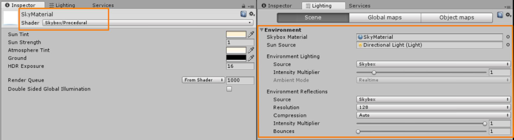
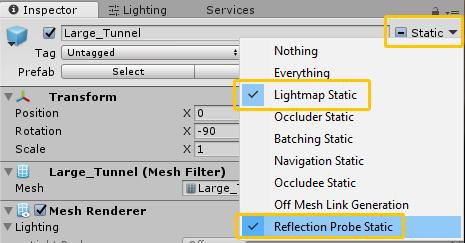
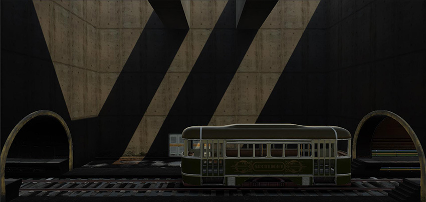
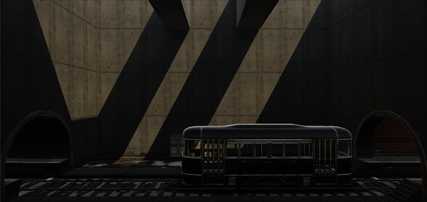
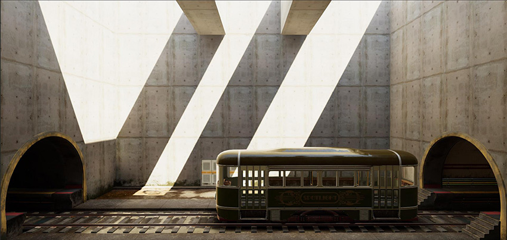
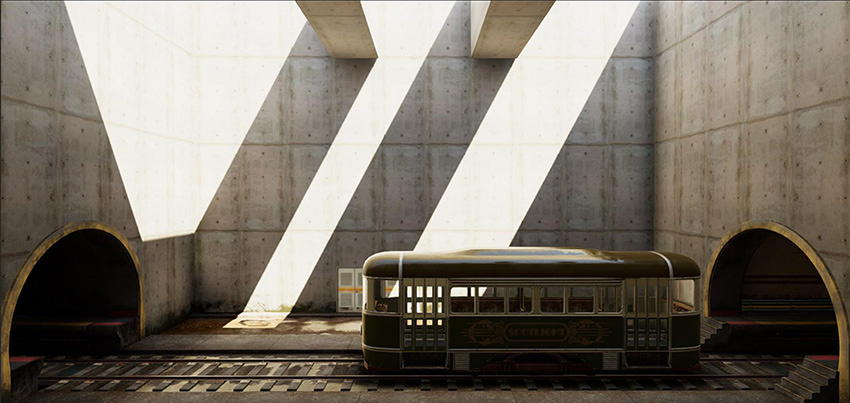
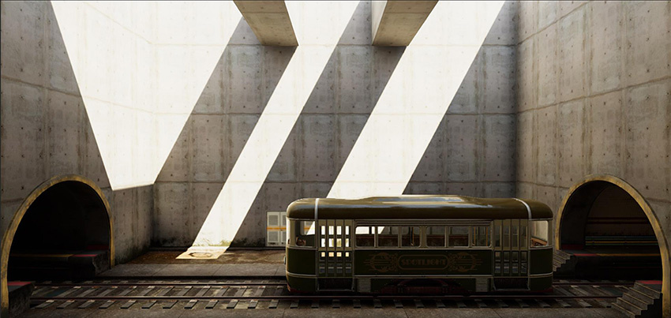
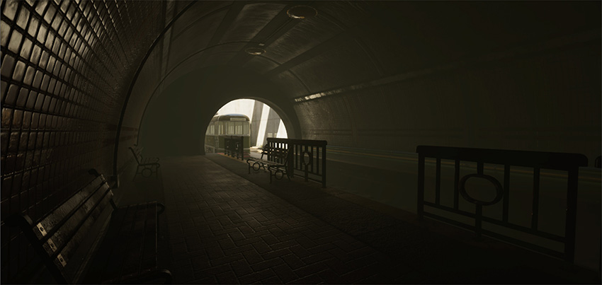

# 室外光照和场景设置

在此阶段，您应该拥有已正确设置纹理的网格以及一个组合场景（具有经过适当色调映射的 Unity 渲染设置）。但该场景仍然需要适当的光照设置。本部分中的建议假定您已使用__实时 GI（全局光照）__策略设置场景，然后使用实时光源进行了照亮以获得即时反馈。烘焙时也适用相同的建议和光照原则。

对于室外光照和场景设置，请注意以下几点：

* [环境光照](#environment)
* [全局光照](#directional)
* [光照探针和反射探针](#gi)
* [HDR 光照值](#probes)
* [屏幕空间环境光遮挡和屏幕空间反射](#hdr)
* [雾效](#fog)

 
## 环境光照

室外光照的主要组成之一是环境光照，也称为半球光照或天光。夜间天空的光照贡献微乎其微，而白昼天空的光照贡献非常大。环境光照设置位于 Lighting 选项卡下方 (__Window__ > __Lighting__ > __Settings__ > __Environment__)。

由于具有简单性和易用性，程序化天空盒材质优于 HDRI 立方体贴图。

要创建程序化天空盒材质，请执行以下操作：

1.在项目中添加新材质并将其命名为 __SkyMaterial__。

1.在 Inspector 中，将材质的 __Shader__ 设置为 Skybox/Procedural

1.在 Lighting 窗口中的 __Scene__ 选项卡上，将 __SkyMaterial__ 分配给 __Environment__ > __Skybox Material__：

 

场景现在略微亮起，它有了环境光照，但环境光照不合适：

 

 
## 方向光

典型的阳光或月光通常由方向光表示。这是由于其光照和阴影方向的平行性质（模仿接近无限远距离的光源）。

 

 
## 全局光照 (GI)

单独的方向光和环境光无法产生可信的光照。为获得适当的环境光照，需要遮挡天光的光照，而阳光需要间接光照反弹。在我们的示例中，天空当前为场景渲染单个颜色值，使其变得单调。这种情况下便需要实时 GI 或烘焙光照来计算遮挡和间接反弹光照。要实现这一目的，请遵循以下步骤：

1.要确保所有相关网格都影响实时 GI 或烘焙，请选择场景中的游戏对象，然后在 Inspector 窗口的 __Static__ 下拉菜单中启用 __Lightmap Static__ 和 __Reflection Probes__：

     

    **注意**：通常应将此设置应用于所有大型静态网格。

1.确保在 Lighting 窗口 > __Scene__ > __Realtime Lighting__ > __Realtime Global Illumination__ 中将场景设置为使用__实时全局光照 (Realtime Global Illumination)__。

1.在 Lighting 窗口的底部，确保选中 __Auto Generate__。

在此阶段，示例场景现在变暗，并且场景的某些元素看起来不合适，例如电车和背景中的门：

 

场景中的静态游戏对象当前具有适当的环境光照（半球光照）遮挡和来自方向光的间接反弹响应，但其余游戏对象还需要适当的光照设置。

 
#### 光照探针和反射探针

对于要接收实时或烘焙 GI 的动态游戏对象和非光照贴图游戏对象，您需要在场景中布置光照探针。在场景中有效地布置光照探针组，例如靠近动态照亮的游戏对象或在玩家经过的区域。有关光照探针组的更多信息，请参阅[光照探针](LightProbes.html)。

由于在 Lighting 窗口中选中了 __Auto Generate__，每次执行更改时都会刷新光照。在示例场景中使用光照探针后，现在电车和背景门的底色改善了，但反射看起来不合适。天空反射遍布整个场景并出现在了隧道内：

 

反射探针可帮助解决这一问题。根据需要在场景中有效放置反射探针并进行适当排布。在上面的场景图像中，整个空间内用一个反射探针就足够了。采用盒体投影的 128 像素立方体贴图分辨率对于大多数情况而言都是很好的基准，并且对于内存和反射烘焙时间也很有帮助。

示例场景现在看起来有了适当底色和凝聚力，这是构成可信场景的重要因素。然而，整体场景比以前更暗，远远达不到可信质量标准：

 

有关反射探针的更多信息，请参阅[反射探针](https://docs.unity3d.com/Manual/class-ReflectionProbe.html)。

 
## HDR 光照值

在实际生活中，环境光照和太阳光是非常明亮的光源。这些光源的亮度远高于像素值 1。这便是 HDR 光照的用武之地，因为它支持 0-1 范围之外的像素值。为了让您充分了解环境光照对场景的影响，让我们在示例场景中关闭方向性阳光，并将 __SkyMaterial__ > __Exposure__ 设置为 16：

 

场景开始变得可信，好像是阴天，阳光完全在天空中漫射，方向光未出现。现在，我们将 __Intensity__ 设置为 5，以高得多的值将太阳光重新引入场景。尽管太阳看起来几乎是白色，但正确选择颜色非常重要，因为来自强烈阳光的间接颜色的影响可以极大地改变场景的外观。

现在，正如现实生活中预期的那样，太阳（方向光）看起来像一个高能量的光源，场景看起来很可信：

 

 
## 屏幕空间环境光遮挡和屏幕空间反射

虽然场景光照在此刻看起来已经相当不错，但您还可以添加更多细节以使场景更加可信。为了实现合理性能，实时 GI 中设置的分辨率会受到限制，因此通常无法烘焙细节化的遮挡。这种情况下，屏幕空间环境光遮挡 (SSAO) 很有用。通过在后期处理配置文件 (Post-Process Profile) 中选中 __Ambient Occlusion__ 即可启用 SSAO。示例场景包含一个名为 _Rin_Post_Basic.asset_ 的后期处理配置文件，其中采用以下 __Ambient Occlusion__ 设置：

* __Intensity__ 0.5
* __Radius__ 1
* __Sample Count__ Medium
* __Downsampling__ 和 __Ambient Only__ 为选中状态

 

SSAO 负责处理额外环境光照遮挡，而屏幕空间反射 (SSR) 可提高精度。在后期处理配置文件中启用 __Screen Space Reflection__ 后，潮湿轨道的左侧不再呈现明亮的反射，因为 SSR 能够为场景屏幕上的游戏对象提供更准确的反射：

 

这两种后期处理选项都会在运行时产生性能影响，因此请合理启用它们。调整这些值时，应确保将性能影响控制在符合运行时要求的合理范围内。

 
## 雾效

在此阶段，我们的示例场景在固定曝光条件下具有可信的不同室外和室内值。反射可在黑暗的室内区域显示为强烈的高光，而不是暗淡的灰暗值。但是，场景前景和背景元素虽然是强大的透视元素，但不会显示出来：

为场景添加细微的雾效会给场景带来另一个维度：

添加雾效后，与上面的零雾效场景相比，前景栏杆的清晰度更好。
要启用雾效，请打开 Lighting 窗口，并选择 __Scene__ > __Other Settings > Fog__。在提供的场景中，__Fog__ 设置为使用 __Color__ #6D6B4EFF，并处于 __Exponential__ 模式（__Density__ 设置为 0.025）。在延迟渲染中，如果未自动激活雾效，可能需要在后期处理配置文件中启用雾效。

---

* 2018-03-21  Page published with limited [editorial review](DocumentationEditorialReview.html)

* 在 Unity 2017.3 中添加了制作可信视觉效果最佳实践指南
