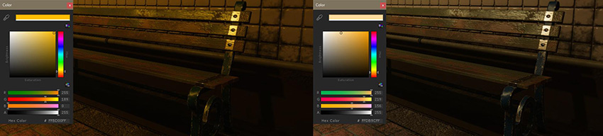
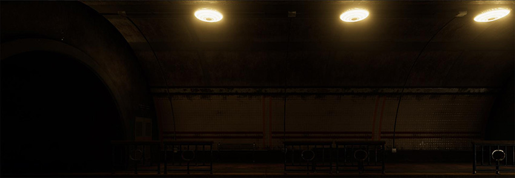
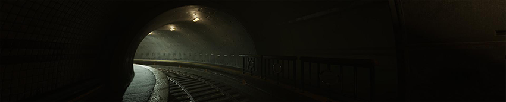

# 室内和局部光照

对于室内和局部光照，请注意以下几点：

* [聚光灯和点光源](#spotLights)
* [光照颜色和强度](#intensity)
* [发光表面](#emissive)

 
## 聚光灯和点光源

实时局部光照最主要的是聚光灯和点光源。从根本上说，这两种类型的光源都是从空间中的一个点发光并具有有限的范围。聚光灯还具有额外的角度限制。有关更多信息，请参阅[光源类型](Lighting.html)文档。

聚光灯和点光源之间的主要区别在于它们如何投射阴影以及如何与剪影相互作用。使用点光源投射阴影需要 6 个阴影贴图，而聚光灯只需要一个。因此，点光源对性能的影响要高得多，应谨慎使用它们。请注意，烘焙光源不需要阴影贴图。

另一个区别是聚光灯的剪影纹理是简单的 2D 纹理，而点光源需要立方体贴图（通常在 3D 建模应用程序中制作）。有关更多信息，请参阅[剪影](Cookies.html)文档。

__注意__：除非使用 HD 可编程渲染管线，否则只能在烘焙光照时使用区域光照。在 HD SRP 模式下可以实时渲染区域光源。

 
## 光照强度和颜色

在选择室内光照强度时，尽可能确保室内光照强度不高于太阳光。示例场景设置在隧道中，因此天花板上不太可能有任何高强度的光源超出太阳光亮度：

 

为光源选择正确的颜色时，请考虑所选颜色和值的影响。选择颜色时，尽量不要完全忽视任何一个颜色通道。否则会产生很难与白色点光源会聚的光。例如，虽然左下图中的光照颜色从技术上讲是一种有效的光照颜色，但会从最终输出中删除所有蓝色：

 

尽量不要限制场景中的最终调色板，特别是您希望稍后进行颜色分级的情况下。

__注意__：有关使用色调映射器来处理高强度颜色值（如彩色光或火焰）的建议，请参阅[高强度颜色](#todo)。

 
## 发光材质

在 Unity 中，如果启用了__实时 GI（全局光照）__或__烘焙__光照，发光材质可能影响光照，带来区域光照效果。如果启用了__实时 GI__，这尤其有用。假设已经提前完成预计算的情况下，您可以修改发光表面的强度和颜色并立即获得反馈。

有关更多信息，请参阅[发光 (Emission)](StandardShaderMaterialParameterEmission.html)。

此时，您应该已经充分了解如何设置并照亮场景以使其看起来可信。

---

* 2018-03-21  Page published with limited [editorial review](DocumentationEditorialReview.html)

* 在 Unity 2017.3 中添加了制作可信视觉效果最佳实践指南
