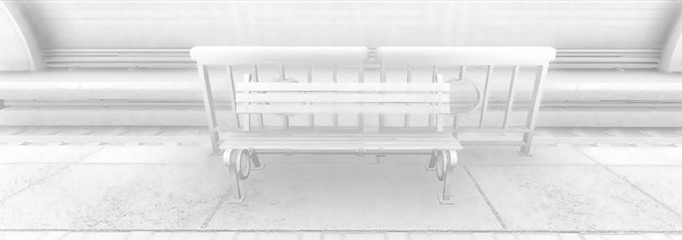
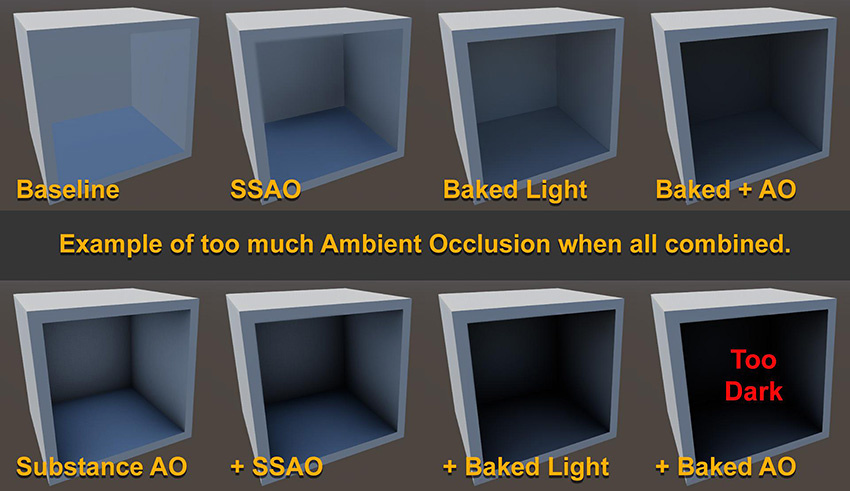
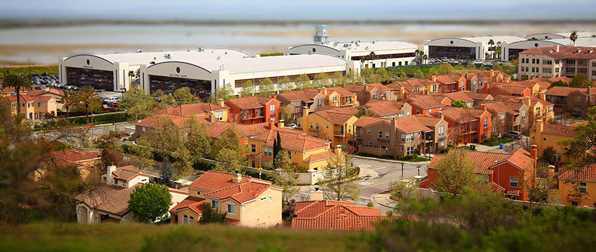
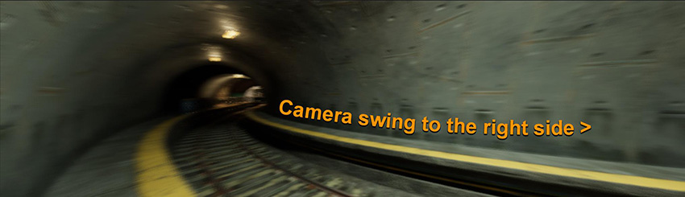
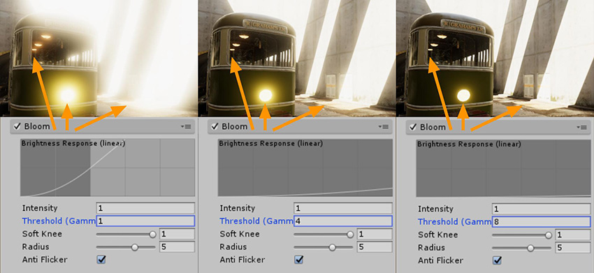
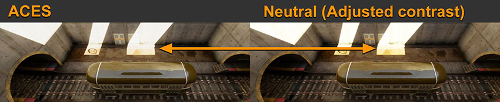

# 了解后期处理

后期处理是基于现有渲染场景的渲染特效。后期处理中的特效通常取决于 Scene 视图，或在生成最终渲染之前叠加在渲染场景上。此功能的明显优势在于即时视觉反馈和对场景的显著改善，无需修改现有内容。

无需使用所有后期处理功能来创建可信场景。但是，后期处理进一步增强场景的能力绝对值得您花时间来了解该系统。本部分将帮助您确定哪种后期处理特效适合您的具体情况，并帮助您避免这些高级功能可能带来的陷阱：

* [抗锯齿](#aa)
* [环境光遮挡 (AO)](#ao)
* [屏幕空间反射](#ssr)
* [景深](#dof)
* [运动模糊](#motionBlur)
* [高强度颜色](#highIntensityColor)
* [色差、颗粒和渐晕](#artifacts)

有关后期处理的深入概述，请参阅[后期处理文档](PostProcessingOverview.html)。

 
## 抗锯齿

将 3D 多边形光栅化为分辨率有限的 2D 屏幕时，最终像素会显示锯齿效果（就像物体边缘的梯级）。实时 3D 中有多种不同的抗锯齿技术解决方案，例如超级采样、多重采样抗锯齿 (MSAA)、快速近似抗锯齿 (FXAA)、空间抗锯齿 (SMAA) 和时间抗锯齿 (TXAA)。目前，最流行的技术是 FXAA 和 TXAA，因为很有效并且性能相对较高。例如，示例场景中的以下图像对 FXAA 和 TXAA 进行了比较：

 

FXAA 在修复一些明显的锯齿效果方面做得很好，但是 TXAA 有更进一步的改善，在电车轨道方面的表现要好得多。

FXAA 是纯粹的后期处理抗锯齿技术。简单来说，它会捕获栅格化的场景，分析边缘，并在现有图像的基础上运行算法以使其平滑。它很简单，没有任何复杂的依赖关系，而且速度很快。

TXAA 要复杂得多。它使用抖动和前一帧作为附加数据混合到当前帧中。它还使用运动矢量来预测要拒绝或接受哪些像素以渲染最终帧。主要思路是以更多数据增加帧的有效分辨率，而不需要将场景渲染到超过其最终分辨率（超级采样通常就是这种情况）。优点显然是平滑得多的抗锯齿效果，类似于超级采样提供的质量，但不会产生重大的性能影响。

像实时渲染中的所有情况一样，总是需要权衡利弊。TXAA 需要运动矢量做运算，并且与 FXAA 相比具有更大的性能影响。TXAA 在预测最终图像方面的复杂性质可能会导致快速移动的游戏对象出现一些意外的瑕疵，并可能在整个场景中发生纹理模糊问题，因此这种方案可能不适合某些应用。

 
## 环境光遮挡 (AO)

环境光遮挡后期处理近似于基于屏幕空间数据（主要是深度）的环境遮挡。因此，通常将其称为屏幕空间环境光遮挡 (SSAO)。正如[启用后期处理](BestPracticeMakingBelievableVisuals2.html#enablePP)中所述，在环境光照着色时，SSAO 可以提供更好的保真度，尤其对于在静态场景和动态场景之间通常没有任何遮挡相互作用的动态游戏对象。

虽然通常情况下 SSAO 有助于场景的环境光着色，但也可能会导致太多的遮挡。来自离线 3D 建模应用程序的具体对象烘焙环境光遮挡与来自光照烘焙的其他环境光遮挡结合使用，使得 SSAO 成为环境光遮挡的第三层。

确保在设置 SSAO 时注意最终输出，并尝试与其他环境光遮挡解决方案之间找到平衡点。

 
## 屏幕空间反射

与 SSAO 一样，屏幕空间反射 (SSR) 使用当前 Scene 视图通过射线追踪来估算反射。为了获得可信的结果，启用此功能几乎始终是明智的做法。此功能会增加一个高度精确的反射，此反射可作为正常立方体贴图捕获的反射的补充。但是，启用此功能会将渲染限制为仅延迟渲染，并对性能有影响。SSR 的另一个缺点是不在屏幕上的对象不会产生反射命中，因此可能导致屏幕边缘缺少反射效果。

 
## 景深

景深特效可以提供大型传感器相机的电影感。它还可用于改变场景的比例感（非常类似于移轴相机镜头产生微缩效果的情况）。例如，下图是真实照片，通过应用景深特效使其看起来像是缩影：

 

 
## 运动模糊

巧妙的运动模糊可使一帧过渡到另一帧的混合更加可信。但是，您需要注意自己的应用情况以降低晕动症风险。如果场景转换存在巨大差异（通常在第一人称或第三人称摄像机中存在此情况），尤其如此。例如，在没有运动模糊的情况下，一个可让玩家从左到右快速摆动摄像机的广角视图看起来抖动很明显，并产生停止运动的感觉，即使以 60FPS 渲染也是如此。下图显示了快门角度为 180 度时的奔跑运动模糊：

 

完整的 360 度快门角度可为您提供全帧持续时间轨迹。更小的角度意味着更少的轨迹。根据这一点，如果您的目标是获得停止运动的感觉，则应禁用运动模糊。

 
## 泛光和发光

在现实生活中，泛光是一种镜头瑕疵，表示光束没有正确聚焦。这种情况通常发生在质量较差的相机镜头上或者一些特效的发光相机滤镜上。如图所示，泛光带来了模糊的柔和图像（__Threshold Gamma__ 设置为 0）：

 

或者，也可以使用泛光来区分高强度或强光的元素，如下所示：

 

过度使用这些功能可能会适得其反。您可以在上图中的第一个示例中看到这种情况；此处有很多高强度像素，并且强度阈值很早就开始泛光。

选择该阈值时，请考虑发光表面的具体值、场景的光照设置以及是否启用了人眼适应。

 
## 高强度颜色

您可以使用色调映射器处理高强度颜色值，色调映射器可处理线性 HDR 缓冲区中的输入数据，并将其渲染回指定的色彩空间以进行最终输出。这类似于摄像机的工作方式。在 Unity 后期处理中，有两种类型的色调映射器：__中性 (Neutral)__ 和 __ACES__（[学院色彩编码系统 - Academy Color Encoding System (Wikipedia)](https://en.wikipedia.org/wiki/Academy_Color_Encoding_System)）。乍一看，两者之间的区别在于色调映射器的默认对比度。但是，两者之间的主要区别在于，您可以将 __Neutral__ 的对比度调整为与 __ACES__ 相似。在下图中，两个示例几乎相同（其中的 __Neutral__ 设置为：__Black__ In 0.02、__White__ In 10、__Black Out__ -0.04、__White Out__ 10、__White Level__ 5.3 和 __White Clip__ 10）：

 

您需要考虑的主要区别是两个色调映射器如何处理高强度颜色值（例如来自爆炸特效或火焰的彩色光或发光特效）。下图显示了 __ACES__ 色调映射器如何以不同方式将高强度颜色标准化为__中性__色调映射器：

 

 
## 色差、颗粒和渐晕

色差、颗粒和渐晕是后期处理特效，用于模拟真实相机系统中的瑕疵。要正确使用这些特效，最好了解每种特效如何在真实相机中产生：

* 如果相机的镜头未能将所有颜色聚焦到相同的会聚点，则会出现在图像上的颜色偏差，这便是__色差 (Chromatic Aberration, CA)__。这种情况通常出现在校准不佳或质量较差的镜头中。虽然这种情况有时可以为数字场景增添真实感，但也意味着您的虚拟摄像机不得不表现低质量镜头。

* 在真实照片或电影的最终图像中看到的__颗粒 (Grain)__ 通常是进入传感器的有用光量不足的标志，例如黑暗场景或高 ISO 相机传感器/胶片转换为噪声。您可以使用此特效来模拟相机限制，使原始的 3D 渲染场景更加可信。但是，场景中过多的噪声会使观察者分散注意力，产生错误的运动感，并影响最终渲染图像的对比度。

* __渐晕 (Vignette)__ 类似于 CA 特效；它增加了一些瑕疵，即镜头无法从相机传感器/胶片的中心到边缘提供一致的光线覆盖。您可以使用此特效为场景的中心点提供一些焦点感。但是，如果过多使用此特效，可能使场景看起来像是经过业余后期编辑的处理。

这些后期处理基础知识的关键之处在于，您应该练习并理解每种特效，这样就能带着目的性有效使用这些功能，并权衡每种附加特效的视觉优点与整体场景性能。

有关其他后期处理功能的建议，请参阅以下相关文档：

* [人眼适应](PostProcessing-EyeAdaptation.html)
* [颜色分级（除色调映射器外）](PostProcessing-ColorGrading.html)
* [用户 LUT（查找表）](PostProcessing-UserLut.html)

---

* 2018-03-21  Page published with limited [editorial review](DocumentationEditorialReview.html)

* 在 Unity 2017.3 中添加了制作可信视觉效果最佳实践指南
