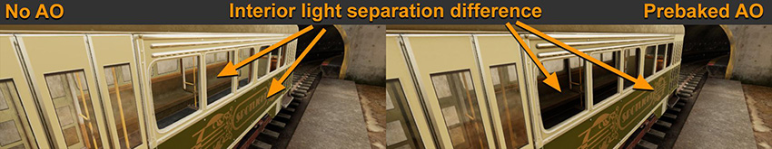

# 动态光照

动态照亮的游戏对象（尤其是大型游戏对象）比静态对象需要更多的技巧。如果游戏对象在场景中改变位置，则通常需要动态光照，因此预计算的光照不适用。但是，动态游戏对象的处理必须满足某些限制。要提高动态游戏对象光照的质量，请注意以下方面：

* [光照探针代理体 (LPPV)](#lppv)
* [逐对象烘焙的环境光遮挡贴图 (AO)](#aoMap)
* [局部反射](#reflection)
* [基于假设的假阴影或遮挡](#assumptions)

 
## 光照探针代理体 (LPPV)

未被动态光照照亮的动态游戏对象的表面通常使用光照探针数据来填充其光照信息（在不存在光照探针的场景中，使用环境光照）。根据场景中使用的光照策略，这些信息可能包括多种信息，从间接光照信息一直到阴影和烘焙漫射光照探针光照信息。这种光照探针策略通常很适合小型动态游戏对象。但是，较大的游戏对象需要更精细的光照探针光照。这便是光照探针代理体 (Light Probe Proxy Volume) 的用武之地。有关更多信息，请参阅[光照探针代理体组件](class-LightProbeProxyVolume.html)。

使用光照探针代理体允许动态照亮的大型游戏对象使用多个光照探针，从而提高光照精度。以下示例显示了具有 LPPV 的胶囊体如何表现出更高的光照探针采样精度（尽管仅使用 2x2x2 代理体网格）：

 
## 每个对象烘焙的环境光遮挡贴图 (AO)

动态游戏对象仅接收来自光照探针或环境光的光照。因此，您需要预计算游戏对象的遮挡，特别是游戏对象包含凹陷内部的情况（例如示例中的电车）。在下面的示例中，未使用 AO 的左侧电车应用了光照探针光照数据，不知道如何区分内部和外部表面。采用预烘焙的 AO 后，该贴图可作为降低外部光线和反射强度的指引，使外观更加接近现实：

具体游戏对象 AO 离线烘焙甚至可从细节程度更高的网格烘焙到细节程度更低的网格来提供进一步细节化的遮挡，其原理与法线贴图烘焙的工作原理类似。

**注意**：具体游戏对象 AO 不与其他动态游戏对象相互作用。例如，动态游戏对象（例如进入电车的角色）从场景接收光照探针数据，不一定要与电车内部的遮挡匹配。

 
## 局部反射

大多数动态游戏对象都不需要有自己的反射。但是，对于包含凹面内部的游戏对象，将反射探针连接到游戏对象并允许其实时运行有助于减少来自环境反射探针的误反射命中。

 
## 基于假设的假阴影或遮挡

如果您能为游戏对象做出某些假设，则可以使用一些技巧来提高视觉品质。在下面显示的示例中，电车应始终在轨道上。因此，为了改善阴影区域中的地面光照遮挡，我们可以使用“Particle/Multiply”透明材质平面：

一种类似的技巧是将模糊阴影投影器 (blob shadow projector) 放置在角色下，而不是角色投射真实阴影。

在实时渲染中，如果能找到一种有效的技巧，并且性能代价较低，那么它通常便是可行的解决方案。肯定还有更多的提示和技巧有助于改善视觉渲染效果。上面列出的内容应该能启发您针对不同类型的视觉化要求思考相应的解决方案。

---

* 2018-03-21  Page published with limited [editorial review](DocumentationEditorialReview.html)

* 在 Unity 2017.3 中添加了制作可信视觉效果最佳实践指南
