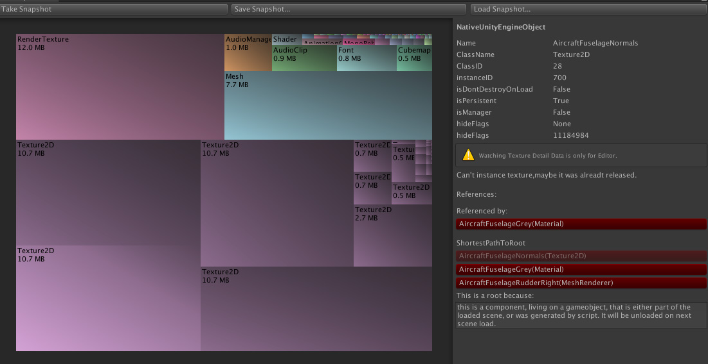
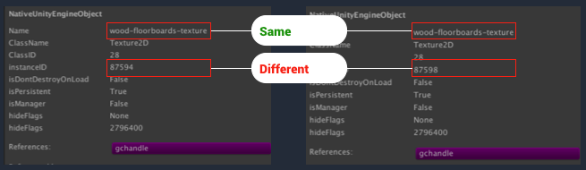
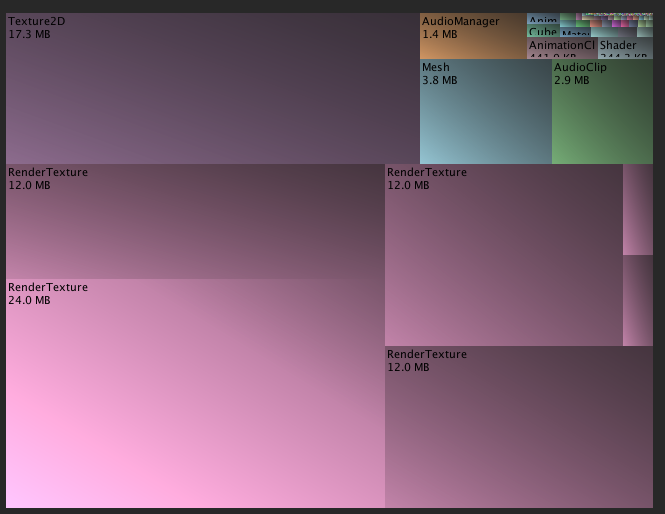

# 内存分析

内存消耗是关键的性能指标，在内存资源有限的平台（例如低端移动设备）上尤为重要。

## 分析内存消耗

使用 Unity Bitbucket 提供的[开源内存可视化工具](https://bitbucket.org/Unity-Technologies/memoryprofiler)可实现 Unity 中的内存问题的最佳诊断。此工具的集成非常简单，只需下载链接的代码仓库并将包含的 _Editor_ 文件夹放入项目中。

该工具可与 Unity 5.3 以上的任何版本结合使用。当连接到使用 IL2CPP 构建的应用程序时，此工具可以捕获有关本机代码和托管代码内存消耗情况的大量信息。

要使用该工具，只需使用 IL2CPP 脚本后端构建项目并将其部署到适当的设备。连接 Unity 的常规编辑器内部 CPU 性能分析器，然后打开 Memory Profiler 窗口（菜单：__Window__ > __MemoryProfilerWindow__）并选择 __Take Snapshot__。

设备上的应用程序暂停一小段时间，此段时间会收集数据并传输到 Unity Editor。然后，Unity Editor 会暂停以便解析收到的数据；这可能需要很长时间。对于消耗了大量内存的应用程序，一次跟踪可能需要 10-30 分钟才能完成解析。

在此解析和加载操作期间，请耐心等待。

 

此截屏来自 iOS 设备上运行的标准资源场景，其中显示有超过四分之三的内存使用量用于四个非常大的纹理，所有这些纹理都与飞机的机身有关。

此可视化视图可以缩放。单击应用程序中的每个框即可查看有关该框的更多信息。

### 识别重复的纹理

一个常见的内存问题是内存中的资源重复。由于纹理通常是项目中消耗内存最多的资源，因此纹理重复是 Unity 项目中最常见的内存问题之一。

识别重复资源可采用的方法是查找两个相同类型和相同大小的对象，这些对象看起来是从同一资源加载的。在新的内存性能分析器的详细信息面板中，检查看似相同的对象的 __Name__ 和 __InstanceID__ 字段。

__Name__ 字段基于资源文件（对象加载自该文件）的名称；通常，该名称是不包含文件路径和扩展名的文件名。__InstanceID__ 字段表示 Unity 运行时分配的内部标识号；此数字在 Unity 游戏的单次运行中是独一无二的(1)。

 

此图演示了此问题的一个简单示例。在图的左侧和右侧是从 5.4 版内存性能分析器的详细信息面板中截取的截屏。这些截屏中显示的资源是在内存中单独加载的两个纹理。纹理具有相同的名称和大小，表明它们可能是重复的。通过检查项目的“Assets”文件夹，可以确定只有一个名为 _wood-floorboards-texture_ 的资源文件，这更加证明了资源被重复加载。

内存中的每个 UnityEngine.Object 都在对象被创建时分配一个唯一的实例 ID。由于这两个纹理具有不同的实例 ID，因此可以肯定它们代表了加载到内存中的两组不同纹理数据。

由于文件名和资源大小相同，而实例 ID 不同，可以肯定这两个对象表示内存中重复的纹理（注意：
	 如果项目中存在具有相同文件名的纹理，那么此判断将不是绝对准确的，但在文件大小也相同时则可能性非常高）。

#### AssetBundle 与资源重复

内存中纹理和资源重复的最常见原因是 AssetBundle 卸载不当。请参阅 Unity 的 [AssetBundle 最佳实践指南 (Best Practice Guide on AssetBundles)](http://unity3d.com/learn/tutorials/topics/best-practices/guide-assetbundles-and-resources?playlist=30089) 以了解有关此问题的描述。关键部分是[管理加载的资源 (Managing Loaded Assets)](http://unity3d.com/learn/tutorials/topics/best-practices/assetbundle-usage-patterns?playlist=30089)。

### 检查图像缓冲区、图像效果和 RenderTexture 内存使用情况

可以通过内存可视化工具显示需要向图像和 RenderTexture 对象提供的渲染缓冲区的内存需求情况。

 

上面的截屏演示了一个简单的场景，场景中应用了 Unity 的一些电影图像效果。图像效果会分配临时渲染缓冲区来执行计算；尤其是泛光特效分配了几个大小递减的缓冲区。由于 Retina iOS 设备的高分辨率，这些临时缓冲区消耗的内存远远超过项目其余部分的总量。

例如 iPad Air 2 的分辨率为 2048x1536，这超出了通常针对现代游戏主机和 PC 的 1080p 分辨率，但却是在平板设备上运行。一个全屏临时渲染缓冲区将占用全部的 24 或 36 兆字节内存（具体取决于缓冲区的格式）。通过将渲染缓冲区的像素大小减半，可使该内存减少 75%。这样做通常不会显著降低显示结果的视觉品质。

优化图像效果对临时渲染缓冲区和其他 GPU 资源的使用的方法之一是创建单个“超级”(uber) 图像效果，此特效将同时执行所有不同的计算。使用 Unity 5.5 或更高版本时，可使用新的 [UberFX](https://github.com/Unity-Technologies/PostProcessing)（可从 [github](https://github.com/Unity-Technologies/PostProcessing) 获取）软件包；该软件包提供了一个可配置的“超级”图像效果，此特效可以执行电影图像效果提供的所有操作，而且开销比单个图像效果更低。

