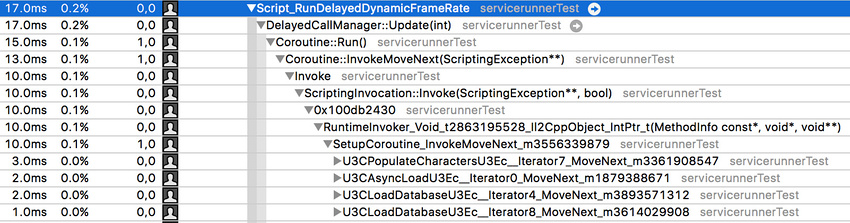

# 协程

协程的执行方式与其他脚本代码不同。大多数脚本代码只显示在性能跟踪内的位于特定 Unity 回调调用下某一个位置。但是，协程的 CPU 代码总是出现在跟踪内的两个位置。

协程中的所有初始代码（从协程方法的开始一直到第一次暂停）将出现在跟踪过程中任何启动协程的位置。通常出现在调用 `StartCoroutine` 方法的位置。从 Unity 回调（例如返回 `IEnumerator` 的 `Start` 回调）生成的协程首先出现在各自的 Unity 回调中。

协程代码的所有其余部分（从第一次恢复一直到完成执行）将显示在 Unity 主循环内出现的 `DelayedCallManager` 行中。

要了解为什么会发生这种情况，请思考协程实际上是如何执行的。

协程由 C# 编译器自动生成的类实例提供支持。此对象用于跟踪单个方法（对程序员而言）的多次调用之间的协程状态。因为协程中的局部作用域变量必须在 `yield` 调用中保持一致，所以这些局部作用域变量将被保存到上一级的生成的它们的类中，从而保证在协程的存活期内保留在堆上的地址分配。该对象还会跟踪协程的内部状态：它会记住协程暂停后必须从代码中的哪一点恢复。

因此，启动协程引起的内存压力等于固定开销成本加上其局部变量的消耗。

启动协程的代码将构造并调用此对象，然后 Unity 的 `DelayedCallManager` 在每当满足协程的暂停条件时再次调用此对象。由于协程通常在其他协程之外启动，因此它们的执行成本将分担到上述两个位置。

 

在上面的截屏中可以看到这种情况，其中的 `DelayedCallManager` 正在恢复几个不同的协程：`PopulateCharacters`、`AsyncLoad` 和 `LoadDatabase` 是其中需要注意的协程。

尽可能将一系列操作压缩到最少数量的协程中。虽然嵌套的协程非常有利于确保代码的条理性和进行维护，但协程跟踪对象本身会导致产生更高的内存开销。

如果一个协程几乎每帧都运行并且在长时间运行操作中不会暂停，那么用 `Update` 或 `LateUpdate` 回调来替换该协程通常更合理一些。例如长时间运行或无限循环的协程。

禁用对象时，协程不会停止，只有明确销毁对象时才会停止。对象禁用时允许协程仍然运行，如果需要，可再次启用对象。调用 Destroy(this) 会立即触发 `OnDisable` 并会处理协程。最后，在帧的末尾调用 `OnDestroy`。

必须注意的是，协程*不是*线程。在协程内运行的同步操作仍然在主线程上执行。如果需要减少主线程上花费的 CPU 时间，与任何其他脚本代码中一样，在协程中避免阻塞操作同样很重要。

在处理长时间异步操作（例如等待 HTTP 传输、资源加载或文件 I/O 完成）时，最适合使用协程。

