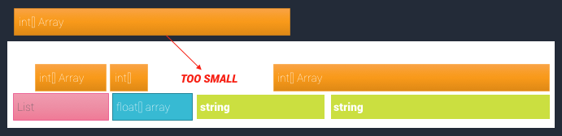
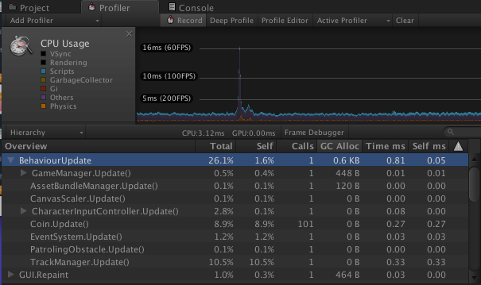

# 了解托管堆

许多 Unity 开发者面临的另一个常见问题是托管堆的意外扩展。在 Unity 中，托管堆的扩展比收缩容易得多。此外，Unity 的垃圾收集策略往往会使内存碎片化，因此可能阻止大型堆的收缩。

## 托管堆的工作原理及其扩展原因

“托管堆”是由项目脚本运行时（Mono 或 IL2CPP）的内存管理器自动管理的一段内存。必须在托管堆上分配托管代码中创建的所有对象(2)（__注意：__严格来说，必须在托管堆上分配所有非 null 引用类型对象和所有装箱值类型对象）。

 

在上图中，白框表示分配给托管堆的内存量，而其中的彩色框表示存储在托管堆的内存空间中的数据值。当需要更多值时，将从托管堆中分配更多空间。

垃圾回收器定期运行(3)（__注意：__具体运行时间视平台而定）。这时将扫描堆上的所有对象，将任何不再引用的对象标记为删除。然后会删除未引用的对象，从而释放内存。

至关重要的是，Unity 的垃圾收集（使用 [Boehm GC 算法](https://en.wikipedia.org/wiki/Boehm_garbage_collector)）是非分代的，也是非压缩的。“非分代”意味着 GC 在执行每遍收集时必须扫描整个堆，因此随着堆的扩展，其性能会下降。“非压缩”意味着不会为内存中的对象重新分配内存地址来消除对象之间的间隙。

 

上图为内存碎片化示例。释放对象时，将释放其内存。但是，释放的空间**不会**整合成为整个“可用内存”池的一部分。位于释放的对象两侧的对象可能仍在使用中。因此，释放的空间成为其他内存段之间的“间隙”（该间隙由上图中的红色圆圈指示）。因此，新释放的空间仅可用于存储与释放相同大小或更小的对象的数据。

分配对象时，请注意对象在内存空间中的分配地址必须始终为连续空间块。

这导致了内存碎片化这个核心问题：虽然堆中的可用空间总量可能很大，但是可能其中的部分或全部的可分配空间对象之间存在小的“间隙”。这种情况下，即使可用空间总量高于要分配的空间量，托管堆可能也找不到足够大的连续内存块来满足该分配需求。

 

但是，如果分配了大型对象，却没有足够的连续可用空间来容纳该对象（如上所示），Unity 内存管理器将执行两个操作。

首先，如果垃圾回收器尚未运行，则运行垃圾回收器。此工具会尝试释放足够的空间来满足分配请求。

如果在 GC 运行后，仍然没有足够的连续空间来满足请求的内存量，则必须扩展堆。堆的具体扩展量视平台而定；但是，大多数 Unity 平台会使托管堆的大小翻倍。

## 堆的主要问题

托管堆扩展方面的核心问题有两个：

* Unity 在扩展托管堆后不会经常释放分配给托管堆的内存页；它会乐观地保留扩展后的堆，即使该堆的大部分为空时也如此。这是为了防止再次发生大量分配时需要重新扩展堆。

* 在大多数平台上，Unity 最终会将托管堆的空置部分使用的页面释放回操作系统。发生此行为的间隔时间是不确定的，因此不要指望靠这种方法释放内存。

* 托管堆使用的地址空间始终不会归还给操作系统。

* 对于 32 位程序，如果托管堆多次扩展和收缩，则可能导致地址空间耗尽。如果一个程序的可用内存地址空间已耗尽，操作系统将终止该程序。

* 对于 64 位程序而言，地址空间足够大到可以运行时间超过人类平均寿命的程序，因此地址空间耗尽的这种情况极几乎不可能发生。

## 临时分配

许多 Unity 项目在每帧都有几十或几百 KB 的临时数据分配给托管堆。这种情况通常对项目的性能极为不利。请考虑以下数学计算：

如果一个程序每帧分配一千字节 (1 KB) 的临时内存，并且以每秒 60 帧的速率运行，那么它必须每秒分配 60 KB 的临时内存。在一分钟内，这会在内存中增加 3.6 MB 的垃圾。每秒调用一次垃圾回收器可能会对性能产生不利影响，但对于内存不足的设备而言每分钟分配 3.6 MB 的内存是个问题。

此外，请考虑加载操作。如果在大型资源加载操作期间生成了大量临时对象，并且对这些对象的引用一直持续到操作完成，则垃圾回收器无法释放这些临时对象，并且托管堆需要进行扩展，即使它包含的许多对象将在不久后释放也是如此。

 

跟踪托管内存分配情况相对简单。在 Unity 的 CPU 性能分析器中，Overview 表有一个“GC Alloc”列。此列显示了在特定帧中的托管堆上分配的字节数(4)（__注意：__这与给定帧期间临时分配的字节数不同。性能分析器会显示特定帧中分配的字节数，不考虑在后续帧中是否重用了部分/全部已分配的内存）。启用“Deep Profiling”选项后，可以跟踪执行这些分配的方法。

__Unity Profiler 不会跟踪在主线程之外发生的分配。__因此，“GC Alloc”列不能用于统计用户创建的线程中发生的托管分配。请将代码执行从单独线程切换到主线程以进行调试，或使用 [BeginThreadProfiling](../ScriptReference/Profiling.Profiler.BeginThreadProfiling.html) API 在时间轴性能分析器 (Timeline Profiler) 中显示例程。

务必使用目标设备上的开发版来分析托管分配。

请注意，某些脚本方法在 Editor 中运行时会产生分配内存，但在构建项目后不会产生分配内存。`GetComponent` 是最常见的示例；此方法始终在 Editor 中执行时分配内存，而不会在已构建的项目中分配内存。

通常，强烈建议所有开发人员在项目处于交互状态时最大限度减少托管堆内存分配。非交互操作（例如场景加载）期间的内存分配很少产生问题。

适用于 Visual Studio 的 [Jetbrains Resharper 插件](https://resharper-plugins.jetbrains.com/packages/ReSharper.HeapView/0.9.1)可以帮助找到代码中的内存分配。

使用 Unity 的[深度性能分析 (Deep Profile)](ProfilerWindow.html) 模式可找到托管分配的具体原因。在深度性能分析模式下，所有方法调用都是单独记录的，可更清晰地查看方法调用树中发生托管分配的位置。请注意，深度性能分析模式不仅可在 Editor 中使用，还可借助命令行参数 `-deepprofiling` 在 Android 和桌面平台上运行。Deep Profiler 按钮在性能分析期间保持灰色。


## 基本的内存节省方法
可使用一些相对简单的技术来减少托管堆分配。

### 集合和数组重用

使用 C# 的集合类或数组时，尽可能考虑重用或汇集已分配的集合或数组。集合类开放了一个 *Clear* 方法，该方法会消除集合内的值，但不会释放分配给集合的内存。

```

void Update() {

	List<float> nearestNeighbors = new List<float>();

	findDistancesToNearestNeighbors(nearestNeighbors);

	nearestNeighbors.Sort();

	// … 以某种方式使用排序列表 …

}

```

在为复杂计算分配临时“helper”集合时，这尤其有用。下面的代码是一个非常简单的示例：

在此示例中，为了收集一组数据点，每帧都为 `nearestNeighbors` List（列表）分配一次内存。将此 List 从方法中提升到包含类中是非常简单的，这样做避免了每帧都为新 List 分配内存：

```

List<float> m_NearestNeighbors = new List<float>();

void Update() {

	m_NearestNeighbors.Clear();

	findDistancesToNearestNeighbors(NearestNeighbors);

	m_NearestNeighbors.Sort();

	// … 以某种方式使用排序列表 …

}

```


在此版本中，List 的内存被保留并在多个帧之间重用。仅在 List 需要扩展时才分配新内存。

## 闭包和匿名方法

使用闭包和匿名方法时需要注意两点。

首先，C# 中的所有方法引用都是引用类型，因此在堆上进行分配。通过将方法引用作为参数传递，可以轻松分配临时内存。无论传递的方法是匿名方法还是预定义的方法，都会发生此分配。

其次，将匿名方法转换为闭包后，为了将闭包传递给接收闭包的方法，所需的内存量将显著增加。


请参考以下代码：

```

List<float> listOfNumbers = createListOfRandomNumbers();

listOfNumbers.Sort( (x, y) =>

(int)x.CompareTo((int)(y/2)) 

);

```

这段代码使用简单的匿名方法来控制在第一行创建的数字列表的排序顺序。但是，如果程序员希望使该代码段可重用，很容易想到将常量 `2` 替换为局部作用域内的变量，如下所示：

```

List<float> listOfNumbers = createListOfRandomNumbers();

int desiredDivisor = getDesiredDivisor();

listOfNumbers.Sort( (x, y) =>

(int)x.CompareTo((int)(y/desiredDivisor))

);

```

匿名方法现在要求该方法能够访问方法作用域之外的变量状态，因此已成为闭包。必须以某种方式将 `desiredDivisor` 变量传递给闭包，以便闭包的实际代码可以使用该变量。

为此，C# 将生成一个匿名类，该类可保存闭包所需的外部作用域变量。当闭包传递给 `Sort` 方法时，将实例化此类的副本，并用 `desiredDivisor` 整数的值初始化该副本。

因为执行闭包需要实例化闭包生成类的副本，并且所有类都是 C# 中的引用类型，所以执行闭包需要在托管堆上分配对象。

通常，请尽可能在 C# 中避免使用闭包。应在性能敏感的代码中尽可能减少匿名方法和方法引用，尤其是那些每帧都需要执行的代码中。

### IL2CPP 下的匿名方法

目前，通过查看 IL2CPP 所生成的代码得知，对`System.Function` 类型变量的声明和赋值将会分配一个新对象。无论变量是显式的（在方法/类中声明）还是隐式的（声明为另一个方法的参数），都是如此。

因此，使用 IL2CPP 脚本后端下的匿名方法必定会分配托管内存。在 Mono 脚本后端下则不是这种情况。

此外，由于方法参数的声明方式不同，将导致IL2CPP 显示出托管内存分配量产生巨大差异。正如预期的那样，闭包的每次调用会消耗最多的内存。

预定义的方法在 IL2CPP 脚本后端下作为参数传递时，其__分配的内存几乎与闭包一样多__，但这不是很直观。匿名方法在堆上生成最少量的临时垃圾（一个或多个数量级）。

因此，如果打算在 IL2CPP 脚本后端上发布项目，有三个主要建议：

* 最好选择不需要将方法作为参数传递的编码风格。

* 当不可避免时，最好选择匿名方法而不是预定义方法。

* 无论脚本后端为何，都要避免使用闭包。

## 装箱 (Boxing)

装箱是 Unity 项目中最常见的非预期临时内存分配来源之一。只要将值类型的值用作引用类型就会发生装箱；这种情况最常发生在将原始值类型的变量（例如 `int` 和 `float`）传递给对象类型的方法时。

在下面非常简单的示例中，对 *x* 中的整数进行了装箱以便传递给 `object.Equals` 方法，因为 `object` 上的 `Equals` 方法要求将 `object` 作为参数传递给它。

```

int x = 1;

object y = new object();

y.Equals(x);

```

C# IDE（集成开发环境）和编译器通常不会发出关于装箱的警告，即使导致意外的内存分配时也是如此。这是因为 C# 语言的设计理念认为，小型临时分配可以被分代垃圾回收器和对分配大小敏感的内存池有效处理。

虽然 Unity 的分配器实际会使用不同的内存池进行小型和大型分配，但 Unity 的垃圾回收器“不是”分代的，因此无法有效清除由装箱生成的小型、频繁的临时分配。

在为 Unity 运行时编写 C# 代码时，应尽可能避免使用装箱。

### 识别装箱

装箱在 CPU 跟踪中显示为对某几种特定方法的调用，具体形式取决于使用的脚本后端。这些调用通常采用以下形式之一，其中 `<some class>` 是其他类或结构的名称，而 `...` 是一些参数：

* `<some class>::Box(…)`

* `Box(…)`

* `<some class>_Box(…)`

也可以通过搜索反编译器或 IL 查看器（例如 ReSharper 中内置的 IL 查看器工具或 dotPeek 反编译器）的输出来定位装箱。IL 指令为“box”。

### 字典和枚举

装箱的一个常见原因是使用 `enum` 类型作为字典的键。声明 `enum` 会创建一个新值类型，此类型在后台视为整数，但在编译时实施类型安全规则。

默认情况下，调用 `Dictionary.add(key, value)` 会导致调用 `Object.getHashCode(Object)`。此方法用于获取字典的键的相应哈希代码，并在所有接受键的方法中使用，如：`Dictionary.tryGetValue, Dictionary.remove` 等。

`Object.getHashCode` 方法为引用类型，但 `enum` 值始终为值类型。因此，对于枚举键字典，每次方法调用都会导致键被装箱至少一次。


以下代码片段展示的一个简单示例说明了此装箱问题：

```

enum MyEnum { a, b, c };

var myDictionary = 

new Dictionary<MyEnum, object>();

myDictionary.Add(MyEnum.a, new object());

```

要解决此问题，则需要编写一个实现 `IEqualityComparer` 接口的自定义类，并将该类的实例指定为字典的比较器（__注意：__此对象通常是无状态的，因此可与不同的字典实例一起重复使用以节省内存）。
	 
以下是上述代码片段 IEqualityComparer 的简单示例。

```

public class MyEnumComparer : IEqualityComparer<MyEnum> {

	public bool Equals(MyEnum x, MyEnum y) {

		return x == y;

	}

	public int GetHashCode(MyEnum x) {

		return (int)x;

	}

} 

```

可将上述类的实例传递给字典的构造函数。

### Foreach 循环

在 Unity 的 Mono C# 编译器版本中，使用 `foreach` 循环会在每次循环终止时强制 Unity 将一个值装箱（__注意：__是在每次整个循环完整执行完成后将该值装箱一次，并非在循环的每次迭代中装箱一次，因此无论循环运行两次还是 200 次，内存使用量都保持不变）。这是因为 Unity 的 C# 编译器生成的 IL 会构造一个通用值类型的枚举器来遍历值集合。

此枚举器将实现 `IDisposable` 接口；当循环终止时必须调用该接口。但是，在值类型的对象（例如结构和枚举器）上调用接口方法需要将它们装箱。


请参考下面非常简单的示例代码：

```

int accum = 0;

foreach(int x in myList) {

	accum += x;

}

```

以上代码通过 Unity 的 C# 编译器运行后将生成以下中间语言：

```

   .method private hidebysig instance void 

       ILForeach() cil managed 

     {

       .maxstack 8

       .locals init (

         [0] int32 num,

         [1] int32 current,

         [2] valuetype [mscorlib]System.Collections.Generic.List`1/Enumerator<int32> V_2

       )

       // [67 5 - 67 16]

       IL_0000: ldc.i4.0     

       IL_0001: stloc.0      // num

       // [68 5 - 68 74]

       IL_0002: ldarg.0      // this

       IL_0003: ldfld        class [mscorlib]System.Collections.Generic.List`1<int32> test::myList

       IL_0008: callvirt     instance valuetype [mscorlib]System.Collections.Generic.List`1/Enumerator<!0/*int32*/> class [mscorlib]System.Collections.Generic.List`1<int32>::GetEnumerator()

       IL_000d: stloc.2      // V_2

       .try

       {

         IL_000e: br           IL_001f

       // [72 9 - 72 41]

         IL_0013: ldloca.s     V_2

         IL_0015: call         instance !0/*int32*/ valuetype [mscorlib]System.Collections.Generic.List`1/Enumerator<int32>::get_Current()

         IL_001a: stloc.1      // current

       // [73 9 - 73 23]

         IL_001b: ldloc.0      // num

         IL_001c: ldloc.1      // current

         IL_001d: add          

         IL_001e: stloc.0      // num

       // [70 7 - 70 36]

         IL_001f: ldloca.s     V_2

         IL_0021: call         instance bool valuetype [mscorlib]System.Collections.Generic.List`1/Enumerator<int32>::MoveNext()

         IL_0026: brtrue       IL_0013

         IL_002b: leave        IL_003c

       } // .try 结束

       finally

       {

         IL_0030: ldloc.2      // V_2

         IL_0031: box          valuetype [mscorlib]System.Collections.Generic.List`1/Enumerator<int32>

         IL_0036: callvirt     instance void [mscorlib]System.IDisposable::Dispose()

         IL_003b: endfinally   

       } // finally 结束

       IL_003c: ret          

     } // 方法 test::ILForeach结束

   } // test 类结束

```

最相关的代码是靠近底部的 `__finally { … }__` 代码块。`callvirt` 指令在调用 `IDisposable.Dispose` 方法之前先发现该方法在内存中的位置，并要求将枚举器装箱。

通常，应在 Unity 中避免使用 `foreach` 循环。原因不仅是这些循环会进行装箱，而且通过枚举器遍历集合的方法调用成本更高，通常比通过 `for` 或 `while` 循环进行的手动迭代慢得多。

请注意，Unity 5.5 中的 C# 编译器升级版本显著提高了 Unity 生成 IL 的能力。特别值得注意的是，已从 `foreach` 循环中消除装箱操作。因此，节约了与 `foreach` 循环相关的内存开销。但是，由于方法调用开销，与基于数组的等效代码相比，CPU 性能差距仍然存在。

###  Unity 数组值 API

虚数组分配的一种更有害和更不明显的原因是重复访问返回数组的 Unity API。返回数组的所有 Unity API 每次被访问时都会创建一个新的数组副本。在不必要的情况下访问数组值 Unity API 是极不适宜的。

例如，下面的代码在每次循环迭代时都会虚化创建 `vertices` 数组的四个副本。每次访问 `.vertices` 属性时都会发生分配。

```

for(int i = 0; i < mesh.vertices.Length; i++)

{

	float x, y, z;

	x = mesh.vertices[i].x;

	y = mesh.vertices[i].y;

	z = mesh.vertices[i].z;

	// ...

	DoSomething(x, y, z);	

}

```

通过在进入循环之前捕获 `vertices` 数组，无论循环迭代次数是多少，都可以简单地重构为单个数组分配：

```

var vertices = mesh.vertices;

for(int i = 0; i < vertices.Length; i++)

{

	float x, y, z;

	x = vertices[i].x;

	y = vertices[i].y;

	z = vertices[i].z;

	// ...

	DoSomething(x, y, z);	

}

```


虽然访问一次属性的 CPU 成本不是很高，但在紧凑循环内重复访问会使得 CPU 性能过热。此外，重复访问会导致托管堆出现不必要的扩展。

此问题在移动端极其常见，因为 `Input.touches` API 的行为与上述类似。项目包含以下类似代码是极为常见的，此情况下每次访问 `.touches` 属性时都会发生分配。

```

for ( int i = 0; i < Input.touches.Length; i++ )

{

   Touch touch = Input.touches[i];

    // …

}

```


当然，通过将数组分配从循环条件中提升出来，可轻松改善该问题：

```

Touch[] touches = Input.touches;

for ( int i = 0; i < touches.Length; i++ )

{

   Touch touch = touches[i];

   // …

}

```


但是，现在有许多 Unity API 的版本不会导致内存分配。如果能使用这些版本时，请尽量选择这种版本。

```

int touchCount = Input.touchCount;

for ( int i = 0; i < touchCount; i++ )

{

   Touch touch = Input.GetTouch(i);

   // …

}

```


将上面的示例转换为无分配的 Touch API 很简单：

请注意，为了节省调用属性的 `get` 方法的 CPU 成本，属性访问 (`Input.touchCount`) 仍然保持在循环条件之外。

### 空数组重用

当数组值方法需要返回空集时，有些开发团队更喜欢返回空数组而不是 `null`。这种编码模式在许多托管语言中很常见，特别是 C# 和 Java。

通常情况下，从方法返回零长度数组时，返回零长度数组的预分配单例实例比重复创建空数组要高效得多(5)（__注意：__当然，在返回数组后调整数组大小时是个例外）。

__脚注__

* __(1)__ 这是因为大多数平台上从 GPU 内存回读的速度极慢。将纹理从 GPU 内存读入临时缓冲区以供 CPU 代码（例如 `Texture.GetPixel`）使用将是非常不高效的。

* __(2)__ 严格来说，必须在托管堆上分配所有非 null 引用类型对象和所有装箱值类型对象。

* __(3)__ 具体运行时间视平台而定。

* __(4)__ 注意，这与给定帧期间临时分配的字节数**不**同。性能分析器会显示特定帧中分配的字节数，不考虑在后续帧中是否重用了部分/全部已分配的内存。

* __(5)__ 当然，在返回数组后调整数组大小时是个例外。


---
* <span class="page-edit">2018-03-05  Page amended with limited [editorial review](DocumentationEditorialReview.html)
</span><br/>
