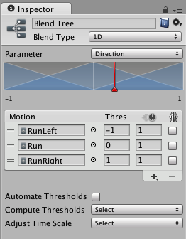

1D 混合
===========

__混合节点__的 __Inspector__ 中的第一个选项是 __Blend Type__。此下拉选单用于选择不同混合类型之一；这些类型可以根据一个或两个参数进行混合。1D 混合根据单个参数来混合子运动。

设置混合类型后，首先需要选择[动画参数](AnimationParameters.html)来控制此混合树。在此示例中，_Direction_ 参数在 -1.0（左）和 +1.0（右）之间变化，其中 0.0 表示无倾斜的直线奔跑。

然后，您可以通过单击“+”小按钮并从弹出菜单中选择 __Add Motion Field__ 来添加单个动画。操作完成后，应如下所示：

<!-- The word "pyramid" is not ideal. However, "triangle", "wedge" etc are worse since the center motion could be perceived as consisting of two triangles, and we want to use a word that describes a single shape for a motion. The word should convey a shape with a peak in the middle and a slope on *both* sides. -->
参数在最小值和最大值之间变化时，Inspector 顶部的图显示每个子运动的影响。每个运动都显示为一个蓝色小金字塔（第一个和最后一个仅显示一半），如果您在其中一个上单击并按住鼠标左键，相应运动将在下面的运动列表中突出显示。每个金字塔的顶峰定义运动具有最大影响的参数值，表示其动画权重为 1，而其他动画的权重为 0。这也称为运动的__阈值__。

<!-- source: MecanimBlendTreeParam.psd --> 

红色竖条表示__参数 (Parameter)__ 的值。如果在 __Inspector__ 底部的 __Preview__ 中按 __Play__ 并左右拖动图中的红色条，可以看到参数值如何控制不同运动的混合。

参数范围
---------------

混合树使用的参数范围在该图下方显示为左右侧的两个数字。可通过单击数字并用鼠标向左或向右拖动来更改其中任意一个数字。请注意，这些值对应于运动列表中第一个和最后一个运动的阈值。

阈值
----------

您可以通过单击图中的对应蓝色金字塔并将其向左或向右拖动来更改运动的阈值。如果未启用“Automate Thresholds”开关，还可通过在 Threshold 列的数字字段中输入数字来编辑运动列表中某个运动的阈值。

运动列表下方是 _Automate Thresholds_ 复选框。启用此复选框将在参数范围内均匀分布运动的阈值。例如，如果有五个剪辑且参数范围为 -90 到 +90，则阈值将按顺序设置为 -90、-45、0、+45 和 +90。

__Compute Thresholds__ 下拉选单将根据您选择的数据设置阈值；这些数据是从动画剪辑的根运动中获得的。可供选择的数据是速度 (Speed)、速度 (Velocity) x、y 或 z 以及以角度或弧度表示的角速度 (Angular Speed)。如果您的__参数__对应于这些属性之一，则可使用 Compute Thresholds 下拉选单来计算阈值。

|**_属性：_** |**_功能：_** |
|:---|:---|
|__Speed__ |根据速度（速度的量级）设置每个运动的阈值。|
|__Velocity X__ |根据 velocity.x 设置每个运动的阈值。|
|__Velocity Y__ |根据 velocity.y 设置每个运动的阈值。|
|__Velocity Z__ |根据 velocity.z 设置每个运动的阈值。|
|__Angular Speed (Rad)__ |根据角速度（弧度/秒）设置每个运动的阈值。|
|__Angular Speed (Deg)__ |根据角速度（角度/秒）设置每个运动的阈值。|

例如，假设您有一段速度为每秒 1.5 个单位的行走动画、一段速度为每秒 2.3 个单位的慢跑动画以及一段速度为每秒 4 个单位的奔跑动画，则从下拉选单中选择 __Speed__ 选项将基于这些值为三段动画设置参数范围和阈值。所以，如果将速度参数设置为 3.0，则会混合慢跑与奔跑，并略微偏向慢跑。
