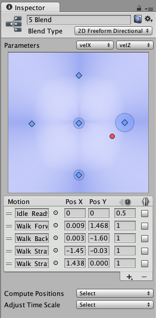

2D 混合
===========

__混合节点__的 __Inspector__ 中的第一个选项是 __Blend Type__。此下拉选单用于选择不同混合类型之一；这些类型可以根据一个或两个参数进行混合。2D 混合类型根据两个参数来混合子运动。

不同的 2D 混合类型具有适用的不同用途。它们的不同之处在于如何计算对每个运动的影响。

__2D Simple Directional__：最好在运动表示不同方向（例如“向前走”、“向后退”、“向左走”和“向右走”或者“向上瞄准”、“向下瞄准”、“向左瞄准”和“向右瞄准”）时使用。根据需要可以包括位置 (0, 0) 处的单个运动，例如“空闲”或“瞄准”。在 Simple Directional 类型中，在同一方向上_不_应该有多个运动，例如“向前走”和“向前跑”。

__2D Freeform Directional__：运动表示不同方向时，也使用此混合类型，但是您可以在同一方向上有多个运动，例如“向前走”和“向前跑”。在 Freeform Directional 类型中，运动集应始终包括位置 (0, 0) 处的单个运动，例如“空闲”。

__2D Freeform Cartesian__：最好在运动不表示不同方向时使用。凭借 Freeform Cartesian，X 参数和 Y 参数可以表示不同概念，例如角速度和线速度。一个示例是诸如“向前走不转弯”、“向前跑不转弯”、“向前走右转”、“向前跑右转”之类的运动。

__Direct__：此类型的混合树让用户直接控制每个节点的权重。适用于面部形状或随机空闲混合。

设置混合类型后，首先需要选择两个[动画参数](AnimationParameters.html)来控制此[混合树](class-BlendTree.html)。在此示例中，参数是 _velocityX_（扫射）和 _velocityZ_（前进速度）。

然后，您可以通过单击 __+ &gt; Add Motion__ 字段并将动画剪辑添加到混合树来添加单个动画。操作完成后，应如下所示：

2D 混合中的位置类似于 1D 混合中的阈值，不同之处是有两个值而不是一个值，对应于两个参数。它们沿水平 X 轴的位置对应于第一个参数，沿垂直 Y 轴的位置对应于第二个参数。向前走动画可能的 velocityX 为 0 而 velocityZ 为 1.5，因此应将这些值输入该运动的 Pos X 和 Pos Y 数字字段中。

2D 混合图
-----------------------

Inspector 顶部的图显示了 2D 混合空间中的子运动的位置。这些运动以蓝点显示。未分配动画剪辑或混合树的运动对混合没有影响，并显示为灰点。您可以通过单击图中的运动点来选择该运动。选择运动后，该运动对混合空间中每个点的影响便会可视化为蓝色区域。此区域位于该运动的位置正下方时最强，此情况下运动具有完全影响，意味着其动画权重为 1 而其他动画的权重为 0。逐渐远离该位置后，此运动的影响将减弱，而其他运动的影响将增强。

<!-- image source MecanimBlendTree2DDiagram.psd --> 

红点表示两个__参数__的值。如果在 __Inspector__ 底部的 __Preview__ 中按 __Play__ 并在图中四处拖动红点，可看到参数值如何控制不同运动的混合。在图中，您还可以看到每个运动的影响（表示为围绕每个运动的圆圈）。您将看到，如果将红点移动到表示运动的其中一个蓝点上，则该运动的圆圈将获得其最大半径，而其他所有运动的圆圈将缩小到看不见。在几个运动之间的位置，附近的多个运动将对混合产生影响。如果选择其中一个运动以查看该运动的蓝色影响区域，您可以看到在四处移动红点时，运动的圆形大小与影响区域在不同位置的强度完全对应。

未选择任何运动时，该图显示所有影响区域的混合，在单个运动主导的位置，颜色会更蓝，而在许多运动对混合有影响的位置，蓝色会更淡。

位置
---------

您可以通过单击图中的对应蓝点并将其四处拖动来更改运动的位置。此外，还可以通过在 Pos X 和 Pos Y 列的数字字段中输入数字来编辑运动列表中某个运动的位置坐标。

__Compute Positions__ 下拉选单将根据您选择的数据设置位置（这些数据是从动画剪辑的根运动中获得的）。可供选择的数据是速度 (Speed)、速度 (Velocity) x、y 或 z 以及以角度或弧度表示的角速度 (Angular Speed)。如果您的一个或两个__参数__对应于其中一个属性，可以使用 Compute Positions 下拉选单来计算 Pos X 和/或 Pos Y。

|**_属性：_** |**_功能：_** |
|:---|:---|
|__Velocity XZ__ |根据运动的 velocity.x 设置每个运动的 Pos X，根据 velocity.z 设置 Pos Y。|
|__Speed And Angular Speed__ |根据运动的角速度（弧度/秒）设置每个运动的 Pos X，根据速度设置 Pos Y。|

此外，可通过选择 __Compute Position &gt; X Position From__ 和/或 __Compute Position &gt; Y Position From__ 来一次仅自动计算其中一项而使其他项保持不变，从而进行混合与匹配。

|**_属性：_** |**_功能：_** |
|:---|:---|
|__Speed__ |根据速度（速度的量级）设置每个运动的 Pos X 或 Pos Y。|
|__Velocity X__ |根据运动的 velocity.x 设置每个运动的 Pos X 或 Pos Y。|
|__Velocity Y__ |根据运动的 velocity.y 设置每个运动的 Pos X 或 Pos Y。|
|__Velocity Z__ |根据运动的 velocity.z 设置每个运动的 Pos X 或 Pos Y。|
|__Angular Speed (Rad)__ |根据角速度（弧度/秒）设置每个运动的 Pos X 或 Pos Y。|
|__Angular Speed (Deg)__ |根据角速度（度/秒）设置每个运动的 Pos X 或 Pos Y。|

例如，假设参数对应于横向速度和前进速度，并有一段平均速度为 (0, 0, 0) 的空闲动画、一段速度为 (0, 0, 1.5) 的行走动画以及两段速度分别为 (-1.5, 0, 0) 和 (1.5, 0, 0) 的扫射动画。从下拉选单中选择 _Velocity XZ_ 选项将根据这些速度的 X 和 Z 坐标来设置运动的位置。
